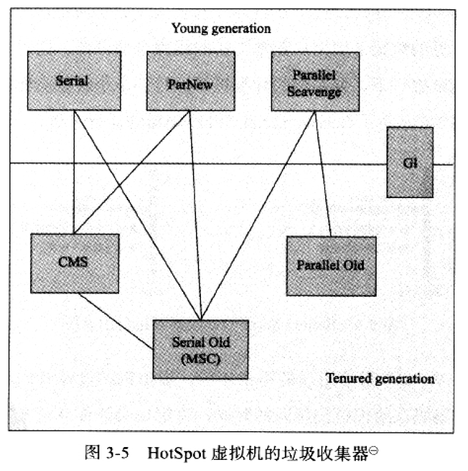

## 2.1 对象存活分析

### 2.1.1 可达性分析

在Java中，可作为GCRoots的对象有

1. 虚拟机栈中(栈帧中的本地变量表)中引用的对象
2. 方法区中类静态属性引用的对象
3. 方法区中常量引用的对象
4. 本地方法栈中JNI(Native方法)引用的对象

### 2.1.2 引用类型

1. 强引用
2. 软引用，SoftReference来实现，当快要发生内存溢出时，将这些对象列入回收范围进行二次回收。如果内存还不够，则抛出OOM异常。
3. 弱引用，只能存活于下次垃圾回收之前，无论当前内存是否够，都会回收只被弱引用关联的对象。
4. 虚引用，PhantomReference，为一个对象设置虚引用，当这个对象被GC时，收到一个系统通知。

### 2.1.3 回收方法区

一个类满足三个条件时，可以判定为无用的类，可以被回收。

1. 该类的所有实例已经被回收
2. 加载该类的ClassLoader已经被回收
3. 该类对应的java.lang.Class对象没有在任何地方被引用，无法在任何地方通过反射访问该类的方法。

虚拟机提供了参数来控制类的回收，在大量使用反射，动态代理，CGLib等Bytecode框架，动态生成jsp，以及OSGi这类频繁自定义ClassLoader的场景都需要虚拟机具备卸载类的功能。

## 2.2 垃圾收集算法

### 2.2.1 标记-清除法

首先标记出需要清除的对象，完成标记后统一回收被标记的对象。

缺点是有两个：

1. 标记和清除的效率都不高
2. 产生大量碎片

### 2.2.2 复制算法

将内存分为两块，只用其中一块，在GC时，将一块中的存活对象复制到另一块。缺点是内存的使用率低。

在HotSpot中，新生代分为Eden区，和两个Survivor区，Eden:Survivor为8:1，在GC时，将Eden区和当前使用的Survivor区中存活的对象复制到另外一个Survivor区中，如果此时这个Survivor区空间不够用时，则需要依赖其他内存(老年代Old)进行分配担保，也就是直接分配到老年代，具体规则见后面。

### 2.2.3 标记-整理算法

适用于老年代的垃圾回收，因为老年代的对象存活率较高，如果用复制算法，则会进行大量复制，更关键是只有50%的利用率。

标记整理算法，首先将垃圾对象标记，然后将所有还存活的对象移动到内存的一端，将清理掉边界意外的内存。

### 2.2.4 分代收集算法

在新生代中，每次垃圾回收都有大量对象死去，只有少量存活，所以适用复制算法。在老年代中，对象存活率高，没有额外空间进行分配担保，就必须使用标记清除，或者标记整理算法。

## 2.3 HotSpot 算法实现

### 2.3.1 枚举根节点

在完成GC Roots枚举时，使用一种叫做OopMap的数据结构，来得知哪些地方存放着对象引用，而不用遍历所有内存。

### 2.3.2 安全点

Java中的各个线程只有执行到安全点时，才能进行GC。现在的虚拟机都使用主动式中断，即需要GC时，设置一个标志位，各个线程在运行中回去主动轮询这个标志位，如果为真，就把自己中断挂起。轮询标志的时间点和安全是重合的，例如方法调用，循环跳转，异常跳转等

### 2.3.3 安全区

当线程处于Sleep或者Blocked时，无法去询问标志位，也就无法自己走到安全点去挂起。解决方法是，将该线程标记为安全区，也就是safe region，当线程执行到Safe Region中的代码时，首先标记自己进入了安全区，GC时，就不管这些进入安全区的线程，当线程要离开安全区时，比如Sleep结束，它会判断系统是否完成了根节点枚举或者整个GC过程，如果完成，则继续执行，如果没完成，则等待直到收到可以离开安全区的信号为止。

## 2.4 垃圾收集器种类

### 2.4.1 Serial收集器

最基本，历史最悠久的收集器，只会使用一个CPU和单线程去执行GC，是JVM在Client模式下的默认收集器。

- 新生代采用复制算法
- 老年代中，SerialOld收集器采用标记整理算法

### 2.4.2 ParNew收集器

ParNew收集器就是Serial收集器的多线程版本

- 除了Serial收集器外，只有ParNew能与CMS搭配使用
- ParNew在单CPU环境中，效果绝不会比Serial收集器好
- 并行收集器是指多个线程参与GC，但是用户线程仍然处于等待状态
- 并发收集器是指用户线程和GC线程同时执行

### 2.4.3 Parallel Scavenge

- 又叫吞吐量优先收集器

- Parallel Scavenge收集器重点关注吞吐量，也就是运行用户代码时间，和CPU总消耗时间的比例。相比较CMS等收集器更关心停顿时间，因此CMS适用于需要与用户交互的程序，而Parallel Scavenge收集器适用于后台计算任务这类不需要太多交互的程序。
- 当开启UseAdaptiveSizePolicy开关时，就不需要指定新生代大小，Eden和Survivor的比例了，虚拟机会根据当前系统运行情况自动调整。

### 2.4.4 Parallel Old收集器

- Parallel Old收集器是Parallel Scavenge收集器的老年代版本，使用多线程和标记整理算法。
- 在注重吞吐量，以及CPU资源敏感的场合，都可以考虑Parallel Scavenge + Parallel Old的组合。

### 2.4.5 CMS收集器

- 是一种并发的垃圾收集器，也就是垃圾回收线程和用户线程可以同时工作
- CMS以最短停顿时间为目标，在重视服务响应速度的场景下，CMS就非常符合
- 整个过程分为四个过程
  1. 初始标记，需要stop the world，仅仅标记一下GCRoots能直接关联到的对象
  2. 并发标记，就是进行GC Roots Tracing
  3. 重新标记，为了修正在并发标记期间因为用户程序继续运行而导致标记产生变动的那一部分对象的标记记录。比初始标记阶段稍微长一点，但远比并发标记的时间短。
  4. 并发清除
- 优点是并发，低停顿
- 缺点是:
  1. 对CPU资源敏感，在并发阶段，虽然不会导致用户线程停顿，但是因为占用了一部分CPU资源而导致应用程序变慢，总吞吐率会降低。
  2. 无法处理浮动垃圾，也就是在并发清理过程中产生的垃圾，也是因为这个原因，需要预留一部分空间，不能像其他收集器那样等老年代快用完才搜集，JDK5默认使用了68%之后就进行回收。
  3. 因为采用标记清除算法，会产生大量碎片，当无法为新对象创建连续新空间时，会触发Full GC。

### 2.4.6 G1收集器

- 同时面向新生代和老年代

- 支持并发与并行，减少停顿时间

- 整体上采用标记-整理算法，从局部上看(两个Region之间)是基于复制算法，因此不会产生碎片

- 可预测的停顿，因为它可以有计划地避免全堆扫描，通过跟踪每个Region里垃圾的大小，维护一个优先列表，每次根据允许的收集时间，优先回收价值最大的Region。Garbage-first名称的由来。每次对Reference类型进行写操作的时候，会检查是否Reference引用的对象是否处于同一个Region中，如果不是，则加入Remember Set中，在回收内存时，在GC根节点枚举范围内加入Remember Set来实现不对全堆扫描也不会遗漏。

- 将内存划分为多个相同大小的独立区域Region

- 步骤可分为

  1. 初始标记,停顿，单线程
  2. 并发标记，并发
  3. 最终标记，停顿，并行
  4. 筛选回收，停顿，并行

  

### 2.4.7 ZGC

JDK11加入的ZGC，号称在128G的堆上，最大停顿时间1.68ms

> 与标记对象的传统算法相比，ZGC在指针上做标记，在访问指针时加入Load Barrier（读屏障），比如当对象正被GC移动，指针上的颜色就会不对，这个屏障就会先把指针更新为有效地址再返回，也就是，永远只有单个对象读取时有概率被减速，而不存在为了保持应用与GC一致而粗暴整体的Stop The World。
>
> -R大

## 2.5 内存分配与回收策略

### 2.5.1 对象优先在Eden分配

- 大多数情况下，对象在新生代Eden区分配，当没有足够空间时，进行一次Minor GC
- 新生代GC，也叫Minor GC，是指发生在新生代的垃圾回收，速度比较快
- Major GC / Full GC，是指发生在老年代的GC，Full GC 比Minor GC慢至少10倍以上，因为老年代采用标记整理，也叫标记压缩的方式。

### 2.5.2 大对象直接进入老年代

- 典型的大对象就是Java数组，或者很长的字符串
- 这样做的目的是为了防止大对象在Eden区和Survivor区之间发生大量复制

### 2.5.3 长期存活的对象将进入老年代

- 对象每经过一次Minor GC，就增加一岁，当年龄到了一定岁数（默认15岁），就晋升到老年区

### 2.5.4 动态对象年龄判断

- 并不永远是要求对象年龄到了阈值才能晋升老年代，当相同年龄的对象大小的总和大于Survivor空间的一半，年龄大于或者等于该年龄的对象就可以直接进入老年代。

### 2.5.5 空间分配担保

- 在Minor GC 之前，会检查老年代最大连续空间是否大于新生代所有对象总空间，如果是，则MinorGC是安全的，如果不是，会看HandlePromotionFailure设置为是否允许担保失败。

  - 如果是，尝试进行一次Minor GC
  - 如果不是，则进行一次Full GC

  