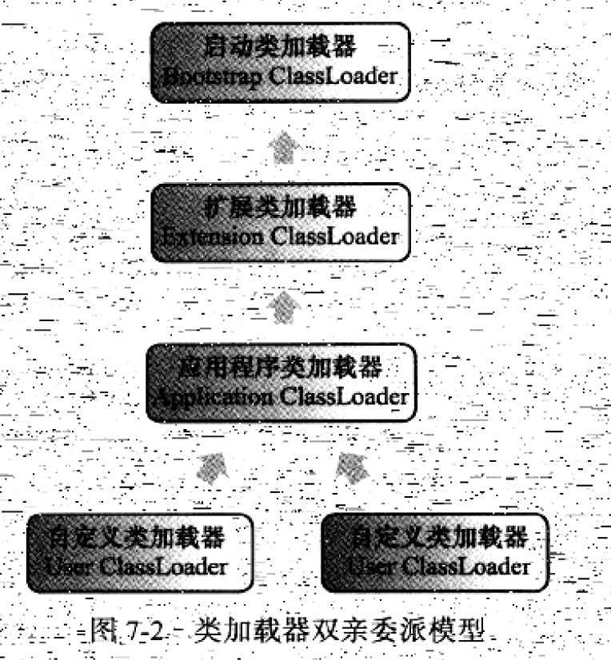

## 5.1 类加载的时机


类的生命周期如上。其中，加载，验证，准备，初始化的顺序是确定的。解析的时刻不确定，可以在初始化之前或者之后（这样做是为了支持动态绑定）

- 加载(Loading)的时机，Java虚拟机并没有强制约束，可以由虚拟机自由把握。

- 下面五中情况必须对类进行“初始化”，当然，加载，验证，准备需要在此之前完成。
  1. 使用new关键字实例化对象时，读取或者设置一个类的静态字段（被final修饰除外），以及调用一个类的静态方法时
  2. 对类进行反射调用时
  3. 当初始化一个类时，如果发现其父类没有被初始化过，需要先初始化其父类
  4. 当虚拟机启动时，用户需要指定要执行的主类(也就是包含main函数的那个类)，虚拟机会初始化这个主类
  5. 当使用jdk1.7的动态语言支持时。。。（不明白）

- 下面情况不会触发类的初始化
  1. 通过子类引用父类的静态字段，不会触发子类初始化
  2. 通过数组定义来引用类，不会触发此类的初始化
  3. 访问类的常量，常量在编译阶段就会存入调用类的常量池，本质上并没直接引用到定义常量的类，因此不会触发定义常量的类的初始化
- 对于接口来说，接口也有初始化过程，用来定义接口中定义的成员变量，特别的是，在一个接口初始化时，并不要求父接口全部完成初始化，只有在真正使用到父接口的时候（如引用接口中定义的常量）才会初始化。

## 5.2 类加载的过程

### 5.2.1 加载

在加载阶段需要完成三件事

1. 通过一个类的全限定名来获取定义此类的二进制字节流
2. 将这个字节流所代表的静态存储结构，转化为方法区的运行时数据结构
3. 在内存中生成一个代表这个类的java.lang.Class对象，作为方法区这个类的各种数据的访问入口

加载的来源包括：

- ZIP包中，例如JAR、EAR、WAR
- 网络中获取，例如Applet
- 运行时计算生成，用得最多的就是动态代理
- 其他文件生成，例如JSP

对于数组类而言，不需要类加载器创建，而是虚拟机直接创建的,一个数组类创建过程遵循以下规则：

- 如果数组的组件类型是引用类型，则递归采用这些规则去加载这个组件类型
- 如果数组的组件类型不是引用类型（如int[]数组），虚拟机会把数组标记为与引导类加载器关联
- 数组的可见性与它的组件类型的可见性一致，如果组件类型不是引用类型，那数组类的可见性默认为public

### 5.2.2 验证

验证是连接阶段的第一步，这一步是为了确保Class文件的字节流包含的信息符合当前虚拟机的要求，并且不会威胁虚拟机自身的安全。这一步的工作量占了整个类加载子系统相当大的一部分时间。大致分为四个阶段：文件格式验证，元数据验证，字节码验证，符号引用验证

1. 文件格式验证：验证字节流是否符合Class文件格式的规范，并且能被当前版本的虚拟机处理，例如：

   - 是否是魔数0xCAFEBABE开头
   - 主次版本号是否在当前虚拟机处理范围之内
   - Class文件中各个部分及文件本身是否有被删除的或附加的其他信息

2. 元数据验证：这个阶段对类的元数据信息进行语义分析，以保证其符合Java语言规范的要求，这个阶段可能包括的验证点如下：

   - 这个类是否有父类（除了java.lang.Object外，所有类都应该有父类）
   - 这个类的父类是否继承了不允许被继承的类（被final修饰的类）
   - 如果不是抽象类，是否实现了父类或者接口之中要求实现的全部方法
   - 类中的字段，是否与父类矛盾（例如覆盖了父类的final字段）

3. 字节码验证：第三阶段是整个验证过程中最复杂的一个阶段，将要通过数据流和控制流分析，对类的方法体进行校验分析，确保被校验类的方法在运行时不会做出危害虚拟机安全的事件，例如

   - 保证跳转指令不会跳转到方法体以外的字节码指令上
   - 保证方法体中的类型转换是有效的，比如可以把子类赋值给父类数据类型，但是把父类对象赋值给子类，甚至把对象赋值给完全不相干的数据类型，是危险和不合法的。
   - 在操作栈中放置一个int类型的数据，使用时却按long类型来加载入本地变量表中。

   即使一个方法通过了验证也不一定是安全的。例如停机问题，用程序去校验程序逻辑是无法做到绝对准确的，也就是不能预测程序能否在有限时间内结束运行。在JDK1.6之后进行了一项优化，给方法体的Code属性的属性表中增加了一项名为“StackMapTable”的属性，该属性描述了方法体中的所有基本块开始时本地变量表和操作数栈应有的状态，在字节码验证阶段，不用再去推到这些状态的合法性，只需要检测StackMapTable中的记录是否合法即可，从而节省时间。

4. 符号引用验证：这个阶段的校验发生在虚拟机将符号引用转化为直接引用的时候，这个转化动作将在连接的第三个阶段-解析中发生。符号引用验证可以看做是对类自身以外的信息进行匹配性验证，通常需要验证一下内容：

   - 符号引用中通过字符串描述的全限定名是否能找到对应的类
   - 在指定类中是否存在符合方法的字段描述符以及简单名称所描述的方法和字段
   - 符号引用中的类，字段，方法的访问性（private,protected,public,default）是否可以被当前类访问

   符号引用验证是为了保证解析动作能正常执行。

验证阶段对于虚拟机的类加载机制来说，非常重要，但不是一定必要，如果所允许的全部代码都已经被反复使用和验证过，可以在实施阶段考虑关闭大部分的类验证措施，以缩减虚拟机类加载时间。

### 5.2.3 准备

准备阶段是正式为类变量分配内存并设置类变量初始值的阶段。这时候进行内存分配的仅包括类变量（被static修饰的变量），而不包括实例变量，实例变量会随着对象实例化时随着对象一起分配在Java堆中。其次，这里所说的初始值通常情况下是数据类型的零值，例如

```java
public static int value = 123
```

变量value再准备阶段之后的初始值是0，而不是123，把value赋值为123的动作将在初始化阶段才会执行。但是对于类字段属性表中存在的常量，在准备阶段就会被赋值为常量属性所指定的值。例如

``` java
public static final int value = 123
```

在准备阶段就会把value赋值为123

### 5.2.4 解析

解析阶段是虚拟机将常量池内的符号引用替换为直接引用的过程。

- 符号引用：符号引用用一组符号来描述所引用的目标，符号可以使任何形式的字面量，只要使用时能无歧义地定位到目标即可。符号引用的目标不一定已经加载到内存中。
- 直接引用：直接引用可以是直接指向目标的指针，相对偏移量或者是一个能间接定位到目标的句柄。直接引用是和虚拟机实现的内存布局有关，同一个符号引用在不同虚拟机实例上翻译出来一般不会相同。如果有了直接引用，那引用的目标必定存在于内存中。

虚拟机并未要求解析阶段的具体发生时间，可以在被类加载器加载时就对符号引用进行解析，也可以等到一个符号引用将要被使用前才去解析它，也就是只要求在执行anewarray,checkcast,getfield,getstatic,instanceof,invokedynamic,invokeinterface,new等16个用于操作符号引用的字节码指令之前，先对符号引用进行解析。

对同一个符号引用进行多次解析是很常见的事情。如果一次成功，后面应该一直成功，反之亦然。

对于invokedynamic指令，上面的规则不成立，当碰到前面某个已经由invokedynamic指令触发过解析的符号引用时，并不意味着这个解析结果对于其他invokedynamic指令也同样生效。因为invokedynamic指令就是为了支持动态语言，这他所对应的引用称为动态调用点限定符，这里的动态指的是程序运行到这里时，解析动作才能进行。

解析动作主要针对7类符号引用进行，这里只分析四种

1. 类或者接口的解析，例如，当前类为D,将符号引用N,解析为一个类或接口的直接引用C

   1. 如果C不是一个数组类型，会将代表N的全限定名传递给D的类加载器去加载这个类C，在加载过程中可能触发相关加载动作，例如加载这个类的父类或实现的接口，一旦这个过程出现任何异常，解析过程就宣告失败
   2. 如果是数组类型，且数组的元素类型为对象，也就是N的描述符是“[Ljava/lang/Integer”，那将会安装第一点的规则加载数组元素类型，需要加载的元素类型就是“java.lang.Integer”，接着由虚拟机生成一个代表此数组维度和元素的数组对象。
   3. 如果上面步骤没有出现任何异常，那么C在虚拟机中实际上已成为一个有效的类或接口了，但在解析完成之前还要进行符号引用验证，确认D是否有队C的访问权限

2. 字段解析，对字段解析，首先会解析字段所属的类或接口的符号引用，如果解析成功，用C来表示这个字段所属的类或接口，虚拟机规范要求按照如下步骤对C进行后续字段的搜索

   1. 如果C本身就含有了与目标相匹配的字段，则返回这个字段的直接引用，查找结束
   2. 否则，如果实现了接口，就从下往上搜索各个接口和父接口
   3. 否则，如果C不是java.lang.Object，将按继承关系从下往上递归搜索父类
   4. 否则抛出异常

   如果查找过程成功返回了引用，将会对这个字段进行权限验证

3. 类方法解析，先解析方法所属的类或接口的符号引用，用C表示这个类或接口

   1. 如果发现C是个接口，则抛出异常
   2. 如果在类C中，找到了匹配的方法，返回直接引用，查找结束
   3. 否则，在类C的父类中递归查找与目标相匹配的方法
   4. 否则，在类C实现的接口列表及他们的父接口之中递归查找是否有相匹配的方法，如果有，说明C是个抽象类，抛出异常
   5. 否则，宣告方法查找失败

   最后，如果查找成功则返回直接引用，并对这个方法进行权限验证。

4. 接口方法解析，接口方法解析需要先解析出这个方法所属的类或接口用C来表示，并进行如下步骤

   1. 如果发现C是个类而不是接口，直接抛出异常
   2. 否则，在接口C中查找是否有与目标相匹配的方法，有则返回这个方法的直接引用，查找结束
   3. 否则，在父接口中递归查找
   4. 否则宣告查找失败

   因为接口中所有方法默认都是public的，所以不存在访问权限的问题

### 5.2.5 初始化

初始化时类加载过程的最后一步，在初始化阶段，才真正开始执行类中定义的Java程序代码（或者说是字节码），初始化就是执行类构造器<clinit>()方法的过程。

- <clinit>()方法是编译器自动收集类中的所有类变量的赋值动作和静态语言块(static{}块)中的语句合并产生的，编译器收集的顺序是由语句在源文件中出现的顺序决定的，静态块中只能访问到定义在静态块之前的变量，定义在之后的，可以赋值，但是不能访问。
- <clinit>()方法与实例构造器<init>()方法不同，它不需要显式调用父类构造器。虚拟机会保证在执行子类的<clinit>()方法之前，父类的<clinit>()方法已经执行完毕。因此虚拟机中第一个被执行<clinit>()方法的类肯定是java.lang.Object
- 由于父类的<clinit>()方法先执行，父类中定义的静态语句块要优先于子类的变量赋值操作。
- <clinit>()方法对于类或接口来说不是必需的，如果一个类中没有静态语句块，也没用对变量的赋值操作，那么就不会生成<clinit>()方法
- 接口中不能使用静态语句块，但仍有变量初始化赋值操作，因此仍然有<clinit>()方法。接口与类不同的是，执行接口的<clinit>()方法不需要先执行父接口的<clinit>()方法，只有父接口中的变量被使用到时，父接口才会初始化。
- 虚拟机会保证一个类的<clinit>()方法在多线程环境中被正确地加锁，同步，如果多个线程去同时初始化一个类，那么只有一个线程去执行这个类的<clinit>()方法，其他线程都要阻塞等待。如果在一个类的<clinit>()方法中有耗时很长的操作，就可能造成多个进程阻塞。

## 5.3 类加载器

虚拟机团队把类加载阶段中的“通过一个类的全限定名来获取此类的二进制字节流”这个动作放到虚拟机外部去实现，以便让程序自己决定如何去获取所需要的类，这个动作的代码模块称为“类加载器”。

### 5.3.1 类与加载器

比较两个类是否“相等”，只有在这个两个类是由同一个类加载器加载的前提下才有意义，否则，即使这两个类来自同一个Class文件，被同一个虚拟机加载，只要类加载器不同，这两个类必定不同。

### 5.3.2 双亲委派模型

从Java虚拟机角度来看，只存在两种不同的类加载器：一种是启动类加载器（Bootstrap ClassLoader）,这个类加载器是由C++实现的，是虚拟机的一部分；另一种就是其他的类加载器，这些加载器都是由Java实现的，独立于虚拟机外部并且全部继承自java.lang.ClassLoader。

从Java开发人员的角度来看，绝大部分Java程序将用到以下三种系统提供的类加载器

- 启动类加载器（Bootstrap ClassLoader）：负责将<JAVA_HOME>/lib目录中的，以及被-Xbootclasspath参数所指定的路径中的，并且是虚拟机识别的类库加载到虚拟机内存中。启动类加载器无法被Java程序直接引用。
- 扩展类加载器（Extension ClassLoader）：负责加载<JAVA_HOME>/lib/ext目录中，以及被java.ext.dirs系统变量所指定的路径中的所有类库，开发者可以直接使用扩展类加载器。
- 应用程序类加载器（Application ClassLoader）：由于这个类加载器是ClassLoader中的getSystemClassLoader()方法的返回值，所以一般称它为系统类加载器。负责加载用户类路径（ClassPath）上所指定的类库，开发者可以直接使用这个类加载器，如果应用程序中没有自定义过自己的类加载器，一般情况下这个就是程序中默认的类加载器。




双亲委派模型工作过程：如果一个类加载器收到了类加载请求，它首先不会自己去尝试加载这个类，而是把这个请求委派给父类加载器去完成，每个层次的类加载器都是如此，因此所有的加载请求都应该传送到顶层的启动类加载器中，只有父类反馈自己无法完成这个加载请求（它的搜索范围内没有找到所需的类）时，子加载器才会尝试自己去加载。

使用双亲委派模型的好处是，Java类随着它的类加载器一起具备了一种带有优先级的层次关系。如果没有双亲委派模型，用户自己写一个java.lang.Object类放在ClassPath中，那系统中将会出现多个不同的Object类，应用程序将变得一片混乱。

### 5.3.3 破坏双亲委派模型

因为双亲委派模型并不是强制性的约束模型，而是Java推荐给开发者的类加载器实现模式。双亲委派模型共出现过三次“被破坏”的情况

1. 因为双亲委派模型在JDK1.2才出现，而ClassLoader类在1.0时代就存在，为了向前兼容，不得不做出一些破坏这个模型的妥协。
2. 基础类是由启动类加载器去加载，但是当基础类需要调用用户的代码，也就是用启动类去加载ClassPath下的代码，是无法实现的，因此Java团队引入了线程上下文类加载器（Thread Context ClassLoader）。最终，就是父加载器调请求子加载器去完成类加载的动作，实际上是逆向使用了双亲委派模型，JDNI，JDBC等都采用了这种方式。
3. 第三次破坏行为，是因为用户对程序动态性的追求而导致的，例如热替换，热部署。在OSGi环境下出现了平级的类加载情况。


