# 1. Java内存区域与内存溢出异常

##   1.1 运行时数据区域

Java 内存结构(区别于Java内存模型)


### 1.1.1 程序计数器(PC寄存器)

- 程序计数器是当前线程所执行的字节码的行号指示器。字节解释器在解释执行字节码的时候，通过改变这个计数器的值来读取下一条需要执行的字节码指令，分支，循环，跳转，异常处理，线程恢复等功能都依赖这个计数器。

- 为了线程切换后能恢复到正确的执行位置，每条线程都需要一个独立的程序计数器，互不影响，这类的内存区域为“线程私有”内存。

- 如果线程正在执行的是java方法，则计数器记录的是正在执行的虚拟机字节码指令的地址，如果正在执行的是native方法，这个计数器值为Null。

- 这个内存区域是唯一一个在JVM规范中没有规定任何OOM的区域。

### 1.1.2 Java虚拟机栈

- 线程私有的
- 用来描述Java方法执行的内存模型，每个方法在执行的时候，创建一个栈帧，里面存储局部变量表，操作数栈，动态链接，方法出口等信息。
- 局部变量表存放了编译期可知的各种基本数据类型(boolean, byte,char)，对象引用(reference类型)和returnAddress类型。
- 64位的long和double类型会占用两个局部变量空间，其余数据类型占用一个。
- 局部变量表内存在编译期就能确定，并完成分配。

### 1.1.3 本地方法栈

- 作用和Java虚拟机栈类似，后者为虚拟机执行Java方法服务。
- 本地方法栈为虚拟机调用的Native方法服务。
- **HotSpotVM中不区分VM栈和native栈，直接合二为一。**

### 1.1.4 Java堆

- 被所有线程共享
- 为对象实例分配空间
- 不是所有的对象都在堆里，例如，经过逃逸分析，对象不会被别的线程使用，则分配栈上内存，这样能减轻GC压力。
- **堆内存划分由使用的垃圾收集器决定**，不同的收集器可能有不同的内存划分方式。
- 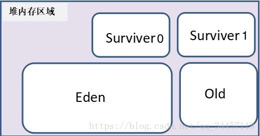
  - Eden:该区域是最主要的刚创建的对象的内存分配区域，绝大多数对象都会被创建到这里（除了部分大对象通过内存担保机制创建到Old区域，默认大对象都是能够存活较长时间的），该区域的对象大部分都是短时间都会死亡的，故垃圾回收器针对该部分主要采用标记整理算法了回收该区域。
  - Surviver:该区域也是属于新生代的区域，该区域是将在Eden中未被清理的对象存放到该区域中，该区域分为两块区域，采用的是复制算法，每次只使用一块，Eden与Surviver区域的比例是8:1，是根据大量的业务运行总结出来的规律。
  - Old:该区域是属于老年代，一般能够在Surviver中没有被清除出去的对象才会进入到这块区域，该区域主要是采用标记清除算法。

### 1.1.5 方法区

- 被所有线程共享
- 用于存储已被虚拟机加载的类信息，常量final，静态变量static，及时编译器JIT编译后的代码等数据。
- 1.8 以前，在HotSpotVM中，方法区又叫做永久代(Permanent Generation)，也可以说用永久代来实现的方法区，其他的虚拟机是不存在永久代的概念。
- 1.7中，部分永久代中的数据已经转移到了Java heap或者Native heap，譬如符号引用(Symbols)转移到了native heap；字面量(interned strings)转移到了java heap；类的静态变量(class statics)转移到了java heap。
- 1.8中，移除了永久代，取而代之的是元空间Metaspace，它们最大的区别是，元空间不在VM里，而是使用本地内存，因此，默认情况下，元空间的大小仅受本地内存限制，但可以通过参数来指定元空间的大小。
- 移除的原因：
  1. 字符串存在永久代中，容易出现性能问题和内存溢出。
  2. 类及方法的信息等比较难确定其大小，因此对于永久代的大小指定比较困难。
  3. 永久代会为 GC 带来不必要的复杂度，并且回收效率偏低。
  4. 为了融合HotSpot 和JRockit虚拟机，JRockit没有永久区。

### 1.1.6 运行时常量池

- 是方法区的一部分
- Class 文件中除了有类的版本，字段，方法，接口等描述信息外，还有一项信息是常量池，用于在编译期生成的**各种字面量和符号引用**，这部分内容将在类加载后进入方法区的运行时常量池中存放。此外，由符号引用翻译出来的**直接引用**也会被放到运行时常量池中。
- String.intern()方法也会将新的常量放入池中。

### 1.1.7 直接内存

- 不属于JVM
- 例如在NIO中，使用直接内存，实现0拷贝，极大提升性能
- 受限于本机总内存

## 1.2 HotSpot虚拟机对象

### 1.2.1 对象的创建过程

1. 当遇到一个new关键字时，先检查是否能在常量池中定位到一个类的符号引用，并检查这个类是否已经加载，解析和初始化过，如果没有，则执行类加载过程。
2. 分配内存，对象所需内存在类加载的时候就能完全确定。分配的方法有，指针碰撞法，空闲列表，TLAB。TLAB是为每个线程预留的一块内存，先在这块内存上为对象分配内存。
3. 将分配的内存空间初始化为零
4. 对对象头进行设置
5. 执行初始化方法

### 1.2.2 对象的内存布局

对象布局可以分为三部分，**对象头**，**实例数据**，**对齐填充**

1. 对象头，分为两部分，Mark Word和类型指针
   - Mark Word用于存储自身的数据，比如哈希吗，GC分代年龄，锁状态标志，线程持有的锁，偏向线程ID。
   - 类型指针表示该对象是某个类的实例。
   - 如果对象是Java数组，则对象头中还有数组的长度信息。
2. 实例数据部分存储真正的有效信息，也就是定义的各个字段的内容。分配策略会影响到字段的存储顺序，以便节省空间。
3. 对齐填充部分不是必须的，因为HotSpot VM要求对象起始地址必须是8字节的整数倍，也就是说对象大小必须是8字节的整数倍，当实例数据不满足上述条件时，通过对齐填充来补全。

### 1.2.3 对象的访问

对象的访问有两种方式

1. 通过句柄访问

   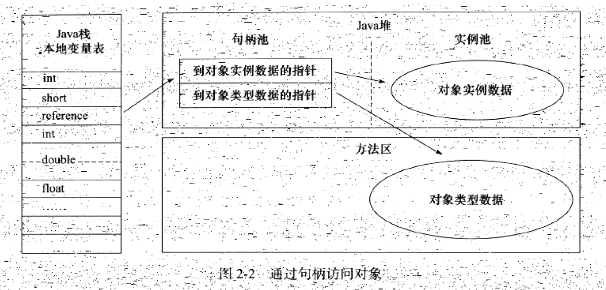

   好处是，当对象在内存中被移动时(GC时会经常移动对象),不用改变reference的值。缺点是速度相对较慢。

2. 通过直接指针访问

   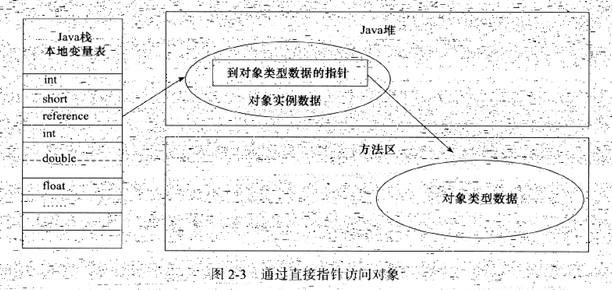

   好处是速度更快，节省了一次指针定位的时间开销。HotSpot采用第二这一种。

## 1.3 OOM

### 1.3.1 栈溢出

如何增加可创建的线程数量？

> (MaxProcessMemory - JVMMemory - 最大方法区容量 -ReservedOsMemory) / (ThreadStackSize) = Number of threads

MaxProcessMemory为操作系统能分配给进程的最大内存，这个不能改。

JVMMemory为heap大小，所以应该减少heap大小。

ReservedOsMemory保留的操作系统内存。

ThreadStackSize为每个线程分到的栈容量，应该减小。

# 2. 垃圾收集器与内存分配策略

## 2.1 对象存活分析

### 2.1.1 可达性分析

在Java中，可作为GCRoots的对象有**(GC Root是对象)**

1. 虚拟机栈中(栈帧中的本地变量表)中引用的对象
2. 方法区中类静态属性引用的对象
3. 方法区中常量引用的对象
4. 本地方法栈中JNI(Native方法)引用的对象
5. JVM内部的引用，如基本数据类型对应的Class对象，异常对象(NPE,OOME)，系统类加载器
6. 同步锁持有的对象

**并发的可达性分析：**并发标记过程中，可能把消亡的对象标记为存活，或者把存活的对象标记为消亡。

解决方案：

1. 增量更新：标记过程中添加了新的引用，扫描完成后对新引用对象重新扫描一遍。（CMS）
2. 原始快照：不管扫描过程中的引用关系变化，按照扫描开始的那一刻的对象图快照来进行搜索。（G1，Shenandoah）

### 2.1.2 引用类型

1. 强引用
2. 软引用，SoftReference来实现，当快要发生内存溢出时，将这些对象列入回收范围进行二次回收。如果内存还不够，则抛出OOM异常。
3. 弱引用，只能存活于下次垃圾回收之前，无论当前内存是否够，都会回收只被弱引用关联的对象。
4. 虚引用，PhantomReference，为一个对象设置虚引用，当这个对象被GC时，收到一个系统通知。

### 2.1.3 回收方法区

一个类满足三个条件时，可以判定为无用的类，可以被回收。

1. 该类的所有实例已经被回收
2. 加载该类的ClassLoader已经被回收
3. 该类对应的java.lang.Class对象没有在任何地方被引用，无法在任何地方通过反射访问该类的方法。

虚拟机提供了参数来控制类的回收，在大量使用反射，动态代理，CGLib等Bytecode框架，动态生成jsp，以及OSGi这类频繁自定义ClassLoader的场景都需要虚拟机具备卸载类的功能。

## 2.2 垃圾收集算法

### 2.2.1 标记-清除法

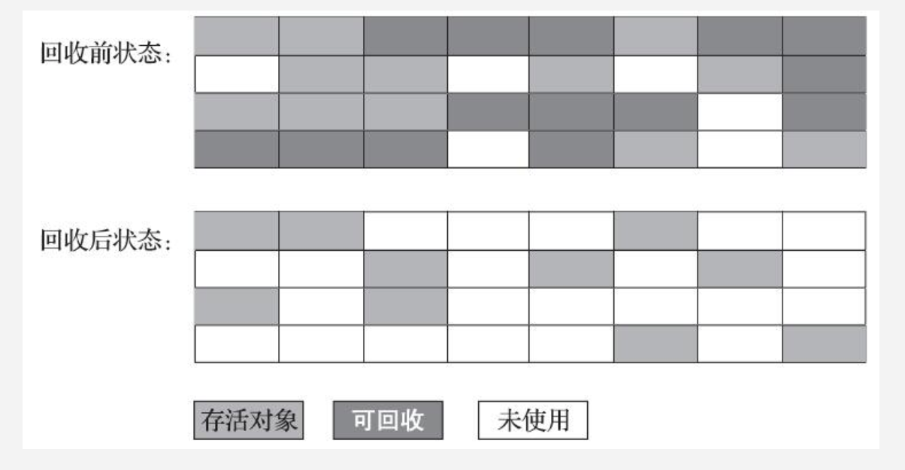

首先标记出需要清除的对象，完成标记后统一回收被标记的对象。

缺点是有两个：

1. 标记和清除的效率都不高
2. 产生大量碎片

### 2.2.2 标记-复制算法

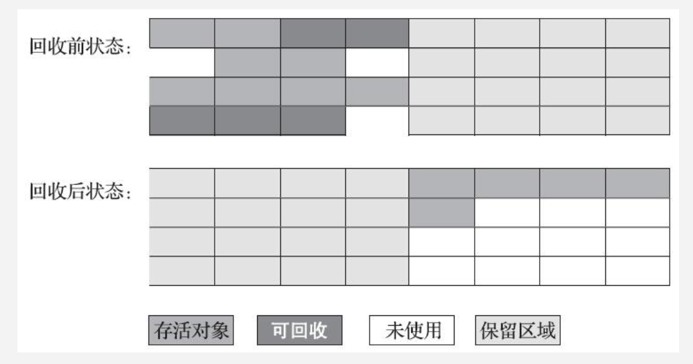

将内存分为两块，只用其中一块，在GC时，将一块中的存活对象复制到另一块。

**缺点是内存的使用率低。**

在HotSpot中，新生代分为Eden区，和两个Survivor区，Eden:Survivor为8:1，在GC时，将Eden区和当前使用的Survivor区中存活的对象复制到另外一个Survivor区中，如果此时这个Survivor区空间不够用时，则需要依赖其他内存(老年代Old)进行分配担保，也就是直接分配到老年代，具体规则见后面。

### 2.2.3 标记-整理算法

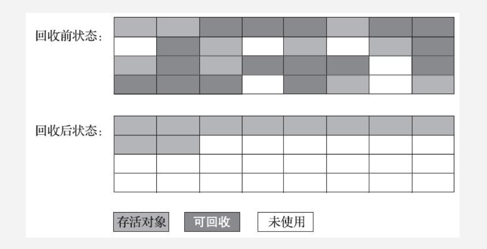

**适用于老年代的垃圾回收**，因为老年代的对象存活率较高，如果用复制算法，则会进行大量复制，更关键是只有50%的利用率。

标记整理算法，首先将垃圾对象标记，然后将所有还存活的对象移动到内存的一端，将清理掉边界意外的内存。

### 2.2.4 分代收集算法

在新生代中，每次垃圾回收都有大量对象死去，只有少量存活，所以适用复制算法。在老年代中，对象存活率高，没有额外空间进行分配担保，就必须使用标记清除，或者标记整理算法。

## 2.3 HotSpot 算法实现

### 2.3.1 枚举根节点

在完成GC Roots枚举时，使用一种叫做OopMap的数据结构，来得知哪些地方存放着对象引用，而不用遍历所有内存。

### 2.3.2 安全点

Java中的各个线程只有执行到安全点时，才能进行GC。

现在的虚拟机都使用主动式中断，即需要GC时，设置一个标志位，各个线程在运行中会去主动轮询这个标志位，如果为真，就把自己中断挂起。采用缺页中断实现。

轮询标志的时间点和安全点是重合的，例如方法调用，循环跳转，异常跳转等

### 2.3.3 安全区

当线程处于Sleep或者Blocked时，无法去询问标志位，也就无法自己走到安全点去挂起。解决方法是，将该线程标记为安全区，也就是safe region，当线程执行到Safe Region中的代码时，首先标记自己进入了安全区，GC时，就不管这些进入安全区的线程，当线程要离开安全区时，比如Sleep结束，它会判断系统是否完成了根节点枚举或者整个GC过程，如果完成，则继续执行，如果没完成，则等待直到收到可以离开安全区的信号为止。

### 2.3.4 记忆集与卡表

OopMap保存了新生代+老年代的全部GC Root。实际回收时会更多关注新生代的垃圾回收，而只从OopMap获取新生代的GC Root是不够的，因为新生代的对象可能被老年代引用，存在跨代引用的情况，在这种情况下如果去遍历所有的老年代GC Root，会造成效率的严重下降。

解决方法：引入记忆集，该集合中记录了被老年代引用的新生代对象。所以每次GC时，对新生代GC Root和记忆集中的对象进行遍历就好了。

卡表：记忆集的一种实现方式，CARD_TABLE中每一个元素都对应着一个512字节的内存块。元素值为1，代表对应的内存块中有某些对象存在跨代引用。

```
CARD_TABLE[this address >> 9] = 0
```

**写屏障：**HotSpot通过写屏障(与volatile用到的内存屏障不同)技术维护卡表状态，每次对引用对象赋值时会产生一个通知，并执行一个操作将卡表对应的元素置为1。

## 2.4 垃圾收集器种类

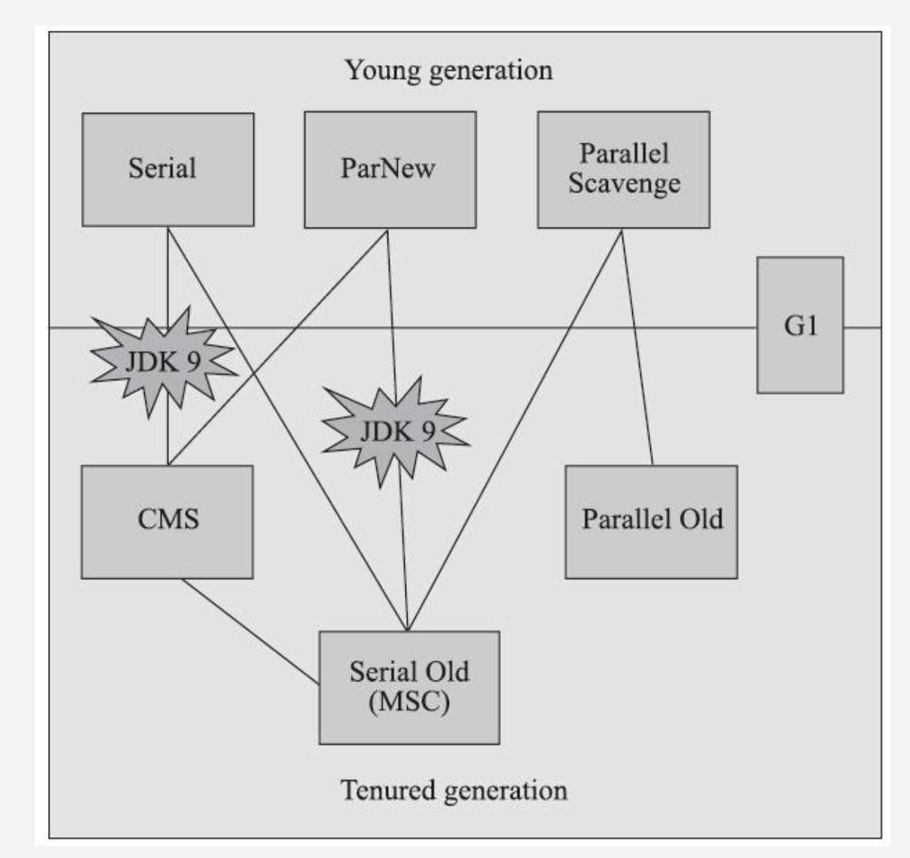

### 2.4.1 Serial收集器

最基本，历史最悠久的收集器，只会使用一个CPU和单线程去执行GC，是JVM在Client模式下的默认收集器。

- 新生代采用标记复制算法
- 老年代中，SerialOld收集器采用标记整理算法

### 2.4.2 ParNew收集器

ParNew收集器就是Serial收集器的多线程版本

- 只有ParNew能与CMS搭配使用
- ParNew在单CPU环境中，效果绝不会比Serial收集器好
- 并行收集器是指多个线程参与GC，但是用户线程仍然处于等待状态
- 并发收集器是指用户线程和GC线程同时执行

### 2.4.3 Parallel Scavenge

- 新生代收集器，基于标记-复制算法。 

- 又叫吞吐量优先收集器，特征是能够容忍长时间停顿，因此换来吞吐量提升。
- 相比于ParNew，提供了两个参数用于精确控制吞吐量，同时拥有自适应调节策略来配置内存区域划分。
- Parallel Scavenge收集器重点关注吞吐量，也就是运行用户代码时间，和CPU总消耗时间的比例。相比较CMS等收集器更关心停顿时间，因此CMS适用于需要与用户交互的程序，而Parallel Scavenge收集器适用于后台计算任务这类不需要太多交互的程序。
- 当开启UseAdaptiveSizePolicy开关时，就不需要指定新生代大小，Eden和Survivor的比例了，虚拟机会根据当前系统运行情况自动调整。

### 2.4.4 Parallel Old收集器

- Parallel Old收集器是Parallel Scavenge收集器的老年代版本，使用多线程和标记整理算法。
- 在注重吞吐量，以及CPU资源敏感的场合，都可以考虑Parallel Scavenge + Parallel Old的组合。

### 2.4.5 CMS收集器

- 工作在老年代，采用标记清除。
- 是一种并发的垃圾收集器，也就是垃圾回收线程和用户线程可以同时工作
- CMS以最短停顿时间为目标，在重视服务响应速度的场景下，CMS就非常符合
- 整个过程分为四个过程
  1. 初始标记，需要stop the world，仅仅标记一下GCRoots能直接关联到的对象
  2. 并发标记，就是进行GC Roots Tracing
  3. 重新标记，为了修正在并发标记期间因为用户程序继续运行而导致标记产生变动的那一部分对象的标记记录。比初始标记阶段稍微长一点，但远比并发标记的时间短。
  4. 并发清除
- 优点是并发，低停顿
- 缺点是:
  1. 对CPU资源敏感，在并发阶段，虽然不会导致用户线程停顿，但是因为占用了一部分CPU资源而导致应用程序变慢，总吞吐率会降低。
  2. 无法处理浮动垃圾，也就是在并发清理过程中产生的垃圾，也是因为这个原因，需要预留一部分空间，不能像其他收集器那样等老年代快用完才搜集，JDK5默认使用了68%之后就进行回收。
  3. 因为采用标记清除算法，会产生大量碎片，当无法为新对象创建连续新空间时，会触发Full GC。

### 2.4.6 G1收集器

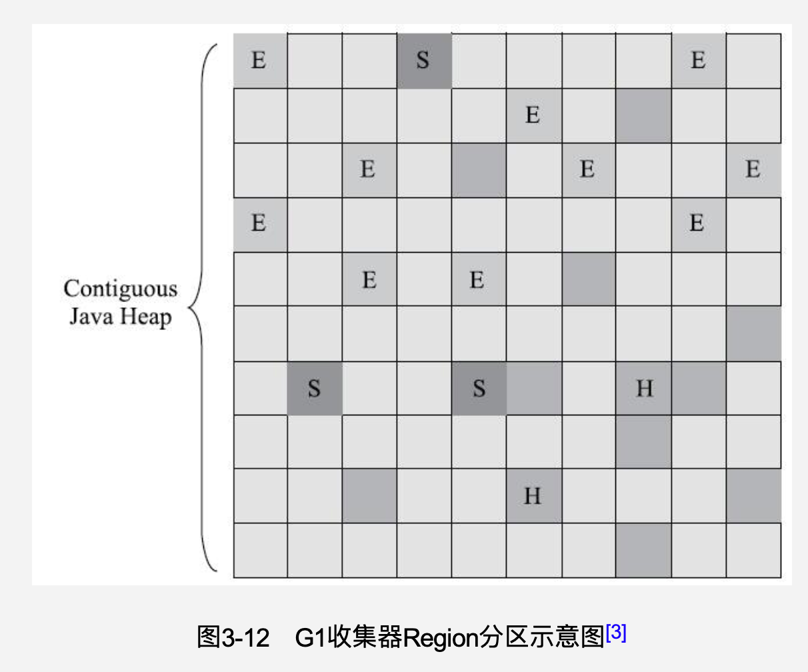

- 同时面向新生代和老年代
- 支持并发与并行，减少停顿时间
- 整体上采用标记-整理算法，从局部上看(两个Region之间)是基于复制算法，因此不会产生碎片
- 可**预测和设置**的停顿时长，因为它可以有计划地避免全堆扫描，通过跟踪每个Region里垃圾的大小，维护一个优先列表，每次根据允许的收集时间，优先回收价值最大的Region。Garbage-first名称的由来。
- 每次对某个对象的Reference类型进行写操作的时候，会检查这个Reference引用的对象和该对象是否处于同一个Region中，如果不是，则加入这个Reference引用的对象所属的region的Remember Set中，在回收内存时，在GC根节点枚举范围内加入Remember Set来实现不对全堆扫描也不会遗漏。
- G1将内存划分为多个相同大小的独立区域Region，每一个Region只能是一种类型，要么young要么old。
- 优点：相比于CMS，可以指定最大停顿时间；不会产生碎片，有利于程序长时间运行。
- 缺点：相比于CMS，额外内存占用10%-20%，主要是卡表占用。额外执行负载高，因为G1的写屏障操作更复杂。

### 2.4.7 ZGC

JDK11加入的ZGC，号称在128G的堆上，最大停顿时间1.68ms

> 与标记对象的传统算法相比，ZGC在指针上做标记，在访问指针时加入Load Barrier（读屏障），比如当对象正被GC移动，指针上的颜色就会不对，这个屏障就会先把指针更新为有效地址再返回，也就是，永远只有单个对象读取时有概率被减速，而不存在为了保持应用与GC一致而粗暴整体的Stop The World。
>
> -R大

- 以低延迟为目标

- 标记整理算法

- 没有分代，没有记忆集

- **劣势**：对象分配速率不会太高。因为没有分代，一次并发收集周期较长。

- **优势**：低延时，高吞吐量。

- 内存布局：大中小Region

- 核心：并发整理的实现

  - **染色指针技术**，将少量额外信息存储在指针(引用)上的技术，信息包括三色标记状态，是否被移动过，是否只能通过finalize方法访问。

    - **缺点**：因为占用了原本属于引用的地址空间，以前64位，现在可用42位。因此ZGC能管理的内存不可以超过4TB。
    - **优点**：
      1. 一旦Region中的存活对象被移走，该Region就可以被释放和重用
      2. 大幅减少内存屏障的使用数量
      3. 染色指针作为一种可扩展的数据结构，可记录更多数据，以进一步提升技能。

  - **虚拟内存映射技术**：将多个虚拟内存地址映射到同一个物理内存地址上。

    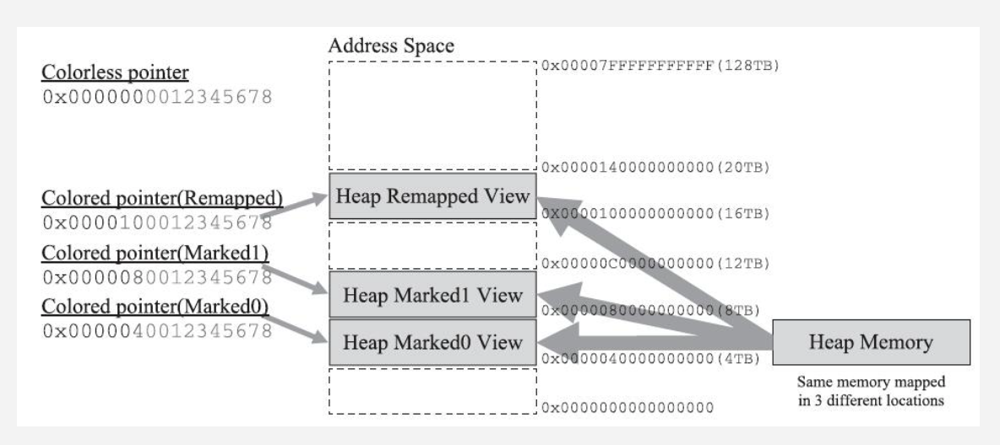

- 运作过程

  1. 并发标记(短暂停顿)：更新染色指针中Marked0，Marked1标志位
  2. 并发预重分配：查询出哪些Region需要清理，将其组成分配集。
  3. 并发重分配：把重分配集中存活对象复制到新的Region上，对象迁移过程中被访问会引发指针的自愈，使其指向新对象。
  4. 并发重映射：修正整个堆中指向重分配集中旧对象的所有引用。(非必要，因为引用可以自愈)

### 2.4.8 垃圾收集器选择

根据关注点，

- 注重吞吐量：如数据分析，科学计算类的任务
- 注重低延迟低停顿：如SLA应用

根据运行环境基础设施，

- 系统架构x86-32/64，ARM/Aarch64
- 处理器数量，内存大小
- 操作系统
- JDK版本

## 2.5 内存分配与回收策略

### 2.5.1 对象优先在Eden分配

- 大多数情况下，对象在新生代Eden区分配，当没有足够空间时，进行一次Minor GC
- 新生代GC，也叫Minor GC，是指发生在新生代的垃圾回收，速度比较快
- Major GC / Full GC，是指发生在老年代的GC，Full GC 比Minor GC慢至少10倍以上，因为老年代采用标记整理，也叫标记压缩的方式。其次，老年代空间一般比新生代要大。

### 2.5.2 大对象直接进入老年代

- 典型的大对象就是Java数组，或者很长的字符串
- 这样做的目的是为了防止大对象在Eden区和Survivor区之间发生大量复制

### 2.5.3 长期存活的对象将进入老年代

- 对象每经过一次Minor GC，就增加一岁，当年龄到了一定岁数（默认15岁），就晋升到老年区

### 2.5.4 动态对象年龄判断

- 并不永远是要求对象年龄到了阈值才能晋升老年代，当相同年龄的对象大小的总和大于Survivor空间的一半，年龄大于或者等于该年龄的对象就可以直接进入老年代。

### 2.5.5 空间分配担保

- 在Minor GC 之前，会检查老年代最大连续空间是否大于新生代所有对象总空间，如果是，则MinorGC是安全的，如果不是，会看HandlePromotionFailure设置为是否允许担保失败。
  - 如果是，尝试进行一次Minor GC
  - 如果不是，则进行一次Full GC

# 3. 虚拟机性能监控与故障处理

## 3.1 JDK的命令行工具

### 3.1.1 jps

全称JVM Process Status Tool, 可以列出正在运行的虚拟机进程，并显示虚拟机执行主类，以及这些进程的本地虚拟机唯一ID(LVMID)。LVMID与操作系统的进程ID是一致的。

### 3.1.2 jstat：虚拟机统计信息监视工具

- jstat是用于监视虚拟机各种**运行状态信息**的命令行工具
- 显示本地或远程虚拟机进程中的类装载，内存，垃圾收集，JIT编译等运行数据
- 能够查到的虚拟机信息主要分为三类：类装载，垃圾收集，运行期编译状况


### 3.1.3 jinfo：Java配置信息查询工具

- 作用是实时查看虚拟机各项参数
- 使用jps -v只能查看虚拟机启动时显式指定的参数列表，而使用jinfo -flag可以查询未显式指定的参数
- 使用jinfo -sysprops可以查看虚拟机System.getProperties()的内容

### 3.1.4 jmap：Java内存映像工具

- jmap命令用于生产堆转储快照（称为heapdump或dump文件），除此之外可通过设置JVM参数-XX:+HeapDumpOnOutOfMemoryError参数，让JVM在出现OOM异常之后自动生成dump文件
- -histo 选项，显示堆中对象统计信息，包括类，实例数量，合计容量

### 3.1.5 jhat:虚拟机堆转储快照分析工具

- jhat和jmap搭配使用，用来分析jmap生成的堆转储快照
- 但是一般是使用其他dump分析工具

### 3.1.6 jstack：Java堆栈跟踪工具

- jstack用于生成虚拟机当前时刻的线程快照（称为threaddump或者javacore文件），
- 线程快照就是虚拟机内每一条线程正在执行的方法堆栈的集合，生成线程快照主要是为了定位线程出现长时间停顿的原因，如线程间死锁，死循环，请求外部资源导致的长时间等待等
- 线程出现停顿的时候，调用jstack来查看各个线程的调用堆栈，就知道没有响应的线程到底在后台做什么事情，或者等待什么资源

## 3.2 JDK可视化工具

### 3.2.1 JConsole：Java监视与管理控制台

- 提供远程监控功能
- 内存监控，线程监控

### 3.2.2 VisualVM：多合一故障处理工具

- 目前为止随JDK发布的功能最强大的运行监控和故障处理程序，还提供性能分析功能
- 可以下载各种插件来增强功能
- 可以生成并浏览堆转储快照
- 分析程序性能，也就是分析CPU和内存使用情况
- BTrace动态日志追踪插件，可以在不停止JVM的情况下，动态插入调试代码

# 4. 类文件结构

## 4.1 Class类文件结构

### 4.1.1 魔数与Class文件的版本

- 魔数的唯一作用是确定这个文件是否为一个能被虚拟机接受的Class文件
- Jpg, gif图片中都有魔数，使用魔数而不是使用文件扩展名来识别文件类型是出于安全考虑，因为扩展名可以改变
- Class文件的魔数为0xCAFEBABE
- 紧接着魔数的4个字节存储Class文件的版本号(与jdk版本有关)
- JVM不接受超过其版本号的Class文件

### 4.1.2 常量池

- 版本号之后是常量池入口

- 可以理解为Class文件的资源仓库，是与其他项目关联最多的数据类型，也是占用空间最大的数据项目之一

- 常量池主要存放两大类常量

  1. 字面量，如文本字符串，声明为final的常量值等。

  2. 符号引用，包含三类常量:

     - 类和接口的全限定名
     - 字段的名称和描述符
     - 方法的名称和描述符

     符号引用会在类创建时或运行时解析，翻译到具体的内存地址中。

- Class文件中定义的方法名，字段名的长度不能超过64K

- 分析Class文件字节码的工具：javap -verbose

### 4.1.3 访问标志

- 常量池结束后，紧接着的两个字节代表访问标志，用于识别一些类或者接口层次的访问信息
- 例如，这个类是Class还是接口，是否为public，是否为abstract，如果是类，是否为final等

### 4.1.4 类索引，父索引与接口索引集合

- 类索引（this_class）和父类索引（super_class）和接口索引（interfaces）是一组u2类型的数据集合，Class文件中由这三项数据来确定这个类的继承关系。

### 4.1.5 字段表集合

- 字段表（field_info）用于描述接口或者类中声明的变量
- 字段包括类级变量以及实例级变量
- 可以包括的信息为，作用域，是类变量还是实例变量，可变性，并发可见性，数据类型等
- 字段表集合不会列出从超类或者父接口继承而来的字段

### 4.1.6 方法表集合

- 对方法的描述包括，访问标志，名称索引，描述符索引，属性表集合
- 方法内的代码被编译后，放在方法属性表集合中一个名为“Code”的属性里面
- 如果父类方法在子类中没有被重写，方法表集合中就不会出现来自父类的方法信息
- 在Class文件里面，可以有两个方法，返回值不同，而描述符的其余部分完全相同，但在Java层面不允许

### 4.1.7 属性表集合

在Class文件，字段表，方法表中都可以携带自己的属性表集合

1. Code属性：Java方法体中的代码经过编译处理后，变成字节码存储在Code属性内，方法不允许超过65535条字节码。
2. Exceptions属性：作用是列举出方法中可能抛出的受检查异常，也就是在throws关键字后面列举的异常
3. LineNumberTable属性：用于描述Java源码行号与字节码行号之间对应关系，如果取消生成这项信息，抛出异常时，则不会显示行号
4. LocalVariableTable属性：用于描述栈帧中局部变量表中的变量与Java源码中定义的变量之间的关系，如果取消生成，其他人引用这个方法时，参数名称都会丢失，IDE会使用诸如arg0，arg1之类的占位符代替原有参数名。
5. SourceFile：用于记录生成这个Class文件的源码文件名称，如果取消生成，抛出异常时，堆栈中将不会显示出错代码所属的文件名。
6. ConstantValue属性：作用是通知虚拟机自动为静态变量赋值。只有被static关键字修饰的变量（类变量）才可以使用这项属性。
7. InnerClasses属性：用于记录内部类与宿主类之间的关联。如果一个类中定义了内部类，那编译器将会为它以及它所包含的内部类生成InnerClass属性。
8. Deprecated和Synthetic属性：Deprecated用于表示某个类，字段或者方法，被程序作者定为不再推荐使用。Synthetic表示此字段或者方法不是由Java源文件直接产生的。
9. StackMapTable属性：这个属性会在类加载的字节码验证阶段被新类型检查验证器使用，使用新的检查器目的在于替代以前的比较消耗性能的验证器，大幅提升字节码验证的性能。
10. Signature属性：可以出现在类，字段和方法表结构的属性表中。主要作用是记录泛型签名信息，来弥补泛型擦除带来的缺陷（例如用反射无法得到泛型信息）。
11. BootstrapMethods属性：用于保存invokedynamic指令引用的方法限定符。
12. 运行时注解相关属性

### 4.2 字节码指令介绍

- 因为限定了虚拟机操作码的长度为一个字节，所以指令集的操作码总数不能超过256个。
- 因为总量有限，不能为每种类型创建一种命令，因此大多数对于boolean、byte、short和char类型的操作，实际上都是使用相应的int类型作为运行类型。
- 虽然类实例和数组都是对象，虚拟机对实例对象和数组的创建与操作使用了不同的字节码指令。
- 同步指令：虚拟机通过从方法常量池的ACC_SYNCHRONIZED标志来判断一个方法是否声明为同步方法。如果是就要求线程成功持有管程，指令集中monitorenter和monitorexit两条指令是用来支持synchronized关键字的。

# 5. 虚拟机类加载机制

## 5.1 类加载的时机

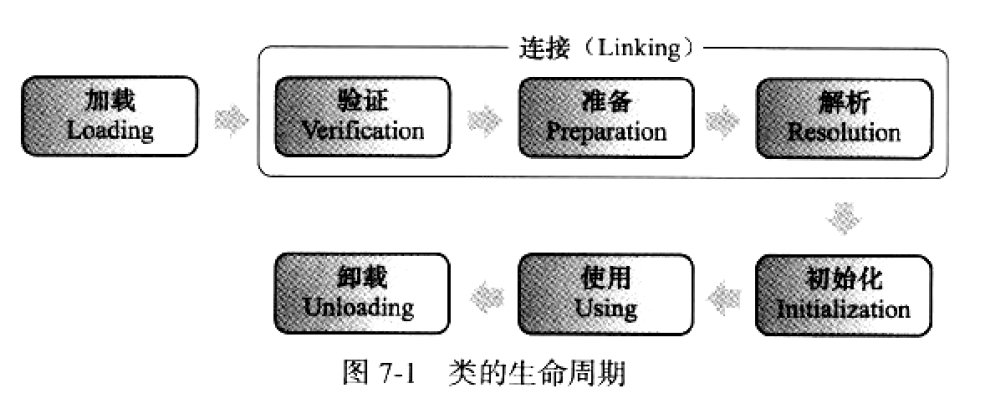

类的生命周期如上。其中，加载，验证，准备，初始化的顺序是确定的。解析的时刻不确定，可以在初始化之前或者之后（这样做是为了支持动态绑定）

- 加载(Loading)的时机，Java虚拟机并没有强制约束，可以由虚拟机自由把握。
- 下面五中情况必须对类进行“初始化”，当然，加载，验证，准备需要在此之前完成。
  1. 使用new关键字实例化对象时；读写一个类的静态字段（被final修饰除外）；以及调用一个类的静态方法时
  2. 对类进行反射调用时
  3. 当初始化一个类时（接口除外），如果发现其父类没有被初始化过，需要先初始化其父类
  4. 当虚拟机启动时，用户需要指定要执行的主类(也就是包含main函数的那个类)，虚拟机会初始化这个主类
  5. 当一个接口定义了default方法，如果该接口的实现类发生了初始化，该接口要在其之前被初始化。
- 下面情况不会触发类的初始化
  1. 通过子类引用父类的静态字段，不会触发子类初始化
  2. 通过数组定义来引用类，不会触发此类的初始化
  3. 访问类的常量，常量在编译阶段就会存入调用类的常量池，本质上并没直接引用到定义常量的类，因此不会触发定义常量的类的初始化
- 对于接口来说，接口也有初始化过程，用来定义接口中定义的成员变量，特别的是，在一个接口初始化时，并不要求父接口全部完成初始化，只有在真正使用到父接口的时候（如引用接口中定义的常量）才会初始化。

## 5.2 类加载的过程

### 5.2.1 加载

在加载阶段需要完成三件事

1. 通过一个类的全限定名来获取定义此类的二进制字节流
2. 将这个字节流所代表的静态存储结构，转化为方法区的运行时数据结构
3. 在内存中生成一个代表这个类的java.lang.Class对象，作为方法区这个类的各种数据的访问入口

加载的来源包括：

- ZIP包中，例如JAR、EAR、WAR
- 网络中获取，例如Applet
- 运行时计算生成，用得最多的就是动态代理
- 其他文件生成，例如JSP

对于数组类而言，不需要类加载器创建，而是虚拟机直接创建的,一个数组类创建过程遵循以下规则：

- 如果数组的组件类型是引用类型，则递归采用这些规则去加载这个组件类型
- 如果数组的组件类型不是引用类型（如int[]数组），虚拟机会把数组标记为与引导类加载器关联
- 数组的可见性与它的组件类型的可见性一致，如果组件类型不是引用类型，那数组类的可见性默认为public

### 5.2.2 验证

验证是连接阶段的第一步，这一步是为了确保Class文件的字节流包含的信息符合当前虚拟机的要求，并且不会威胁虚拟机自身的安全。这一步的工作量占了整个类加载子系统相当大的一部分时间。大致分为四个阶段：文件格式验证，元数据验证，字节码验证，符号引用验证

1. 文件格式验证：验证字节流是否符合Class文件格式的规范，并且能被当前版本的虚拟机处理，例如：

   - 是否是魔数0xCAFEBABE开头
   - 主次版本号是否在当前虚拟机处理范围之内
   - Class文件中各个部分及文件本身是否有被删除的或附加的其他信息

2. 元数据验证：这个阶段对类的元数据信息进行语义分析，以保证其符合Java语言规范的要求，这个阶段可能包括的验证点如下：

   - 这个类是否有父类（除了java.lang.Object外，所有类都应该有父类）
   - 这个类的父类是否继承了不允许被继承的类（被final修饰的类）
   - 如果不是抽象类，是否实现了父类或者接口之中要求实现的全部方法
   - 类中的字段，是否与父类矛盾（例如覆盖了父类的final字段）

3. 字节码验证：第三阶段是整个验证过程中最复杂的一个阶段，将要通过数据流和控制流分析，对类的方法体进行校验分析，确保被校验类的方法在运行时不会做出危害虚拟机安全的事件，例如

   - 保证跳转指令不会跳转到方法体以外的字节码指令上
   - 保证方法体中的类型转换是有效的，比如可以把子类赋值给父类数据类型，但是把父类对象赋值给子类，甚至把对象赋值给完全不相干的数据类型，是危险和不合法的。
   - 在操作栈中放置一个int类型的数据，使用时却按long类型来加载入本地变量表中。

   即使一个方法通过了验证也不一定是安全的。例如停机问题，用程序去校验程序逻辑是无法做到绝对准确的，也就是不能预测程序能否在有限时间内结束运行。在JDK1.6之后进行了一项优化，给方法体的Code属性的属性表中增加了一项名为“StackMapTable”的属性，该属性描述了方法体中的所有基本块开始时本地变量表和操作数栈应有的状态，在字节码验证阶段，不用再去推到这些状态的合法性，只需要检测StackMapTable中的记录是否合法即可，从而节省时间。

4. 符号引用验证：这个阶段的校验发生在虚拟机将符号引用转化为直接引用的时候，这个转化动作将在连接的第三个阶段-解析中发生。符号引用验证可以看做是对类自身以外的信息进行匹配性验证，通常需要验证一下内容：

   - 符号引用中通过字符串描述的全限定名是否能找到对应的类
   - 在指定类中是否存在符合方法的字段描述符以及简单名称所描述的方法和字段
   - 符号引用中的类，字段，方法的访问性（private,protected,public,default）是否可以被当前类访问

   符号引用验证是为了保证解析动作能正常执行。

验证阶段对于虚拟机的类加载机制来说，非常重要，但不是一定必要，如果所允许的全部代码都已经被反复使用和验证过，可以在实施阶段考虑关闭大部分的类验证措施，以缩减虚拟机类加载时间。

### 5.2.3 准备

准备阶段是正式为**类变量**分配内存并设置类变量**初始值**的阶段。这时候进行内存分配的仅包括类变量（被static修饰的变量），而不包括实例变量，实例变量会随着对象实例化时随着对象一起分配在Java堆中。其次，这里所说的初始值通常情况下是数据类型的零值，例如

```java
public static int value = 123
```

变量value在准备阶段之后的初始值是0，而不是123，把value赋值为123的动作将在初始化阶段才会执行。但是对于类字段属性表中存在的常量，在准备阶段就会被赋值为常量属性所指定的值。例如

```java
public static final int value = 123
```

在准备阶段就会把value赋值为123

### 5.2.4 解析

解析阶段是虚拟机将常量池内的符号引用替换为直接引用的过程。

- 符号引用：符号引用用一组**符号**来描述所引用的目标，符号可以使任何形式的字面量，只要使用时能无歧义地定位到目标即可。符号引用的目标不一定已经加载到内存中。
- 直接引用：直接引用可以是直接指向目标的**指针**，相对偏移量或者是一个能间接定位到目标的句柄。直接引用是和虚拟机实现的内存布局有关，同一个符号引用在不同虚拟机实例上翻译出来一般不会相同。如果有了直接引用，那引用的目标必定存在于内存中。

虚拟机并未要求解析阶段的具体发生时间，可以在被类加载器加载时就对符号引用进行解析，也可以等到一个符号引用将要被使用前才去解析它，也就是只要求在执行anewarray,checkcast,getfield,getstatic,instanceof,invokedynamic,invokeinterface,new等16个用于操作符号引用的字节码指令之前，先对符号引用进行解析。

对同一个符号引用进行多次解析是很常见的事情。如果一次成功，后面应该一直成功，反之亦然。

**对于invokedynamic指令，上面的规则不成立**，当碰到前面某个已经由invokedynamic指令触发过解析的符号引用时，并不意味着这个解析结果对于其他invokedynamic指令也同样生效。因为invokedynamic指令就是为了支持动态语言，这他所对应的引用称为动态调用点限定符，这里的动态指的是程序运行到这里时，解析动作才能进行。

解析动作主要针对7类符号引用进行，这里只分析四种

1. 类或者接口的解析，例如，当前类为D,将符号引用N,解析为一个类或接口的直接引用C

   1. 如果C不是一个数组类型，会将代表N的全限定名传递给D的类加载器去加载这个类C，在加载过程中可能触发相关加载动作，例如加载这个类的父类或实现的接口，一旦这个过程出现任何异常，解析过程就宣告失败
   2. 如果是数组类型，且数组的元素类型为对象，也就是N的描述符是“[Ljava/lang/Integer”，那将会安装第一点的规则加载数组元素类型，需要加载的元素类型就是“java.lang.Integer”，接着由虚拟机生成一个代表此数组维度和元素的数组对象。
   3. 如果上面步骤没有出现任何异常，那么C在虚拟机中实际上已成为一个有效的类或接口了，但在解析完成之前还要进行符号引用验证，确认D是否有队C的访问权限，jdk9后，即使是public也不意味着任何位置都能访问，还取决于模块的访问权限。

2. 字段解析，对字段解析，首先会解析字段所属的类或接口的符号引用，如果解析成功，用C来表示这个字段所属的类或接口，虚拟机规范要求按照如下步骤对C进行后续字段的搜索

   1. 如果C本身就含有了与目标相匹配的字段，则返回这个字段的直接引用，查找结束
   2. 否则，如果实现了接口，就从下往上搜索各个接口和父接口
   3. 否则，如果C不是java.lang.Object，将按继承关系从下往上递归搜索父类
   4. 否则抛出异常

   如果查找过程成功返回了引用，将会对这个字段进行权限验证

3. 类方法解析，先解析方法所属的类或接口的符号引用，用C表示这个类或接口

   1. 如果发现C是个接口，则抛出异常
   2. 如果在类C中，找到了匹配的方法，返回直接引用，查找结束
   3. 否则，在类C的父类中递归查找与目标相匹配的方法
   4. 否则，在类C实现的接口列表及他们的父接口之中递归查找是否有相匹配的方法，如果有，说明C是个抽象类，抛出异常
   5. 否则，宣告方法查找失败

   最后，如果查找成功则返回直接引用，并对这个方法进行权限验证。

4. 接口方法解析，接口方法解析需要先解析出这个方法所属的类或接口用C来表示，并进行如下步骤

   1. 如果发现C是个类而不是接口，直接抛出异常
   2. 否则，在接口C中查找是否有与目标相匹配的方法，有则返回这个方法的直接引用，查找结束
   3. 否则，在父接口中递归查找
   4. 否则宣告查找失败

   因为接口中所有方法默认都是public的，所以不存在访问权限的问题

### 5.2.5 初始化

初始化时类加载过程的最后一步，在初始化阶段，才真正开始执行类中定义的Java程序代码（或者说是字节码），初始化就是执行类构造器\<clinit>()方法的过程。

- \<clinit>()方法是编译器自动收集类中的所有类变量的赋值动作和静态语言块(static{}块)中的语句合并产生的，编译器收集的顺序是由语句在源文件中出现的顺序决定的，静态块中只能访问到定义在静态块之前的变量，定义在之后的，可以赋值，但是不能访问。
- \<clinit>()方法与实例构造器\<init>()方法不同，它不需要显式调用父类构造器。虚拟机会保证在执行子类的\<clinit>()方法之前，父类的\<clinit>()方法已经执行完毕。因此虚拟机中第一个被执行\<clinit>()方法的类肯定是java.lang.Object
- 由于父类的\<clinit>()方法先执行，父类中定义的静态语句块要优先于子类的变量赋值操作。
- \<clinit>()方法对于类或接口来说不是必需的，如果一个类中没有静态语句块，也没用对变量的赋值操作，那么就不会生成\<clinit>()方法
- 接口中不能使用静态语句块，但仍有变量初始化赋值操作，因此仍然有\<clinit>()方法。接口与类不同的是，执行接口的\<clinit>()方法不需要先执行父接口的\<clinit>()方法，只有父接口中的变量被使用到时，父接口才会初始化。
- 虚拟机会保证一个类的\<clinit>()方法在多线程环境中被正确地加锁，同步，如果多个线程去同时初始化一个类，那么只有一个线程去执行这个类的\<clinit>()方法，其他线程都要阻塞等待。如果在一个类的\<clinit>()方法中有耗时很长的操作，就可能造成多个进程阻塞。

## 5.3 类加载器

虚拟机团队把类加载阶段中的“通过一个类的全限定名来获取此类的二进制字节流”这个动作放到虚拟机外部去实现，以便让程序自己决定如何去获取所需要的类，这个动作的代码模块称为“类加载器”。

### 5.3.1 类与加载器

比较两个类是否“相等”，只有在这个两个类是由同一个类加载器加载的前提下才有意义，否则，即使这两个类来自同一个Class文件，被同一个虚拟机加载，只要类加载器不同，这两个类必定不同。

### 5.3.2 双亲委派模型

从Java虚拟机角度来看，只存在两种不同的类加载器：一种是启动类加载器（Bootstrap ClassLoader）,这个类加载器是由C++实现的，是虚拟机的一部分；另一种就是其他的类加载器，这些加载器都是由Java实现的，独立于虚拟机外部并且全部继承自java.lang.ClassLoader。

从Java开发人员的角度来看，绝大部分Java程序将用到以下三种系统提供的类加载器

- 启动类加载器（Bootstrap ClassLoader）：负责将<JAVA_HOME>/lib目录中的，以及被-Xbootclasspath参数所指定的路径中的，并且是虚拟机识别的类库加载到虚拟机内存中。启动类加载器无法被Java程序直接引用。
- 扩展类加载器（Extension ClassLoader）：负责加载<JAVA_HOME>/lib/ext目录中，以及被java.ext.dirs系统变量所指定的路径中的所有类库，开发者可以直接使用扩展类加载器。
- 应用程序类加载器（Application ClassLoader）：由于这个类加载器是ClassLoader中的getSystemClassLoader()方法的返回值，所以一般称它为系统类加载器。负责加载用户类路径（ClassPath）上所指定的类库，开发者可以直接使用这个类加载器，如果应用程序中没有自定义过自己的类加载器，一般情况下这个就是程序中默认的类加载器。


双亲委派模型工作过程：如果一个类加载器收到了类加载请求，它首先不会自己去尝试加载这个类，而是把这个请求委派给父类加载器去完成，每个层次的类加载器都是如此，因此所有的加载请求都应该传送到顶层的启动类加载器中，只有父类反馈自己无法完成这个加载请求（它的搜索范围内没有找到所需的类）时，子加载器才会尝试自己去加载。

使用双亲委派模型的好处是，Java类随着它的类加载器一起具备了一种带有优先级的层次关系。如果没有双亲委派模型，用户自己写一个java.lang.Object类放在ClassPath中，那系统中将会出现多个不同的Object类，应用程序将变得一片混乱。

### 5.3.3 破坏双亲委派模型

因为双亲委派模型并不是强制性的约束模型，而是Java推荐给开发者的类加载器实现模式。双亲委派模型共出现过三次“被破坏”的情况

1. 因为双亲委派模型在JDK1.2才出现，而ClassLoader类在1.0时代就存在，为了向前兼容，不得不做出一些破坏这个模型的妥协。
2. 基础类是由启动类加载器去加载，但是当基础类需要调用用户的代码，也就是用启动类去加载ClassPath下的代码，是无法实现的，因此Java团队引入了线程上下文类加载器（Thread Context ClassLoader）。最终，**就是父加载器调请求子加载器去完成类加载的动作，实际上是逆向使用了双亲委派模型**，JDNI，JDBC等都采用了这种方式。
3. 第三次破坏行为，是因为用户对程序动态性的追求而导致的，例如热替换，热部署。在OSGi环境下出现了平级的类加载情况。


### 5.3.4 类加载案例

**Tomcat**

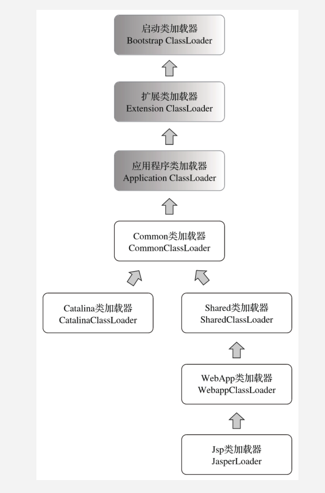

# 6. 虚拟机字节码执行引擎

## 6.1 运行时栈帧结构

栈帧里面包括局部变量表，操作栈，动态链接，返回地址

### 6.1.1 局部变量表

- 存放方法参数和方法内部定义的局部变量
- 在编译时就确定了局部变量表的最大容量

- 局部变量表以slot为最小单位，大小不确定，但是要求能存下一个boolean、byte、char、short、int、float、reference或returnAddress类型的数据。
- 对于64位数据，虚拟机会分配两个slot。
- 在执行方法时，如果执行的是实例方法，那么局部变量表的第0位索引的Slot默认是用于传递方法所属对象实例的引用。
- 为了节省空间，局部变量表是可以被重用的，所以当一个大对象使用完毕，在没有对局部变量写入新变量之前，变量表里还存在这个大对象的引用，当有新的变量写入的时候，之前那个大对象的引用才会被覆盖掉。因此有人提出对于不再使用的变量，手动将其设置为null值。但是，代码在经过JIT编译后，赋值null的语句被消除掉了，因此设置为null的语句是无效的。

### 6.1.2 操作数栈

操作数栈，也称为操作栈，是一个后入先出栈。元素可以是任意的Java数据类型。32位数据占栈容量为1，64位数据类型所占栈容量为2。举个例子，整数加法字节码指令iadd在运行时将最接近栈顶的两个int型相加，将结果出栈。

### 6.1.3 动态链接

每个栈帧都包含一个指向运行时常量池中该栈帧所属方法的引用。持有这个引用的目的，是为了支持方法调用过程中的动态链接。Class文件常量池中的符号引用，在运行过程中转化为直接引用，这部分称为动态链接。符号引用在类加载阶段或者第一次使用的时候转化为直接引用，称为静态解析。

### 6.1.4 方法返回地址

方法执行后，有两种方式退出这个方法，第一种，遇到任意一个返回的字节码，这个时候可能会有返回值传递给方法调用者，这种称为正常完成出口。另一种退出方式是，在执行过程中遇到了异常，并且没有在方法体中得到处理，例如虚拟机内部产生的异常，或者字节码athrow产生的异常。这种退出叫做异常完成出口。

方法正常退出时，调用者的PC计数器的值可以作为返回地址。异常退出时，返回地址要通过异常处理器表来确定。

## 6.2 方法调用

方法调用不是方法执行，这个阶段的目的只是确定被调用方法的版本（即调用哪一个方法）。Class文件的编译过程不包括传统编译中的连接步骤，所以方法调用在Class文件中都只是符号引用，而不是方法在实际运行时内存中的入口地址（也就是直接引用）。

### 6.2.1 解析

在类加载的解析阶段，会将其中一部分符号引用转化为直接引用，但是前提是，方法在程序真正运行之前就有一个可以确定的调用版本，且在运行期间不可变。这类方法的调用就称为解析。

在Java中符合上述描述的方法有两类，静态方法和私有方法，它们无法被继承和重写。Java提供了5条方法调用字节码指令。分别如下。

1. Invokestatic:调用静态方法
2. Invokespecial: 调用实例构造器方法，私有方法和父类方法
3. Invokevirtual：调用所有的虚方法
4. Invokeinterface: 调用接口方法，在运行时再确定一个实现此接口的对象
5. Invokedynamic：先在运行时动态解析出调用点限定符所引用的方法，然后再执行该方法。

只要能被Invokestatic，Invokespecial指令调用的方法，都能在解析阶段确定它的唯一版本。例如，静态方法，私有方法，实例构造器，父类方法四种。这些方法可以被称为非虚方法，其他方法称为虚方法（除去final方法）。Java中的非虚方法还有一种，就是被final修饰的方法，虽然final方法是用invokevirtual来调用，但是由于它无法被覆盖，也没有其他版本，因此在Java语言规范中，说明了final方法是一种非虚方法。

### 6.2.2 分派（dispatch）

1. 静态分派，所有依赖静态类型来定位方法执行版本的分派动作称为静态分派，静态分派的典型应用就是方法重载。编译器能够在多个可重载版本中，选择一个最合适的版本。
2. 动态分派，跟重写有着密切关系。在调用一个对象的虚方法时，对应指令是invokevirtual,invokevirtual指令在运行时的解析过程为
   1. 找到操作数栈顶的第一个元素所指向的对象的实际类型，计作C
   2. 如果在C中找到与常量中的描述符和简单名称都相符的方法，则进行访问权限校验，如果通过就返回这个方法的直接引用，查找结束。
   3. 否则，按照继承关系从下往上对C的父类进行第二步的搜索和验证过程
   4. 如果始终没找到，就抛出AbstractMethodError异常
3. 动态分派实现，在类的方法区中建立一个虚方法表，使用虚方法表索引来代替元数据查找以提高性能。具有相同签名的方法（方法签名由方法名和参数确定，不包括访问限定符和返回值），在子类，父类的虚方法表中都具有一样的索引序号，当类型变换时，仅需要变更查找的方法表，就可以从不同的虚方法表中按索引转换出所需的入口地址。
4. 虚方法表一般在类加载的连接阶段进行初始化，准备了类的变量初始值后，虚拟机就会把方法表初始化完毕。

### 6.2.3 动态类型语言支持

1. invoke包：在以前单纯靠符号引用来确定调用的目标方法这种方式以外，提供了一种新的动态确定目标方法的机制，称为MethodHandle。可以将它作为参数传递到函数中，相当于传一个函数作为参数。和反射的区别：
   - 反射是在模拟Java代码层次的方法调用，而MethodHandle是在模拟字节码层次的调用，例如MethodHandle.lookup中的3个方法-findStatic()、findVirtual()、findSpecial()。对应invokestatic, invokevirtual, invokespecial这几条字节码指令的执行权限校验行为。
   - 反射是重量级的，MethodHandle是轻量级的。
   - MethodHandle是对字节码的方法指令调用的模拟，所以虚拟机在这方面做的优化，在MethodHandle上也可以有。
   - MethodHandle可以服务于所有虚拟机上的语言。反射是针对Java的。
2. invokedynamic指令：和MethodHandle机制作用是一样的，为了把如何查找目标方法的决定权从虚拟机转嫁给用户代码中，让用户有更高自由度。
   - 每一处含有invokedynamic指令的位置，都称作动态调用点
   - 这条指令的第一个参数不再是符号引用，而是CONSTANT_InvokeDynamic_info常量，这个常量包含三个变量，引导方法，方法类型和名称。根据CONSTANT_InvokeDynamic_info常量，虚拟机可以找到并执行引导方法，从而获得一个CallSite对象，这个对象代表真正要执行的目标方法,最终调用要执行的目标方法。
3. 掌控方法分派规则：利用MethodHandle，可以让子类调用祖父类的方法。

## 6.3 基于栈的字节码解释执行引擎

### 6.3.1 解释执行


编译过程如上图，中间那条分支是解释执行，下面那条分支是传统的程序代码到目标机器代码的生成过程。C/C++将词法分析，语法分析以至于后面的优化器和目标代码生成器形成一个完整意义的编译器去实现。Java将一部分步骤，词法分析，语法分析，抽象语法树，生成字节码指令流的过程实现为一个半独立的编译器。而JS执行器把这些步骤和执行步骤全部封装在一个黑匣子中。

### 6.3.2 基于栈的指令集和基于寄存器的指令集

基于栈的指令集

- 好处：可移植，不依赖于硬件，而基于寄存器的指令集会受到硬件的约束。代码相对紧凑（字节码中每个字节对应一条指令，而多地址指令集还需存放参数），编译器更加简单（不需要考虑空间分配问题）

  缺点：慢！出栈入栈产生了相当数量的指令，栈实现在内存中，频繁访问内存增大了性能开销。
  
- 

# 7. 程序编译与代码优化

## 7.1 早期（编译期）优化

有三种类型的编译器

- 前端编译器：把java文件转变为class文件，例如Javac
- JIT编译器：后端运行期编译器，把字节码转变成机器码，例如HotSpot VM的C1，C2编译器
- AOT编译器：静态提取编译器，直接把java文件编译成本地机器代码的过程。例如GNU Compiler for the Java(GCJ)

相当多新生的Java语法，都是靠编译器的语法糖来实现的，而不是依赖虚拟机的底层改进来支持。JIT在运行期的优化过程对于程序来说更重要，而前端编译器在编译期的优化过程对于程序编码来说关系更加密切。

### 7.1.1 Javac编译器

Javac的编译过程分为三个过程


1. 解析与填充符号表

   - 解析步骤包括词法分析和语法分析，词法分析将源代码的字符流转变为Token集合，语法分析根据Token序列构造抽象语法树。
   - 填充符号表，符号表是一组符号地址和符号信息构成的表格。符号表中的信息在不同编译阶段都要用到。

2. 注解处理器

   JDK1.5之后提供了对注解的支持，JDK1.6提供了一组注解处理器，可以看做是一组编译器的插件，在这些插件里面，可以读取，修改，添加抽象语法树中的任意元素。如果这些插件在处理注解期间对语法树进行了修改，编译器将回到解析与填充符号表的过程，直到所有的注解处理器都没有再对语法树进行修改为止。

3. 语义分析与字节码生成

   语法分析后，得到了抽象语法树，它能够表示一个结构正确的源程序的抽象，但无法保证源程序是符合逻辑的。而语义分析主要是对结构上正确的源程序进行上下文有关性质的审查，如进行类型审查。

   - **标注检查**，内容包括变量使用前是否已被声明，变量与赋值之间的数据类型是否能够匹配，还有常量折叠，例如

     ```java
     int a = 1 + 2
     // 折叠之后成为
     int a = 3
         
     ```

   - **数据及控制流分析**，对程序的上下文逻辑进行进一步验证，可以检查出程序局部变量在使用前是否赋值，方法每条路径是否都有返回值，是否所有的受检查异常都被正确处理了等问题。

   - **解语法糖**：解语法糖步骤会将java语法糖还原回简单的基础语法结构，因为虚拟机是不支持这些语法的。

   - **字节码生成**：这是Javac编译过程的最后一步，把前面各个步骤所生成的信息（语法树，符号表）转化成字节码写到磁盘中，编译器还做了少量的代码添加和转换工作。例如将类的初始化语句都放到<clinit>方法中。

### 7.1.2 语法糖

- **泛型与类型擦除**，Java的泛型只存在于程序源码中，编译之后的字节码已经替换为原来的原生类型了，并且在相应地方加入了强制转型代码，所以泛型是java的语法糖，java泛型的实现方法称为类型擦除，是一种伪泛型。方法的Signature在Java层面只包括方法名称，参数顺序，以及参数类型。在字节码中的Signature还包括方法的返回值以及受查异常表。擦除法所谓的擦除，仅仅对方法的Code属性中的字节码进行擦除，实际上元数据中还是保留了类型信息，可以利用反射手段取得。
- **自动装箱、拆箱与遍历循环**
- **条件编译**，Java中，条件编译的实现，也是Java语言的一颗语法糖，根据布尔常量值的真假，编译器会把分支中不成立的代码块消除掉。
- 除此之外，还有其他语法糖，如内部类，枚举类，断言语句，对枚举类和字符串的switch支持，try语句中定义和关闭资源。

## 7.2 晚期（运行期）优化

### 7.2.1 HotSpot内的即时编译器

#### 7.2.1.1 解释器与编译器

- 并不是所有虚拟机都采用解释器和编译器共存架构（JRockit只有编译器，常用于服务端），但主流商用虚拟机都同时包含两者。

- 当程序需要迅速启动和执行时，解释器可以首先发挥作用。当运行环境中内存资源受限，使用解释执行可以节约内存，反之可以用编译器来提升效率。

- 解释器可以作为编译器激进优化的“逃生门”，当激进优化后，内部发生了改变，激进优化条件不再成立，可以以通过逆优化回退到解释执行。

- Client Compiler称为C1，Server Compiler 称为C2。

- 可用通过参数指定虚拟机的运行模式（client or server），也可以强制虚拟机运行在解释模式，或强制运行在编译模式（最新的HotSpot中已移除），此时将优先采用编译方式执行程序。

- 分层编译

  - 第0层，程序解释执行，解释器不开启性能监控功能
  - 第1层，也称为C1编译，将字节码编译为本地代码，进行简单，可靠的优化，必要时加入性能监控功能。
  - 第2层或以上，称为C2编译，也是将字节码编译为本地代码，但是会使用一些编译耗时长的优化，甚至根据性能监控信息进行一些不可靠的激进优化。

  分层编译实施后，C1和C2会同时工作，许多代码可能被多次编译，用C1获得更快的编译速度，用C2获得更好的编译质量。

#### 7.2.1.2 编译对象与触发条件

有两类会在运行过程中被JIT认为是“热点代码”：

- 被多次调用的方法
- 被多次执行的循环体（连同整个方法一起编译，这种编译方式因为发生在方法执行过程之中，因此称为栈上替换。）

判断一段代码是不是热点代码，称为热点探测，目前有两种方式：

- 基于采样的热点探测：周期性地检查各个线程的栈顶，如果发现某些方法经常出现在栈顶，那这个方法就是热点方法。好处是实现简单，高效。缺点是很难精确确认一个方法的热度，容易受到线程阻塞或别的外界因素的影响。
- 基于计数器的热点探测：为每个方法甚至是代码块建立计数器，统计方法的执行次数，超过阈值时就认为是热点代码。实现起来麻烦，但是统计结果更加精确，严谨。

HotSpot虚拟机使用的是第二种，基于计数器的热点探测方法。

- 方法调用计数器，用于统计方法调用次数，在Client模式下的阈值为1500，在Server模式下的阈值为10000次。

  流程如下：

  

计数器热度衰减：超过一定时间，如果方法的调用次数仍不能触发编译，计数器数值将会减少一半，如果没有这个机制，随着虚拟机一直运行，所有方法的调用次数最终都将到达编译阈值。

- 回边计数器：用来统计一个方法中，循环体代码被执行的次数。在字节码中遇到控制流向后跳转的指令称为回边。回边计数器的阈值由方法调用计数器的阈值算出。有具体的公式。回边计数器没有热度衰减。当回边计数器溢出时，也会将方法计数器调整到溢出状态，下次再进入该方法就会执行标准编译过程。

#### 7.2.1.3 编译过程

- 默认情况下，当编译请求发起之后，在编译完成之前，代码还是按照解释执行的方法运行，而编译动作在后台的编译线程中执行。当禁用后台编译后，一旦到达JIT编译条件，执行线程提交编译请求后将会一直等待，直到编译过程完成后再开始执行编译后的代码。

### 7.2.2 编译优化过程

以编译方式执行本地代码比解释方式更快，原因有二

- 虚拟机解释执行字节码会额外消耗时间。
- 虚拟机团队几乎把对代码的所有优化措施都集中在即时编译器中。因此，即时编译器产生的本地代码，比解释执行产生的本地代码更加优秀。

#### 7.2.2.1 优化技术

- 公共子表达式消除：重用之前计算过的表达式，当表达式中的值没有变化时。

  ```java
  int d = (c * b) * 12 + a + (a + b * c) 
  // 优化后
  int d = E * 12 + a + (a + E) 
  ```

- 数组边界检查消除：在编译器，对数据流分析来确定数组的长度，就可以在访问数组时，省去边界判断的工作。

- 方法内联：将调用方法的代码插入调用处，除去了方法调用的成本，为其他优化建立良好基础。由于Java中的实例方法默认是虚方法，也就是在编译的时候不确定会具体是哪一种方法的实现，因此为方法内联带来困难，对此做出的方案是：

  - 通过CHA技术，分析类型继承关系
  - 编译器在内联时，如果是非虚方法，直接内联
  - 遇到虚方法，会向CHA查询当下程序是否有多个目标版本可供选择，如果查到只有一个版本，则可以内联，这种内联属于激进优化，需要预留逃生门。当虚拟机此后加载了导致继承关系变化的新类，那就需要抛弃已编译的代码，回退到解释执行状态。
  - 使用内联缓存，在这个新加入的类中的该方法被真正调用之前，还可以使用之前编译好的代码。

- 逃逸分析：分析对象动态作用域，为其他优化提供依据的分析技术。

  - 逃逸：一个对象在方法中被定以后，它可能被外部方法引用，称为方法逃逸。甚至被别的线程访问到，这称之为线程逃逸。如果能证明这个变量不会逃逸，则可以进行一些高效的优化。例如
    - 栈上分配：将变量分配在栈上，对象使用的内存会随着栈帧出栈而销毁。
    - 同步消除：如果确定一个变量不会逃出线程，则对这个变量实施的同步措施（synchronized关键字）可以消除掉。
    - 标量替换：标量是指一个数据不能被分解成更小的数据了。用标量的集合来代替一个对象，也就是把一个对象拆分成许多标量，而不用去创建这个对象，而标量可以分配到栈上，就可以减少GC压力。

### 7.2.3 Java与C++编译器对比

- 劣势：
  - 即时编译器运行占用的是用户程序的运行时间，有很大的时间压力。
  - Java因为是动态的类型安全语言，意味着虚拟要频繁动态检查，例如检查空指针，数组元素越界访问检查，类型转换时继承检查，会消耗不少时间。
  - 使用虚方法的频率远远大于C++，因此许多优化更难以实施。
  - Java是可以动态扩展的语言，运行时可以加载新类，导致很多全局优化都难以进行，虚拟机需要时刻注意类型的变化而在运行时撤销或者重新进行一些优化。
  - Java的内存管理是托管给虚拟机，依赖于GC。而C++的内存管理靠用户程序，运行时效率会更高。
- 优势：
  - 开发效率极大提高
  - Java编译器可以利用动态性，以运行期性能监控为基础，进行一些优化。


