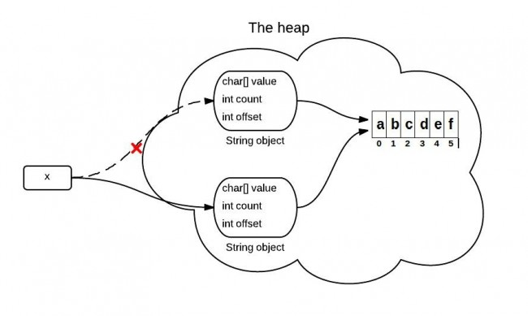
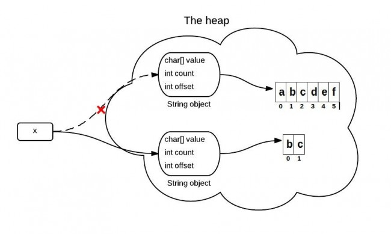

###   ==、equals与hashcode

- ==比较内存地址
- equals是Object类的方法，默认实现用==比较两个对象
- hashCode：内存地址=>int
- 重写equals必须重写hashCode，否则无法正常在基于hash值的集合类中运行。
- equals为true，hashCode一定要相等。反之不一定。


### 值传递和引用传递

- Java只有值传递，无论基础类型还是引用类型
- 从函数调用栈的角度去理解
- 基础类型的值直接分配在栈上

### Final关键字

- final变量初始化时机
  - 定义时
  - final成员变量可在初始化块，不可在static块。static final变量可在static块中。
  - final成员变量可在构造器中初始化，static final变量不行。
- 调用final方法=>内联
- 匿名内部类只能用外部类中final修饰的变量， 因为匿名内部类用到外部类的变量时机不确定，如果不用final变量，可能导致结果不确定。                                                                                                                                                                                                

### volatile关键字

- 可见性，有序性，不保证原子性
- 写volatile变量时，JVM执行Write-Barrier指令，将当前处理器缓存中的数据写回系统内存，并使其他CPU核里引用了该地址的数据成为脏数据。
- 读volatile变量时，JVM执行Read-Barrier指令，如果该数据已经变脏，则从主内存重新读取数据。

### 泛型

- 数组是具象化的，会保存数组内元素的类型信息，而泛型在运行时会被擦除。

- 泛型在运行时被擦除，擦除之后变为泛型的原始类型，一般而言对应泛型的定义上界。在运行时需要的地方做类型转换。

- 泛型擦除不代表泛型信息完全丢弃，只有局部代码块中的泛型被擦除。而接口、类、方法、成员变量上定义的泛型信息会被保留，这部分信息可通过反射获取。

- 通过反射能够获类中定义的泛型信息，不能在运行时，获取某个实例的具体泛型信息（因为被擦除了）。

- 类型检查是针对引用，而不是引用实际指向的对象。

  ```java
  List<Integer> list1 = new ArrayList();
  list1.add(1);
  List1.add("a"); //报错
  
  List list2 = new ArrayList<Integer>();
  list1.add(1);
  List1.add("a"); //不报错
  Integer i = list2.get(0); //报错
  ```

- 泛型不能是基本数据类型

### Java版本新特性

- 8：Lambda；函数式接口(有且仅有一个抽象方法的接口)；接口支持默认方法和静态方法；方法引用；Optional类；Stream类；日期新特性；调用JavaScript；
- 9：JShell；不可变集合工厂方法；接口支持私有方法；模块化；Reactive Stream API；

### 序列化

- serialVersionUID作用：在反序列化时，判断序列化对象是否和目标类匹配。

### 浮点数

- 定点数
- a = m × 2^e

### String

#### substring

```java
String x = "abcdef";
x = x.substring(1,3);
System.out.println(x);	
```

**Java6:**



```java
public String substring(int beginIndex, int endIndex) {
    //check boundary
    return  new String(offset + beginIndex, endIndex - beginIndex, value);
}
```

缺陷：字符数组被多处引用，有内存泄漏风险。


**Java7:**



```java
public String(char value[], int offset, int count) {
    //check boundary
    this.value = Arrays.copyOfRange(value, offset, offset + count);
}

public String substring(int beginIndex, int endIndex) {
    //check boundary
    int subLen = endIndex - beginIndex;
    return new String(value, beginIndex, subLen);
}
```

使用`new String`创建了一个新字符串，避免对老字符串的引用。从而解决了内存泄露问题。

#### StringBuffer和StringBuilder

- 封装了一个非fianl 的char[] value;
- `StringBuffer`线程安全，使用synchronized方法保证线程安全。而`StringBuilder`则不是线程安全的。

#### 字符串拼接

速度：`StringBuilder`<`StringBuffer`<`concat`<`+`<`StringUtils.join`


### switch对String的支持

- switch实际只能使用整形，char会转化为ascii码，String对象会转化为哈希值。