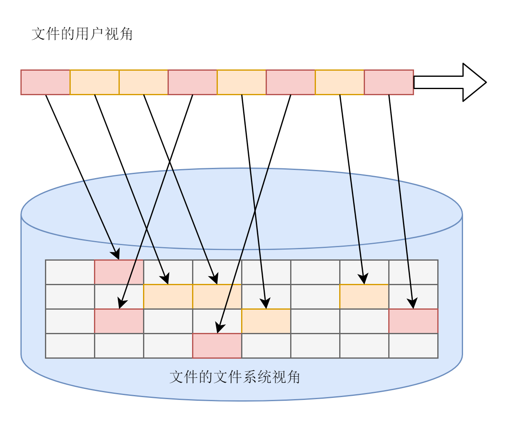

#3. 文件系统

##3.1 概述

内存中的数据在进程结束时，或者机器掉电时会丢失，如果想要永久保存这些数据，就需要将数据持久化，也就是写入文件。操作系统的文件系统就是这样一个存放数据的档案库，负责管理外部存储设备上的数据。常见的外部存储设备有硬盘，u盘等。

### 3.1.1 文件系统功能划分

为了管理文件，文件系统应该考虑到以下几点：

1. 文件系统要有严格的组织形式，使得文件能够以块为单位进行存储。

2. 文件系统要有索引区，用来方便查找一个文件分成的多个块的存储位置。如下图所示，

   

3. 文件系统应该有缓存层，用来存储那些近期经常被读取和写入的热点文件。

4. 文件系统应该用文件夹的形式组织起来，方便管理和查询。使用文件夹还可以通过将同名文件放在不同文件夹下，来避免重名冲突。

   

5. 内核要在自己内存里维护一套数据结构，来保存哪些文件被哪些进程打开和使用。

### 3.1.2 文件系统相关命令行

```c
fdisk -l 						 // 查看硬盘分区情况
mkfs.ext3或mkfs.ext4 // 对分区进行格式化
mount 							 // 将硬盘挂载在某个目录下
unmount							 // 卸载某个硬盘
ls -l 							 // 查看当前目录下所有文件的信息
```

在Linux里，一切都是文件，通过ls -l结果的第一位可以看出

- \- 表示普通文件
- d 表示文件夹
- c 表示字符设备文件
- b 表示块设备文件
- s 表示套接字socket文件
- l 表示符号链接

### 3.1.3 相关系统调用

- open，打开一个文件，并返回一个文件描述符fd。

  ```c
  fd=open("./test", O_RDWR|O_CREATE|O_TRUNC)
  O_CREATE代表不存在时，创建一个新文件。
  O_RDWR表示以读写方式打开
  O_TRUNC表示打开文件后，将文件长度截断为0
  ```

- write，写入数据，第一个参数是文件描述符，第二个参数是要写入的数据的存放位置，第三个参数表示希望写入的字节数。返回值是成功写入文件的字节数。

- lseek，重新定位读写的位置。

- read，读取数据。第一个参数是文件描述符，第二个参数是读取来的数据存放的空间，第三个参数是希望读取的字节数。返回值是成功读取的字节数。

- close，关闭一个文件。

- stat，通过文件名查询状态信息。lstat可以处理软连接。fstat，通过文件描述符查询文件信息。

- opendir 打开一个目录, 生成一个目录流 DIR

- readdir 读取目录流的一个条目, 自动指向下一个条目

- closedir 关闭目录流


文件系统总体如下


## 3.2 硬盘文件系统

这一节主要讲Linux下最主流的文件系统格式——ext系列文件系统格式。以下以传统机械硬盘为例。

### 3.2.1 inode与块的存储

硬盘分成相同大小的单元，称为块(block)，一个块的大小是扇区大小的整数倍，默认是4k。这个值可以在格式化的时候设定。文件可以存放在不连续的块中，不一定要分配连续的空间，这样比较灵活。

但是文件存放在哪些block中，需要记录下来，还需要建立索引快速查找。这个时候就需要一个结构体inode来存放。inode里还存放有文件的元数据如名字，权限等。inode中的i是index的意思，inode定义如下

```c
struct ext4_inode {
	__le16	i_mode;		/* File mode */
	__le16	i_uid;		/* Low 16 bits of Owner Uid */
	__le32	i_size_lo;	/* Size in bytes */
	__le32	i_atime;	/* Access time */
	__le32	i_ctime;	/* Inode Change time */
	__le32	i_mtime;	/* Modification time */
	__le32	i_dtime;	/* Deletion Time */
	__le16	i_gid;		/* Low 16 bits of Group Id */
	__le16	i_links_count;	/* Links count */
	__le32	i_blocks_lo;	/* Blocks count */
	__le32	i_flags;	/* File flags */
......
	__le32	i_block[EXT4_N_BLOCKS];/* Pointers to blocks */
	__le32	i_generation;	/* File version (for NFS) */
	__le32	i_file_acl_lo;	/* File ACL */
	__le32	i_size_high;
......
};
```

里面指定了文件的读写权限，属于哪个用户，哪个组，大小，占用多少块，跟时间相关的信息。当我们执行ls命令的时候，就是从这里取出信息的。

i_block这个变量里，存放了文件被分成了哪些块，每一块在哪里的信息。


如上图所示，在ext3中，前12项直接存放块地址，如果块太多就会在12-14项存放间接块，像树的结果那样存放大量的块信息。这样的缺点就是当块太多是，需要多次读盘，速度太慢。

为了解决这个问题，ext4引入了新的概念Extents，可以把最大128M的数据放到一个Extents里面，对大文件的读写性能提高了，文件碎片页减少了。

### 3.2.2 inode位图和块位图

当需要新建文件的时候，需要找到一个未使用的inode，然后分配未使用的块。为了找到未使用的inode和块，在文件系统里，专门用一个块，也就是4k来存储inode位图，0表示未使用，1代表已使用。同样的，也有一个块用来保存块的位图。需要inode就去位图里找，需要块就去块位图里找。

### 3.2.3 文件系统格式

我们把一个块的位图+一系列的块，外加一个块的inode位图+一系列的inode的结构称为一个块组，可以表示128M的数据，有N多的块组，可以表示N大的文件，如下图：


一个个块组构成了文件系统。块组描述符保存了当前块组的inode位图，块位图等信息。

块组描述符表是所有的块组描述符组成的列表，超级块描述了整个文件系统，如一共有多少个块，每个块组有多少个inode等信息，这些信息都是全局信息。

因为这些信息很重要，如果这些数据丢失，整个文件系统都打不开了。于是这些数据都要备份到其他多个块组中，这样一来就产生了两个问题：

- 浪费空间
- 块组描述符表的大小，限制了整个文件系统的大小。

于是，引入了Meta Block Groups特性。

块组描述符表不会保存所有块组的描述符了，而是将块组分为多个组，称为元块组。如图：


每个元块组包含64个块组，块组描述符也是64项，备份三份，在元块组的第1，2和最后一块的开始处。

ext4采用48位块寻址，高达1EB的空间。

### 3.2.4 目录的存储格式

目录本身也是一个文件，也有inode，只是在数据块里存储的数据，和普通文件不一样，为了加快目录下文件的查找速度，将文件按hash值分到不同的块中。如下图所示：


- 首先出现的是两个文件名为“.”和“..”的目录文件，分别指向当前目录和上级目录。
- 当我们要查找文件夹下某个文件时，先计算其hash值，再到对应的块里面去查，这样可以加快查找速度。

###3.2.5 软链接和硬链接的存储格式

使用`ln [参数][源文件或目录][目标文件或目录]` 来创建链接。ln -s是创建软链接，不加-s是硬链接。他们的区别如下：

- 硬链接和原始文件共用一个inode，但是inode是不跨文件系统的，因此硬链接没法跨文件系统。
- 软链接相当于重新创建了一个文件，这个的内容是指向另一个文件的路径。可以跨文件系统，甚至目标文件被删除了，链接文件还是在的。


