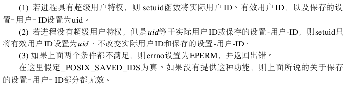

# 1. 进程

进程是程序的运行实例。当一段程序被同时运行多次时，就会创建多个进程。进程在Linux内核里也叫做task。

## 1.1 进程描述符

进程描述符(process descriptor)，结构类型是task_struct。用来记录进程的状态，存储线程的数据。


###1.1.1 任务ID

- pid，新建一个进程时，会在前一个进程的ID上加1，赋予新的进程，用来唯一标识这个进程。pid上限是32767，当到达上限时，会重用已经回收的进程的PID。
- tgid，标识该进程所属的线程组，如果某个task的pid等于tgid，则表明该task是线程组的主线程，由这个主线程创建的子线程，其tgid等于主线程的tgid也等于主线程的pid，每个线程都有自己独立的pid，也就是说线程数量不可能超过32767。
- group leader，指向线程组的主线程。

###1.1.2 亲缘关系

- *parent，指向其父进程，父进程是创建它的进程。
- \*real_parent，通常与\*parent一致，在debug的时候，会出现不一致。
- children，子进程链表的头结点，顺着头结点可以访问每一个子进程。
- sibling，该进程的兄弟进程。

###1.1.3 任务状态

- state，表示进程当前状态。
- exit_state，表示当前进程处于哪种退出状态。
- flags，是一个bitmap，表示线程的状态。从下面可以看出如何设置这个bitmap。

```c
/* Used in tsk->state: */
#define TASK_RUNNING                    0
#define TASK_INTERRUPTIBLE              1
#define TASK_UNINTERRUPTIBLE            2
#define __TASK_STOPPED                  4
#define __TASK_TRACED                   8
/* Used in tsk->exit_state: */
#define EXIT_DEAD                       16
#define EXIT_ZOMBIE                     32
#define EXIT_TRACE                      (EXIT_ZOMBIE | EXIT_DEAD)
/* Used in tsk->state again: */
#define TASK_DEAD                       64
#define TASK_WAKEKILL                   128
#define TASK_WAKING                     256
#define TASK_PARKED                     512
#define TASK_NOLOAD                     1024
#define TASK_NEW                        2048
#define TASK_STATE_MAX                  4096
```


TASK_RUNNING表示进程处于可运行状态，不一定获得了CPU时间片，也就是不一定正在执行。

Linux中，有两种睡眠（挂起）状态，

1. TASK_INTERRUPTIBLE，可中断睡眠，当一个信号到来，进程可以被唤醒，醒来之后处理这个信号。处理完之后，继续睡眠或者退出睡眠。只有当真正等待的条件满足时，才醒来继续往下执行。
2. TASK_UNINTERRUPTIBLE，不可中断的睡眠。不可以被信号唤醒，只能等待满足条件之后才醒来。kill信号都不行，kill本身也是一个信号，也就是说，除了重启电脑，没有别的方法。

TASK_KILLABLE是一种可以终止的新睡眠状态，运行原理和TASK_UNINTERRUPTIBLE类似，只不过可以响应致命信号。

TASK_STOPPED是进程在收到SIGSTOP，SIGTSTP或者SIGTTOU信号之后进入的状态。

一个进程刚结束时，进入EXIT_ZOMBIE状态，此时仅保持进程的描述符，其余的都释放掉。只有等待父进程调用wait()类方法后，才彻底删除这个进程。之后进程的状态为EXIT_DEAD。

还有一些状态，我们称为标志。放在flags字段中，这些字段被定义为宏，以PF开头。例如

```c
#define PF_EXITING			0x00000004
#define PF_VCPU					0x00000010
#define PF_FORKNOEXEC		0x00000040
```

PF_EXITING表示正在退出。PF_VCPU表示运行在虚拟CPU上，PF_FORKNOEXEC表示fork完了，还没有exec。

### 1.1.4 权限

\*real_cred表示谁能操作当前进程，\*cred表示当前进程能操作谁。

cred结构定义如下，cap_xxx表示拥有的能力。xxid都是用户和用户组的信息。

```c
struct cred {
......
        kuid_t          uid;            /* real UID of the task */
        kgid_t          gid;            /* real GID of the task */
        kuid_t          suid;           /* saved UID of the task */
        kgid_t          sgid;           /* saved GID of the task */
        kuid_t          euid;           /* effective UID of the task */
        kgid_t          egid;           /* effective GID of the task */
        kuid_t          fsuid;          /* UID for VFS ops */
        kgid_t          fsgid;          /* GID for VFS ops */
......
        kernel_cap_t    cap_inheritable; /* caps our children can inherit */
        kernel_cap_t    cap_permitted;  /* caps we're permitted */
        kernel_cap_t    cap_effective;  /* caps we can actually use */
        kernel_cap_t    cap_bset;       /* capability bounding set */
        kernel_cap_t    cap_ambient;    /* Ambient capability set */
......
} __randomize_layout;

```

chmod u+s 命令，如果一个文件被设置这样的权限的话，任何进程在执行这个文件时，会获得该文件拥有者的权限，就可以像文件拥有者一样去执行这个文件。

需要了解setuid(uid)函数的原理。



### 1.1.5 运行统计信息

这些字段用来记录该进程运行的时间信息

```c
u64								utime;// 用户态消耗的 CPU 时间
u64								stime;// 内核态消耗的 CPU 时间
unsigned long			nvcsw;// 自愿 (voluntary) 上下文切换计数
unsigned long			nivcsw;// 非自愿 (involuntary) 上下文切换计数
u64								start_time;// 进程启动时间，不包含睡眠时间
u64								real_start_time;// 进程启动时间，包含睡眠时间
```

### 1.1.6 进程调度

详解见进程调度章节

### 1.1.7 信号处理

task_struct里面的信号处理字段如下，

```c
/* Signal handlers: */
struct signal_struct		*signal;
struct sighand_struct		*sighand;
sigset_t								blocked;
sigset_t								real_blocked;
sigset_t								saved_sigmask;
struct sigpending				pending;
unsigned long						sas_ss_sp;
size_t									sas_ss_size;
unsigned int						sas_ss_flags;
```

blocked这个集合表示哪些信号暂不处理，pending表示哪些信号暂待处理，sighand表示正在被处理的信号。详解见信号处理章节。

### 1.1.8 内存管理

每个进程都有自己独立的虚拟内存空间，用mm_struct来表示。详解见内存管理章节。

```c
struct mm_struct                *mm;
struct mm_struct                *active_mm;
```

详见内存管理章节。

### 1.1.9 文件与文件系统

每个进程都有一个文件系统的数据结构，还有一个数据结构用来记录已打开文件。详解见文件系统章节。

```c
/* Filesystem information: */
struct fs_struct                *fs;
/* Open file information: */
struct files_struct             *files;
```

### 1.1.10 内核栈

进程一旦涉及到用户态和内核态切换，就会用到以下两个变量

```c
struct thread_info		thread_info;
void  *stack;
```

stack表示内核栈，进程在内核运行时，需要切换到内核栈。

我们以系统调用为例，


在用户态的时候，将用户态的代码段，数据段，CPU上下文都保存到task_struct->stack的pt_regs寄存器里。


然后，将系统调用名转为系统调用号，去系统调用表里，根据系统调用号找到对应的函数进行调用。从系统调用返回的时候，需要恢复寄存器的值，也就是读取stack里的pt_regs写入CPU寄存器，系统调用的返回值在pt_regs的ax寄存器里。

## 1.2 创建进程

###1.2.1 fork

在linux中，怎么创建进程呢？是使用fork()系统调用。内部的调用过程为fork -> sys_fork -> _do_fork，sys_fork的定义如下：

```c
SYSCALL_DEFINE0(fork)
{
......
	return _do_fork(SIGCHLD, 0, 0, NULL, NULL, 0);
}
```

sys_fork又会去调用_do_fork，

```c
long _do_fork(unsigned long clone_flags,
	      unsigned long stack_start,
	      unsigned long stack_size,
	      int __user *parent_tidptr,
	      int __user *child_tidptr,
	      unsigned long tls)
{
	struct task_struct *p;
	int trace = 0;
	long nr;


......
	p = copy_process(clone_flags, stack_start, stack_size,
			 child_tidptr, NULL, trace, tls, NUMA_NO_NODE);
......
	if (!IS_ERR(p)) {
		struct pid *pid;
		pid = get_task_pid(p, PIDTYPE_PID);
		nr = pid_vnr(pid);


		if (clone_flags & CLONE_PARENT_SETTID)
			put_user(nr, parent_tidptr);


......
		wake_up_new_task(p);
......
		put_pid(pid);
	} 
......
```

这里主要做了两件事，`copy_process`复制结构和`wake_up_new_task`唤醒线程。

### 1.2.2 copy_process

复制父进程就是复制它的进程描述符task_struct，按照下图逐一解释复制过程。


- 整体

  - 先调用alloc_task_struct_node，分配一个task_struct结构。
  - 调用memcpy将父进程的task_struct进程复制。
  - 此时所有的成员变量都指向父进程对应的值，也就是共用父进程的数据，之后一步步地创建自己的数据，与父进程彻底隔绝。

- 内核栈

  - 调用alloc_thread_stack_node，分配内存空间并创建一个栈赋值给task_struct的 void *stack成员变量。
  - 调用setup_thread_stack设置thread_info。

- 权限

  - 调用prepare_creds，在内存中分配一个新的struct cred结构，然后调用memcpy复制一份父进程的cred。
  - 将新进程的read_cred和cred都指向这个新创建的cred。

- 运行统计

  初始化变量值。

  ```c
  p->utime = p->stime = p->gtime = 0;
  p->start_time = ktime_get_ns();
  p->real_start_time = ktime_get_boot_ns();
  ```

- 调度相关

  - 调用__sched_fork，将on_rq设为0，初始化shed_entity，shed_entity的定义如下

    ```c
    struct sched_entity {
    	struct load_weight		load;
    	struct rb_node			run_node;
    	struct list_head		group_node;
    	unsigned int			on_rq;
    	u64				exec_start;
    	u64				sum_exec_runtime;
    	u64				vruntime;
    	u64				prev_sum_exec_runtime;
    	u64				nr_migrations;
    	struct sched_statistics		statistics;
    ......
    };
    ```

    初始化shed_entity就是把exec_start，sum_exec_runtime等涉及进程运行时间置零。

  - 设置进程的状态p->state设置为TASK_NEW。

  - 初始化优先级

  - 设置调度类，如果是普通进程，则设置sched_class = &fair_sched_class，公平调度。

  - 调用调度类的task_fork函数，将子进程和父进程的vruntime设为一样，这样就能防止父进程通过不断新建子进程来占用cpu。如果设置了让子进程先行，调用resched_curr，标记当前运行的进程TIF_NEED_RESCHED，这样下次调度的时候，父进程会被子进程抢占。

- 文件与文件系统

  ```c
  retval = copy_files(clone_flags, p);
  retval = copy_fs(clone_flags, p);
  ```

  copy_files是复制父进程打开的文件信息，这些信息存在一个结构files_struct中，每个打开的文件都有一个文件描述符。这里创建一个新的files_struct，然后将所有的文件描述符数组fdtable拷贝一份。

  copy_fs用于复制一个进程的目录信息，这些目录信息包括进程自己的根目录，根文件系统root，也有当前目录pwd，和当前目录的文件系统。

- 信号相关

  ```c
  init_sigpending(&p->pending);
  retval = copy_sighand(clone_flags, p);
  retval = copy_signal(clone_flags, p);
  ```

  copy_sighand会分配一个新的sighand_struct，主要是维护信号处理函数。然后调用memcpy将信号处理函数从父进程复制到子进程。

  copy_singal用于复制和维护发给这个进程的信号的数据结构。

- 内存空间

  ```c
  retval = copy_mm(clone_flags, p);
  ```

  进程都有自己的内存空间，用mm_struct结构来表示。copy_mm函数中调用dup_mm分配一个新的mm_struct结构。

- 任务ID

  - 分配pid，设置tid，group_leader。
  - 建立进程直接的亲缘关系。

至此，copy_process就结束了。

### 1.2.3 wake_up_new_task

新创建的进程，需要做些工作，才可能去抢占CPU。wake_up_new_task定义如下，

```c
void wake_up_new_task(struct task_struct *p)
{
	struct rq_flags rf;
	struct rq *rq;
......
	p->state = TASK_RUNNING;
......
	activate_task(rq, p, ENQUEUE_NOCLOCK);
	p->on_rq = TASK_ON_RQ_QUEUED;
	trace_sched_wakeup_new(p);
	check_preempt_curr(rq, p, WF_FORK);
......
}
```

1. 将state设置为TASK_RUNNING。
2. activate_task函数会调用enqueue_task，将进程放到运行队列里面，每个CPU有自己的多个运行队列，一个进程只能同时在一个队列里排队。如果是CFS的调度类，也就是公平调度，就会将进程放到cfs_rq，然后调用date_curr更新运行的统计量，将进程的sched_entity加入到红黑树（cfs_rq的实现是红黑树）里，设置se->on_rq = 1。
3. 调用check_preempt_curr，看能否抢占当前进程。如果前面设置了让子进程先运行，则直接返回。如果没有设置，就让父子进程PK一下，看是否要抢占，如果是，则标记父进程为TIF_NEED_RESCHED。抢占的时机为，fork系统调用返回的时候，因为进程抢占可以发生在系统调用返回的时候。

##1.3 创建线程

线程和进程的创建过程有很多相似的地方，因此接着讲线程的创建。


如上图所示，左边是创建进程，右边是创建线程，它们最大的区别有2点，首先是线程的创建有一部分工作是在用户态完成的，也就是`pthread_create`函数，这个函数来自Glibc，不是系统调用。第二点不同是在下面复制数据的时候，子线程是直接引用了parent的数据，也就是说，这部分数据被所有的子线程共享。

### 1.3.1 用户态工作pthread_create

首先说说pthread是什么，我们知道在无论是线程还是进程内核里都用task_struct来表示，而线程在用户态是用pthread这个结构来维护。因此首先就是创建这么一个pthread结构，怎么创建呢？

```c
struct pthread *pd = NULL;
int err = ALLOCATE_STACK (iattr, &pd);
```

看起来有点奇怪，创建一个pthread是调用ALLOCATE_STACK去创建一个stack，但是经过这么一个调用后确实创建了一个新的pthread，接下来来看具体里面做了什么。ALLOCATE_STACK的定义如下

```c
1   # define ALLOCATE_STACK(attr, pd) allocate_stack (attr, pd, &stackaddr)
2   
3   static int
4   allocate_stack (const struct pthread_attr *attr, struct pthread **pdp,
5                   ALLOCATE_STACK_PARMS)
6   {
7     struct pthread *pd;
8     size_t size;
9     size_t pagesize_m1 = __getpagesize () - 1;
10  ......
11    size = attr->stacksize;
12  ......
13    /* Allocate some anonymous memory.  If possible use the cache.  */
14    size_t guardsize;
15    void *mem;
16    const int prot = (PROT_READ | PROT_WRITE
17                     | ((GL(dl_stack_flags) & PF_X) ? PROT_EXEC : 0));
18    /* Adjust the stack size for alignment.  */
19    size &= ~__static_tls_align_m1;
20    /* Make sure the size of the stack is enough for the guard and
21    eventually the thread descriptor.  */
22    guardsize = (attr->guardsize + pagesize_m1) & ~pagesize_m1;
23    size += guardsize;
24    pd = get_cached_stack (&size, &mem);
25    if (pd == NULL)
26    {
27      /* If a guard page is required, avoid committing memory by first
28      allocate with PROT_NONE and then reserve with required permission
29      excluding the guard page.  */
30  	mem = __mmap (NULL, size, (guardsize == 0) ? prot : PROT_NONE,
31  			MAP_PRIVATE | MAP_ANONYMOUS | MAP_STACK, -1, 0);
32      /* Place the thread descriptor at the end of the stack.  */
33  #if TLS_TCB_AT_TP
34      pd = (struct pthread *) ((char *) mem + size) - 1;
35  #elif TLS_DTV_AT_TP
36      pd = (struct pthread *) ((((uintptr_t) mem + size - __static_tls_size) & ~__static_tls_align_m1) - TLS_PRE_TCB_SIZE);
37  #endif
38      /* Now mprotect the required region excluding the guard area. */
39      char *guard = guard_position (mem, size, guardsize, pd, pagesize_m1);
40      setup_stack_prot (mem, size, guard, guardsize, prot);
41      pd->stackblock = mem;
42      pd->stackblock_size = size;
43      pd->guardsize = guardsize;
44      pd->specific[0] = pd->specific_1stblock;
45      /* And add to the list of stacks in use.  */
46      stack_list_add (&pd->list, &stack_used);
47    }
48    
49    *pdp = pd;
50    void *stacktop;
51  # if TLS_TCB_AT_TP
52    /* The stack begins before the TCB and the static TLS block.  */
53    stacktop = ((char *) (pd + 1) - __static_tls_size);
54  # elif TLS_DTV_AT_TP
55    stacktop = (char *) (pd - 1);
56  # endif
57    *stack = stacktop;
58  ...... 
59  }
```

`allocate_stack`具体做了一下工作：

1. 11行，如果你设置了stack的size，就把这个值取出来，之后要用来设置stack的大小。
2. 22行，为了防止栈的越界访问，在栈的尾部会有一块儿空间guardsize，一旦访问这里就错误了。
3. 24行，接下来就是真正创建pthread的地方了，会调用`get_cached_stack`去缓存中获取一个栈，因为所有线程的栈都是在进程的堆里面创建的，创建删除十分频繁，所以需要把这些分配的内存缓存起来。
4. 如果从缓存中获取栈失败，则进入26-47行
   1. 30行，调用`__mmap`分配一块新的栈内存。
   2. 接下来将栈底这块空间分配给pthread，也就是说pthread是放在栈里面的。至此，我们得到了pthread。
   3. 39行，计算出guard内存的位置，40行调用`setup_stack_prot`来设置这一块内存是受保护的。
   4. 41-44行，填充pthread这个结构里的stackblock（刚才分配的栈内存块），stackblock_size（栈内存大小），guardsize（内存保护区），specific（存放的是线程的全局变量）。
   5. 将新建的这个线程栈放入到stack_used链表中，之后用完了会缓存到stack_cache中。
5. 49行，将新建的pthread赋值给目标。

到这里，pthread就创建好了，现在我们就能理解了为什么用allocate_stack来创建pthread，因为要先创建线程栈，再指定一块栈内存用来创建pthread。现在我们知道了，在用户态中，创建线程需要做的工作就是创建了新线程所需的栈。接下来要把这个栈交给内核态去完成后续的创建工作。

在交给create_thread去进行内核态工作之前，我们还需要为新建的pthread设置start_routine，也就是线程需要执行的函数，以及arg，传给这个函数的参数，以及调度策略。

```c
pd->start_routine = start_routine;
pd->arg = arg;
pd->schedpolicy = self->schedpolicy;
pd->schedparam = self->schedparam;
/* Pass the descriptor to the caller.  */
*newthread = (pthread_t) pd;
atomic_increment (&__nptl_nthreads);
retval = create_thread (pd, iattr, &stopped_start, STACK_VARIABLES_ARGS, &thread_ran);
```

###1.3.2 内核态工作create_thread

create_thread是内核态工作的入口，还没有正式进入内核态，因为我们知道要进行系统调用才算进入内核态。其定义如下：

```c
static int
create_thread (struct pthread *pd, const struct pthread_attr *attr,
bool *stopped_start, STACK_VARIABLES_PARMS, bool *thread_ran)
{
  const int clone_flags = (CLONE_VM | CLONE_FS | CLONE_FILES | CLONE_SYSVSEM | CLONE_SIGHAND | CLONE_THREAD | CLONE_SETTLS | CLONE_PARENT_SETTID | CLONE_CHILD_CLEARTID | 0);
  ARCH_CLONE (&start_thread, STACK_VARIABLES_ARGS, clone_flags, pd, &pd->tid, tp, &pd->tid)；
  /* It's started now, so if we fail below, we'll have to cancel it
and let it clean itself up.  */
  *thread_ran = true;
}
```

clone_flags定义了一些标志，指明了要复制的数据是哪些。需要特别关注。

ARCH_CLONE宏，其实就是调用__clone，定义如下，这里正式进入系统调用了。

```c
SYSCALL_DEFINE5(clone, unsigned long, clone_flags, unsigned long, newsp,
		 int __user *, parent_tidptr,
		 int __user *, child_tidptr,
		 unsigned long, tls)
{
	return _do_fork(clone_flags, newsp, 0, parent_tidptr, child_tidptr, tls);
}
```

看到了熟悉的_do_fork，也就是和进程的复制步骤一样了。

_do_fork前面讲过了，现在重点关心一下创建进程和创建线程在这个地方的区别。

1. 之前我们设置了clone_flags，其影响了以下几方面。

   首先是copy_files，创建进程时，是复制一个files_struct，而这里因为有CLONE_FILES标志，只是将files_struct引用计数加一。

   ```c
   static int copy_files(unsigned long clone_flags, struct task_struct *tsk)
   {
   	struct files_struct *oldf, *newf;
   	oldf = current->files;
   	if (clone_flags & CLONE_FILES) {
   		atomic_inc(&oldf->count);
   		goto out;
   	}
   	newf = dup_fd(oldf, &error);
   	tsk->files = newf;
   out:
   	return error;
   }
   ```

   对于copy_fs，原来是复制一个fs_struct，因为CLONE_FS标志的存在，将原来的fs_struct用户数加一。

   ```c
   static int copy_fs(unsigned long clone_flags, struct task_struct *tsk)
   {
   	struct fs_struct *fs = current->fs;
   	if (clone_flags & CLONE_FS) {
   		fs->users++;
   		return 0;
   	}
   	tsk->fs = copy_fs_struct(fs);
   	return 0;
   }
   ```

   同理，对于copy_sighand，copy_signal，copy_mm都从以前的复制一个新的，到现在的共享一个老的。

2. 对于亲缘关系的影响，因为在clone_flags里设置了CLONE_THREAD，就表明现在是在创建一个线程。

   - 如果是创建新进程，设置新进程的group_leader是他自己，tgid是它自己的pid。如果是创建新线程，group_leader是当前进程的group_leader，tgid是当前进程的tgid，也就是说，这个新线程是当前进程的线程组的一员。
   - 如果是创建新进程，那么新进程的real_parent就是当前进程，进程树上又会多一层。如果是创建新线程，线程的real_parent是当前进程的real_parent，就是一辈的。

3. 对信号处理的不同在于，对于新建进程，会在copy_signal的时候，初始化signal_struct里面的shard_pending，也就是说不同的进程有自己的信号处理。而新建线程的时候，共享了父进程的signal_struct，也就是线程组中的所有线程共享一个share_pending，这是一个信号列表。因此发给父进程的信号所有的子线程都能收到。kill掉一个进程，也就会Kill掉所有子线程。

至此，clone在内核的调用完毕，要退出系统调用，返回用户态。

### 1.3.3 用户态执行线程

回到用户态后，根据__clone的第一个参数，不是马上执行我们指定的那个函数，而是执行一个通用的start\_thread，这是所有线程再用户态的统一入口。

```c
1   #define START_THREAD_DEFN \
2     static int __attribute__ ((noreturn)) start_thread (void *arg)
3   
4   
5   START_THREAD_DEFN
6   {
7       struct pthread *pd = START_THREAD_SELF;
8       /* Run the code the user provided.  */
9       THREAD_SETMEM (pd, result, pd->start_routine (pd->arg));
10      /* Call destructors for the thread_local TLS variables.  */
11      /* Run the destructor for the thread-local data.  */
12      __nptl_deallocate_tsd ();
13      if (__glibc_unlikely (atomic_decrement_and_test (&__nptl_nthreads)))
14          /* This was the last thread.  */
15          exit (0);
16      __free_tcb (pd);
17      __exit_thread ();
18  }
```

- 在第9行，真正执行调用用户提供的函数
- 12-17行是在用户的函数执行完毕之后，释放这个线程相关的数据。
  - 13行，线程数目减一，如果是进程中最后一个线程了，就退出进程。
  - 16行，__free\_tcb用于释放pthread。\_\_free\_tcb会调用\_\_deallocate_stack来释放整个栈，把这个栈从stack\_used中拿下来，放到stack\_cache中。

总结一下，创建进程的系统调用是fork，在copy_process里面讲五大结构都复制一遍，从此父子进程各用个的。而创建线程的话，先创建线程的栈，然后调用系统调用clone，在copy_process的时候，仅仅将五大结构的引用计数加一，也就是共享进程的数据结构。

##1.4 退出进程

进程结束了自己的任务之后，就应该做一些善后的工作。这些工作包括，通知父进程自己已经结束，以及释放占用的资源。

进程的退出分为正常退出和非正常退出：

- 正常退出：在main中return，调用exit()，调用_exit()。
- 异常退出：调用abort函数，收到终止信号，或者产生了一个不可恢复的CPU异常。

Linux中有两个终止用户态应用的系统调用，exit_group()和exit()。

###1.4.1 exit_group()和exit()

exit_group()用来终止整个线程组，即整个基于多线程的应用。具体调用的内核实现函数式do_group_exit()。do_exit_group()接受进程终止代号作为参数，这个代号可以是正常结束，也可以是内核提供的一个错误代号。该函数做以下操作：

1. 检查已退出线程的SIGNAL_GROUP_EXIT标志是否为0，如果不为0，说明内核已经开始执行退出线程组。则调到第4步。
2. 否则。设置进程的SIGNAL_GROUP_EXIT标志，并把终止代号存放到current->signal_group_exit_code字段。
3. 调用zap_other_threads()杀死当前线程组里的其他线程（除了自己），也就是找到tgid对应的线程组，对线程组的每个不同于当前进程的线程发送SIGKILL信号。结果就是每个线程都会执行do_exit()，从而被杀死。
4. 调用do_exit()，把终止代号传给它，结束自己。


exit()系统调用用来终止某一个进程（或线程）。do_exit()是实现这个系统调用的主要内核函数。所有进程的终止都是用do_exit()来处理，这个函数从终止进程的内核数据结构(task_struct)中删除大部分引用。它接受一个终止代码作为参数并执行以下操作：

1. 把进程描述符的flag字段设置为PF_EXITING标志，以表示进程正在被删除。
2. 分别调用exit_mm()，exit_sem()，\_\_exit_files()，\_\_exit\_fs()，exit\_namespace()和exit\_thread()函数从进程描述符中分离出与分页，信号量，文件系统，打开文件描述符，命名空间以及I/O权限位图相关的数据结构。如果没有其他进程共享这些数据结构，就会被删除。
3. 将进程描述符的exit_code字段设置成进程的终止代号。
4. 调用exit_notify()函数执行下面的操作：
   1. 更新父进程与子进程的亲属关系，如果被终止的进程所在的线程组中，还有别的线程，则把终止进程创建的所有子进程都过继给自己的兄弟，也就是线程组中的某一个线程，因为线程组中的线程都是终止进程的兄弟。否则，也就是当线程组里没有别的线程了，就把终止进程创建的子进程过继给init进程。
   2. 如果终止进程是线程组里最后一个成员，则向父进程发送SIGCHLD信号，通知父进程子进程死亡。如果线程组还有其他进程，且终止进程正在被追踪，就向调试进程发送一个SIGCHLD信号，通知自己已经死亡。
   3. 如果进程没有被跟踪，就把进程描述符的exit_state字段设置为EXIT_DEAD，然后调用release_task()回收进程的其他数据结构占用的内存，但不会释放进程描述符本身。如果进程被追踪，就把exit_state字段设置为EXIT_ZOMBIE。
   4. 把进程描述符的flag字段设置为PF_DEAD。
5. 调用schedule()选择一个新进程运行，选择的时候会忽略那些EXIT_ZOMBIE状态的进程。

### 1.4.2 进程删除

想象一下这个场景，父进程在fork出子进程之后就接着往下执行了，如果父进程想知道子进程的执行结果，怎么办呢？当然是在某个地方等着了。wait()类系统调用就是提供这样的功能，wait()可以设置无限等待子线程，直到返回一个终止代号，告诉父进程是执行成功还是失败。也可以设置timeout，等多久，要是等不到就不等了，父进程接着往下执行。

对于子进程来说，事情做完了也要保留进程描述符，因为父进程可能会用到。但是如果父进程根本没有等子进程，也就是没有调用wait()，或者父进程比子进程先结束，子进程的进程描述符就一直得不到释放，而子进程也就变成了僵尸进程。如果这些僵尸进程得不到处理，就会白白浪费资源，因此僵尸进程都会过继给init进程，init进程会调用wait()来处理这些进程。

release_task()用来回收进程描述符所占用的内存空间。执行步骤如下：

1. 递减终止进程拥有者的进程个数。
2. 如果进程正在被跟踪，把它从调试程序的ptrace_children链表中删除，并让该进程重新属于初始的父进程。
3. 删除所有挂起的信号并释放singal_struct描述符。
4. 删除信号处理函数。
5. 从进程描述符链表中删除该进程描述符。将nr_threads减一。
6. 递减进程描述符的使用计数器，如果为0，就释放进程描述符以及thread_info描述符和内核栈所占用的空间。

## 1.5 进程调度

一颗4核CPU，加上超线程技术也就8线程，也就是说，任意一时刻可以执行8个进程，而操作系统里同时运行着成千上万的进程，因此需要一个进程调度机制，让进程们有条不紊地使用CPU，这是一个非常复杂需要平衡的事情。先来看看跟调度有关的数据结构。

### 1.5.1 数据结构

#### 1.5.1.1 调度策略与调度类

在Linux中，进程可以被分为两类

1. 实时进程，它们有很强的调度需求，需要很短的响应时间，不能被低优先级进程阻塞，例如音视频程序。
2. 普通进程，大部分进程都是普通进程。

不同的进程，我们需要不同的调度策略，这个策略设置在task_struct中，这个成员变量叫调度策略

```c
unsigned int policy;
```

它有以下几种定义，

```c
#define SCHED_NORMAL		0
#define SCHED_FIFO		1
#define SCHED_RR		2
#define SCHED_BATCH		3
#define SCHED_IDLE		5
#define SCHED_DEADLINE		6
```

- 实时调度策略：针对实时进程的调度策略，有以下三种
  - SCHED_FIFO：对于相同的优先级，先来先服务，高优先级可以抢占低优先级。
  - SCHED_RR：对于相同优先级，采用时间片轮流调度法，用完时间片的进程就放到队列后面。高优先级可以抢占低优先级。
  - SCHED_DEADLINE：按照任务的deadline进行调度，总是先选择离deadline最近的那个任务执行。
- 普通调度策略：
  - SCHED_NORMAL：普通进程。
  - SCHED_BATCH：后台线程，不需要和前端交互，在后台默默执行，可以降低其优先级。
  - SCHED_IDLE：只有在空闲状态下，才执行的线程。

配合调度策略的，还有优先级，也在task_struct中

```c
int prio, static_prio, normal_prio;
unsigned int rt_priority;
```

优先级是一个数值，对于实时进程，优先级范围是0~99；对于普通进程，优先级范围是100~139。数值越小优先级越高。

上面的优先级，调度策略只是定义了该怎么做，具体实现这些调度策略的，是调度类sched_class，有以下几种实现：

- stop_sched_class，优先级最高的任务会使用这种策略，可以中断别人，自己不会被打断。
- dl_sched_class，对应上面的deadline调度策略。
- rt_sched_class对应RR算法或者FIFO算法的调度策略，具体有task_struct->policy指定。
- fair_sched_class就是普通进程的调度策略。
- idle_sched_class就是空闲进程的调度策略。

因为我们平时用到的绝大多数都是普通进程，所以重点分析fair_sched_class，对于普通进程来说，公平是最重要的。

#### 1.5.1.2 完全公平调度算法

完全公平调度算法，简称CFS，在进程运行的时候，CPU会提供一个时钟，过一段时间就会触发一个时钟中断。每个进程都有一个变量vruntime用来记录进程运行时长，每当一个时钟中断到来的时候，就将vruntime增加，但是因为每个进程的优先级不同，增加vruntime的计算方式也不同。

```
vruntime += 实际运行时间 * NICE_0_LOAD/权重
```

我们知道优先级高的进程NICE_0_LOAD越低，权重越大。导致vruntime不会增加实际运行那么多时间。而对于优先级低的进程，vruntime增加的值会比实际运行的值要大。

现在，每个进程都有自己的vruntime了，CFS要做的就是保证所有进程的vruntime都大致相等，谁运行久了就停下来，谁运行少了就多跑一会儿。

#### 1.5.1.3 调度队列与调度实体

调度队列是存放进程的地方，也根据不同的调度策略将进程排序。对CFS来说，需要一个队列使得每次取出的进程的vruntime都是最小的，插入新的进程之后还要快速地调整排序。出于对查询速度和更新速度的考虑，选择红黑树作为这个队列的实现。

现在我们有了这个队列，那么还需要一个实体来代表一个进程进入到队列中，这样的实体叫做调度实体sched_entity。调度实体有sched_dl_entity也就是Deadline调度实体，sched_rt_entity实时调度实体，以及完全公平算法调度实体sched_entity。

普通进程的sched_entity定义如下：

```c
struct sched_entity {
	struct load_weight		load;
	struct rb_node			run_node;
	struct list_head		group_node;
	unsigned int			on_rq;
	u64				exec_start;
	u64				sum_exec_runtime;
	u64				vruntime;
	u64				prev_sum_exec_runtime;
	u64				nr_migrations;
	struct sched_statistics		statistics;
......
};
```

记录了vruntime以及权重，还有对运行时间的统计。

然后把sched_entity挂到红黑树上，就像这样


每次都取最左叶子节点作为下一个获得CPU的任务。

再回到调度队列上来，每个CPU都有自己的struct rq结构，用来描述在这个CPU上运行的所有进程，定义如下：

```c
struct rq {
	/* runqueue lock: */
	raw_spinlock_t lock;
	unsigned int nr_running;
	unsigned long cpu_load[CPU_LOAD_IDX_MAX];
......
	struct load_weight load;
	unsigned long nr_load_updates;
	u64 nr_switches;


	struct cfs_rq cfs;
	struct rt_rq rt;
	struct dl_rq dl;
......
	struct task_struct *curr, *idle, *stop;
......
};
```

里面有几个任务队列，这里列出了cfs_rq，rt_rq，dl_rq。

cfs_rq的定义如下：

```c
/* CFS-related fields in a runqueue */
struct cfs_rq {
	struct load_weight load;
	unsigned int nr_running, h_nr_running;


	u64 exec_clock;
	u64 min_vruntime;
#ifndef CONFIG_64BIT
	u64 min_vruntime_copy;
#endif
	struct rb_root tasks_timeline;
	struct rb_node *rb_leftmost;


	struct sched_entity *curr, *next, *last, *skip;
......
};
```

rb_root指向的是红黑树的根节点，rb_leftmost指向的是最左面的节点。

我们来看看所有数据结构的关系：


#### 1.5.1.4 调度类工作流程

首先来看调度类的定义：

```c
struct sched_class {
	const struct sched_class *next;


	void (*enqueue_task) (struct rq *rq, struct task_struct *p, int flags);
	void (*dequeue_task) (struct rq *rq, struct task_struct *p, int flags);
	void (*yield_task) (struct rq *rq);
	bool (*yield_to_task) (struct rq *rq, struct task_struct *p, bool preempt);


	void (*check_preempt_curr) (struct rq *rq, struct task_struct *p, int flags);


	struct task_struct * (*pick_next_task) (struct rq *rq,
						struct task_struct *prev,
						struct rq_flags *rf);
	void (*put_prev_task) (struct rq *rq, struct task_struct *p);


	void (*set_curr_task) (struct rq *rq);
	void (*task_tick) (struct rq *rq, struct task_struct *p, int queued);
	void (*task_fork) (struct task_struct *p);
	void (*task_dead) (struct task_struct *p);


	void (*switched_from) (struct rq *this_rq, struct task_struct *task);
	void (*switched_to) (struct rq *this_rq, struct task_struct *task);
	void (*prio_changed) (struct rq *this_rq, struct task_struct *task, int oldprio);
	unsigned int (*get_rr_interval) (struct rq *rq,
					 struct task_struct *task);
	void (*update_curr) (struct rq *rq)
```

定义了很多方法，最主要的是将进程入队，pick_next_task，取出下一个将被执行的进程。

我们知道调度类有以下几种

```c
extern const struct sched_class stop_sched_class;
extern const struct sched_class dl_sched_class;
extern const struct sched_class rt_sched_class;
extern const struct sched_class fair_sched_class;
extern const struct sched_class idle_sched_class;
```

他们是被放到一个链表上以此调用的，当我们需要选一个进程到CPU上去执行时，执行以下函数：

```c
/*
 * Pick up the highest-prio task:
 */
static inline struct task_struct *
pick_next_task(struct rq *rq, struct task_struct *prev, struct rq_flags *rf)
{
	const struct sched_class *class;
	struct task_struct *p;
......
	for_each_class(class) {
		p = class->pick_next_task(rq, prev, rf);
		if (p) {
			if (unlikely(p == RETRY_TASK))
				goto again;
			return p;
		}
	}
}
```

这里的for_each_class循环会依次调用stop_sched_class->dl_sched_class->...->idle_sched_class，在这个过程中某一个1调度类找到了需要执行的进程，就开始执行这个进程，然后下次又从stop_sched_class开始找，这样保证了优先级高的队列里的进程总是会被优先执行。

下图描述了进程调度的数据结构，以及流程


### 1.5.2 主动调度

进程切换分两种，主动切换和被动切换。主动切换发生在需要等待某些事情完成，例如IO，在此期间是不需要用到CPU的，就应该主动让出使用权。被动切换发生在，高优先级进程抢占，或者运行时间过长，需要切换到其他进程了。

来看一个例子，从Tap网络设备等待一个读取，

```c
static ssize_t tap_do_read(struct tap_queue *q,
			   struct iov_iter *to,
			   int noblock, struct sk_buff *skb)
{
......
	while (1) {
		if (!noblock)
			prepare_to_wait(sk_sleep(&q->sk), &wait,
					TASK_INTERRUPTIBLE);
......
		/* Nothing to read, let's sleep */
		schedule();
	}
......
}
```

当数据没有来的时候，它需要等待，所以应该把CPU让给其他进程。调用schedule()函数开始进程的切换。

schedule()函数定义如下：

```c
asmlinkage __visible void __sched schedule(void)
{
	struct task_struct *tsk = current;


	sched_submit_work(tsk);
	do {
		preempt_disable();
		__schedule(false);
		sched_preempt_enable_no_resched();
	} while (need_resched());
}
```

其中主要逻辑是在__schedule中完成的，

```c
static void __sched notrace __schedule(bool preempt)
{
	struct task_struct *prev, *next;
	unsigned long *switch_count;
	struct rq_flags rf;
	struct rq *rq;
	int cpu;


	cpu = smp_processor_id();
	rq = cpu_rq(cpu);
	prev = rq->curr;
......
```

首先找到当前CPU，从里面取出任务队列，再把当前运行的进程存放到prev变量里，因为它马上就要变成前任了。接下来

```c
next = pick_next_task(rq, prev, &rf);
clear_tsk_need_resched(prev);
clear_preempt_need_resched();
```

这里会依次调用调度类，去获取接下来要执行的进程。

####1.5.2.1 进程上下文切换

现在我们已经确定要切换的那个进程了，接下来就是切换上下文。主要做两件事情，一是切换进程空间；二是切换寄存器和CPU上下文。

上下文切换的函数context_switch的实现如下：

```c
/*
 * context_switch - switch to the new MM and the new thread's register state.
 */
static __always_inline struct rq *
context_switch(struct rq *rq, struct task_struct *prev,
	       struct task_struct *next, struct rq_flags *rf)
{
	struct mm_struct *mm, *oldmm;
......
	mm = next->mm;
	oldmm = prev->active_mm;
......
	switch_mm_irqs_off(oldmm, mm, next);
......
	/* Here we just switch the register state and the stack. */
	switch_to(prev, next, prev);
	barrier();
	return finish_task_switch(prev);
}
```

首先就是内存空间的切换。

接下来就是switch_to()函数，它要做的事情就是寄存器和栈的切换。

对于栈的切换，是调用了__switch_to_asm，对于32位操作系统，切换的是栈顶指针esp，对于64位操作系统来说，是切换栈顶指针rsp。以下是64位操作系统的定义，

```c
/*
 * %rdi: prev task
 * %rsi: next task
 */
ENTRY(__switch_to_asm)
......
	/* switch stack */
	movq	%rsp, TASK_threadsp(%rdi)
	movq	TASK_threadsp(%rsi), %rsp
......
	jmp	__switch_to
END(__switch_to_asm)
```

最后jmp 到了_switch_to，这个函数用来实现寄存器的切换，

```c
__visible __notrace_funcgraph struct task_struct *
__switch_to(struct task_struct *prev_p, struct task_struct *next_p)
{
......
	int cpu = smp_processor_id();
	struct tss_struct *tss = &per_cpu(cpu_tss, cpu);
......
	load_TLS(next, cpu);
......
	this_cpu_write(current_task, next_p);


	/* Reload esp0 and ss1.  This changes current_thread_info(). */
	load_sp0(tss, next);
......
	return prev_p;
}
```

每个CPU的TR寄存器都指向了一个TSS结构，里面存储的是CPU所有寄存器的值。

在进程中的task_struct里，有一个成员变量thread，里面保存了切换进程时需要修改的寄存器。

```c
/* CPU-specific state of this task: */
	struct thread_struct		thread;
```

因此切换进程过程中的寄存器切换，就是将进程的thread变量里的值，写入到CPU的TR指向的tss_struct，就相当于完成了切换。例如上面的`load_sp0(tss, next);`就是将新进程的sp0值，加载到tss_struct里。

#### 1.5.2.2 指令指针的保存与恢复

用户栈在内存切换的时候就切换了，内核栈在__switch_to里面切换了，也就是指向了新进程task_struct的stack指针，也就是当前的内核栈。而用户栈的栈顶指针，是要从内核栈顶的pt_regs结构里面拿，也就是当从内核态返回时，栈顶指针会指向之前保存的栈顶指针，指令指针也保存在这个pt_regs里面。这样新进程就可以恢复执行了。

switch_to()函数定义如下：

```c
#define switch_to(prev, next, last)					\
do {									\
	prepare_switch_to(prev, next);					\
									\
	((last) = __switch_to_asm((prev), (next)));			\
} while (0)
```

prev代表的是上一个进程，next代表的是即将要执行的进程，而这个last，会告诉你，当前线程是由谁切换回来的。

比如，当前是A，要切换到B，那么A进程在执行完__switch_to_asm后，还没等到函数返回，CPU就跳去执行B进程了，确切的说，也是B进程的相同的这一行代码，对于B进程来说，返回值last是A，B就知道了，我是由A切换过来的。之后，B切换到了C，C由切换回A，这个时候A进程继续从这一行开始执行，它得到了一个返回值last C，告诉A，是由C切换回来的。


进程主动切换流程总结：


### 1.5.3 抢占式调度

除了进程主动让出CPU，还会有被动让出CPU的情况，我们称这种情况为抢占式调度。

#### 1.5.3.1 抢占场景

最常见的一个场景就是进程运行的时间太长了，是时候切换别的进程了。操作系统怎么衡量一个进程是否允许太久了呢？计算机里有一个时钟，每隔一段时间就会触发时钟中断，告诉操作系统，又过了一个时钟周期，操作系统就会调用scheduler_tick()来处理这个时钟中断，判断是否需要抢占当前进程。

scheduler_tick()定义如下：

```c
void scheduler_tick(void)
{
	int cpu = smp_processor_id();
	struct rq *rq = cpu_rq(cpu);
	struct task_struct *curr = rq->curr;
......
	curr->sched_class->task_tick(rq, curr, 0);
	cpu_load_update_active(rq);
	calc_global_load_tick(rq);
......
}
```

先拿到当前CPU任务队列里正在运行的进程，然后调用它的调度类sched_class的task_tick()方法。

如果我们运行的是普通进程，调度类为fair_sched_class，调用的处理时钟的函数为task_tick_fair，定义如下

```c
static void task_tick_fair(struct rq *rq, struct task_struct *curr, int queued)
{
	struct cfs_rq *cfs_rq;
	struct sched_entity *se = &curr->se;


	for_each_sched_entity(se) {
		cfs_rq = cfs_rq_of(se);
		entity_tick(cfs_rq, se, queued);
	}
......
}
```

根据当前进程的task_struct，找到对应的sched_entity和cfs_rq队列，调用entity_tick。

```c
static void
entity_tick(struct cfs_rq *cfs_rq, struct sched_entity *curr, int queued)
{
	update_curr(cfs_rq);
	update_load_avg(curr, UPDATE_TG);
	update_cfs_shares(curr);
.....
	if (cfs_rq->nr_running > 1)
		check_preempt_tick(cfs_rq, curr);
}
```

终于来到了最重要的地方，这里的update_curr函数，就是更新当前进程的vruntime，然后调用check_preempt_tick来检查运行时间是不是太长了，是否需要被抢占了。

check_preempt_tick先计算出一个ideal_runtime，这个值是一个进程应该运行的时间。然后计算出本次获得CPU后实际的运行时间，如果大于了ideal_runtime，就应该被抢占了。

还有一个判断条件就是，当前进程的vruntime比红黑树上最小的vruntime大于了ideal_runtime，也该被抢占。

判定当前进程应该被抢占之后，并不是马上踢走这个进程，因为进程的切换必须让这个进程自己执行__schedule。那你可能会想，进程要是不愿意执行\_\_schedule()怎么办呢？就可以一直占着CPU？我们继续往下看。判定为应该被抢占之后，会给进程打上一个标签TIF_NEED_RESCHED。

```c
static inline void set_tsk_need_resched(struct task_struct *tsk)
{
	set_tsk_thread_flag(tsk,TIF_NEED_RESCHED);
}
```

另外一个可能抢占的场景就是进程被唤醒的时候，比如，当一个进程在等待IO的时候，会让出CPU，IO完成后会唤醒这个进程，这个时候会判断一下该进程的优先级是否高于正在运行的进程，如果是，就将当前进程标记为应该抢占。

#### 1.5.3.2 抢占的时机

前面我们已经标记了抢占标志，那么什么时刻可以让当前进程取执行以下__schedule()呢？这个时机分用户态和内核态。

**用户态的抢占时机**

对用户态来说，从系统调用返回的那一刻是一个合适的抢占时机。64位操作系统的系统调用路径如下：do_syscall_64->syscall_return_slowpath->prepare_exit_to_usermode->exit_tousermode_loop。exit_tousermode_loop的定义如下：

```c
static void exit_to_usermode_loop(struct pt_regs *regs, u32 cached_flags)
{
	while (true) {
		/* We have work to do. */
		local_irq_enable();


		if (cached_flags & _TIF_NEED_RESCHED)
			schedule();
......
	}
}
```

这里会检查一下抢占标志位，如果被标记过，说明需要被抢占，因此调用schedule()完成进程切换。

**内核态的抢占时机**

内核态的抢占时机一般发生在preempt_enable()中。在内核态的执行过程中，有的操作时不能够被中断的，所以在这些操作前，都要调用preempt_disable()关闭抢占，执行完成之后，就会调用preempt_enable()开启抢占，这是一个进程切换的时机。

有些内核线程也会被中断，中断返回的时候，也是一个可抢占时机。

**进程的调度总结**


# 2. 内存管理

应用程序在运行的时候需要用到内存来存储数据， 而提供内存的硬件当然就是内存条了。应用程序必须通过操作系统来使用内存，因此内存管理是操作系统需要做的十分重要的事情。

内存管理需要做的事情主要分为以下三类：

1. 物理内存的管理
2. 虚拟地址的管理
3. 虚拟地址和物理地址如何映射

程序在运行时需要保存在内存中的数据如下：

- 用户态
  - 代码
  - 全局变量
  - 字符串常量
  - 函数栈，包含了局部变量，传入参数等
  - 堆，也就是使用malloc分配的内存
  - 涉及对glibc的调用的话，内存中要存放glibc对应的so文件

- 内核态
  - 内核代码
  - 内核全局变量
  - 每个进程对应的task_struct
  - 内核栈
  - 动态分配的内存

## 2.1 内存布局

操作系统作为应用程序和硬件沟通的桥梁，为应用程序提供的是虚拟内存地址，管理硬件的时候，使用的是物理内存地址。

### 2.1.1 虚拟内存

**为什么需要虚拟地址，而不是为应用程序直接分配物理地址？**首先，对于上层的应用程序，应该屏蔽硬件的细节，这样应用程序才是可移植的，跨平台的，能够兼容各种内存硬件的。其次，为进程分配地址空间时，应当分配一段连续的内存空间，这样很容易管理。但是物理内存可能存在碎片，使用虚拟地址就可以克服这个问题，因为连续的虚拟内存可以映射到不连续的物理。

**虚拟内存空间的划分，可以按段划分，也可以按页划分**。

- 按段划分，虚拟地址由段和偏移量组成。通过计算得到物理内存地址。

  

  在Linux里，所有段的起始地址都是0，因此Linux并没有用到全部的分段功能，只是使用了分段的权限审核功能，例如用户态DPL是3，内核态DPL是0。当用户态进程试图访问内核态地址时，就会报错。

- 按页划分，在32位系统中，虚拟地址的范围从0x00000000到0xffffffff，由页号和页内偏移量组成。虚拟地址最终映射为物理地址。

  

  操作系统将物理内存划分为一个一个的页，通常是4KB一个页。虚拟内存中的一个页对应物理内存中的一个页。物理内存可以在内存不足时，将物理页换到硬盘上，需要用的时候又换回到内存中。下面这个图展示了虚拟内存中的页如何映射到物理内存中的页。

  

使用映射表来保存虚拟内存页和物理内存页的映射关系，表中的项称为页表项。在32位环境下，一共4G内存，一个页4K，就需要1M个页，每个页表项需要4个字节存储。那么一共需要4MB来存储映射表，每个进程需要4MB，100个进程需要400MB内存，这个开销太大了。但是每个进程并不会用到所有内存，因此不需要保留多余的页表项。于是就有了以下的寻址方式，下图是64位操作系统对虚拟地址的划分，


一个虚拟地址被分为了3个目录项，内部的实现就是一颗树，查找的时候，先查全局页目录，找到对应的上层页目录，然后找到中间页目录，最后找到页表，根据偏移量访问内存地址。这样能够极大地减少用于保存页表项的内存。


虚拟内存空间分为两部分，一部分用来存储内核的东西，称为内核空间，一部分用来存储用户的东西，称为用户空间。


如上图所示，前半部分是用户态使用的内存空间。后半部分是内核空间。

- Text Setment存放的是二进制可执行代码。
- Data Segment存放的是静态常量。
- BSS Segment存放的是静态变量。
- 堆是用来动态分配内存的区域，malloc就是在这里面分配的。
- Memory Mapping Segment用来把文件映射进内存的，就是先将虚拟内存映射到一块物理内存上，将文件写入这块物理内存中。
- 栈是在调用函数时用到的。

对于用户态进程来说，它们看到的整个虚拟空间都是它自己独占的，没有其他进程的存在。但是进入内核空间了之后，所有的进程看到的都是同一个内核空间，看到的都是同一个进程列表，虽然内核栈还是各用各的。


