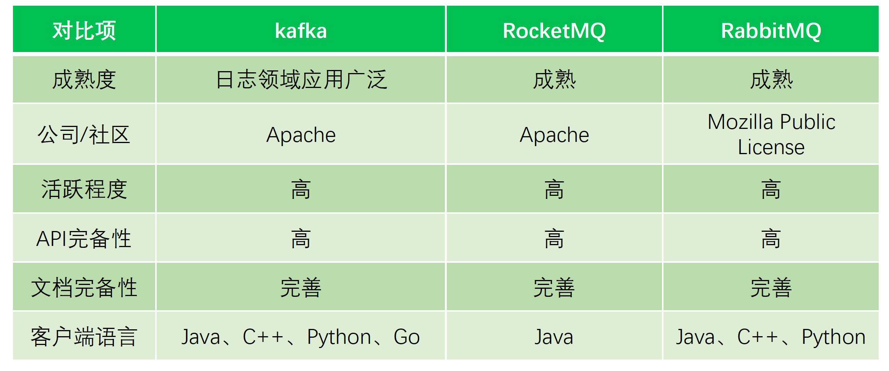
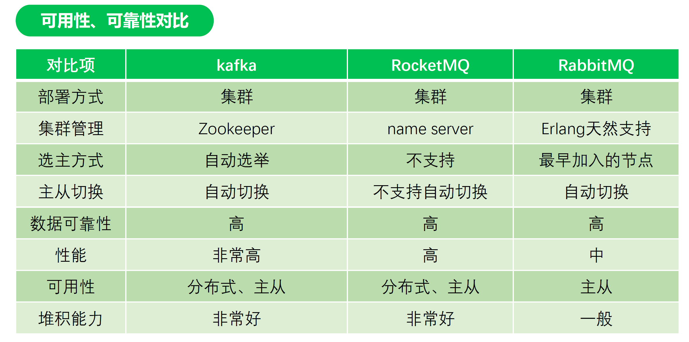
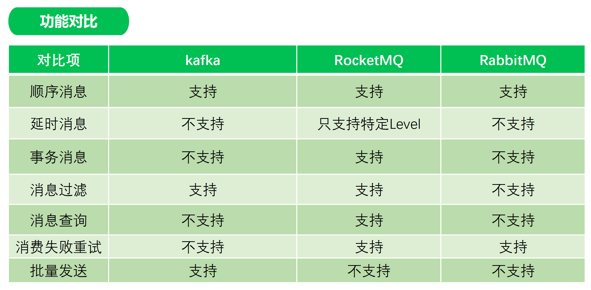

### 什么是消息队列

在消息的传输过程中保存消息的容器，生产者和消费者不直接通讯，依靠队列保证消息的可靠

性，避免了系统间的相互影响。

### 消息队列主要作用

- 业务解耦

  将模块间的RPC调用改为通过消息队列中转，解除系统间的耦合

  通过MQ解耦

  - 提升系统稳定性

  - 通过广播消息避免多次调用

  - 提高编码效率

- 异步调用

  对于无需关注调用结果的场景，可以通过消息队列异步处理

- 流量削峰

  系统的吞吐量往往取决于底层存储服务的处理能力，数据访问层可以调整消费速度缓解存储服务压力，避免

  短暂的高峰将系统压垮

### 引入MQ对系统架构影响

- 系统可用性

- 架构复杂度

- 排查问题路径

### 主流消息队列选型对比分析

目前主流的MQ主要是RocketMQ、Kafka、RabbitMQ，选型是应该从以下几个维度对比

- 系统定位

- 支持功能

- 可用性

- 可靠性

- 运维

