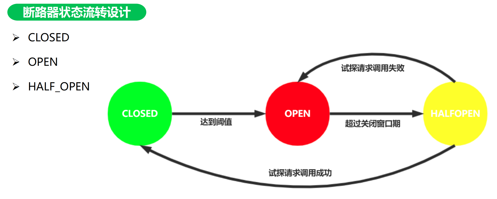
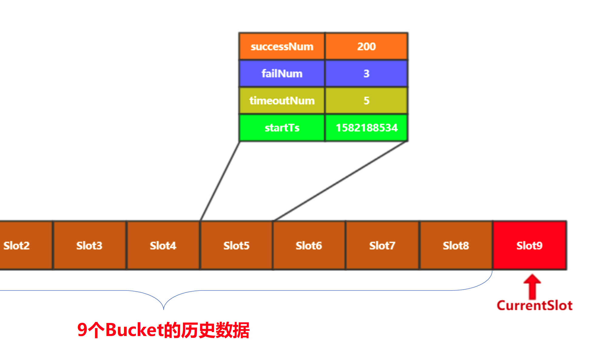
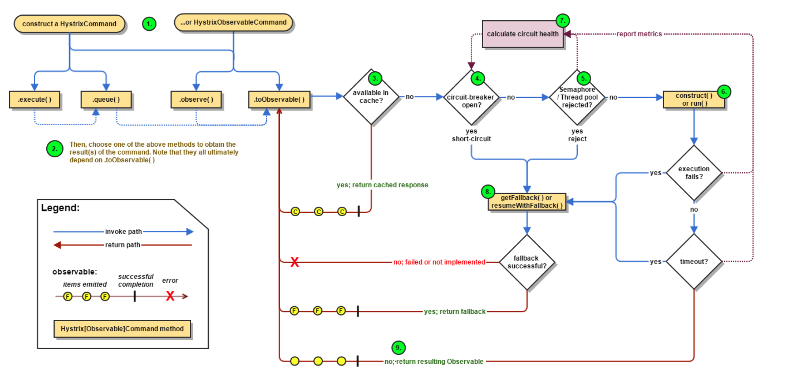

## 服务容错分析

### 服务容错意义

- 单个节点故障，可能被无限向上放大；

- 多租户相互影响；

- 瞬时流量激增，系统抗不住；

### 解决方案

- 资源隔离

  - 线程隔离
    1. 服务端按请求分队列隔离，每个队列可以设置优先级，每个队列中的任务由单独的线程池处理。
    2. 调用方工作线程隔离，针对每个服务提供方设立专门的线程池发起调用。
  - 信号量隔离：用于限制调用的并发数

- 熔断

  临时关闭对某些功能的调用，个别业务不可用，系统整体可用（用户可感知）

- 服务降级

  有损提供服务，服务柔性可用（用户不易感知）

  降级触发的时机有：1. 发生熔断 2.调用超时/异常

### 断路器设计

断路器：服务熔断开关，当对下游服务调用异常量达到设定阈值后，打开断路器，触发熔断

实现断路器技术要点

- 断路器控制逻辑

  

- 阈值与统计数据

  利用Bucket记录单位时间内调用总次数，成功失败次数，将一段时间内的所有Bucket放入一个循环数组中，利用滑动窗口来计算是否达到熔断阈值。

  

## 熔断组件Hystrix原理剖析

Hystrix语义为“豪猪"，是由Netflix开源的一个服务隔离组件，通过服务隔离来避免由于依赖延迟、异常，

引起资源耗尽导致系统不可用的解决方案。

### Hystrix解决问题

- 阻止某个有问题调用耗尽系统的所有线程

- 阻止错误在分布式系统之间的传播

- 快速失败代替请求排队

- 错误回退、优雅的服务降级

### 依赖隔离

1. 包装依赖调用逻辑，每个命令在单独线程池中执行；

2. 可配置依赖调用超时时间，当调用超时时，执行的fallback逻辑；

3. 线程池已满调用将被立即拒绝，快速失败判定。

4. 依赖调用请求失败(异常，拒绝，超时，断路)时执行fallback逻辑；

5. 提供熔断器组件,可以自动运行或手动调用;

### 主要特性

- 资源隔离：限制调用服务使用的资源，当某一下游服务出现问题是，不会影响整个调用链。

- 熔断机制：当失败率达到阀值自动触发熔断，熔断器触发不再进行调用

- 降级机制：超时、资源耗尽或触发熔断后，调用预设的降级接口返回托底数据。

### Hystrix执行逻辑

