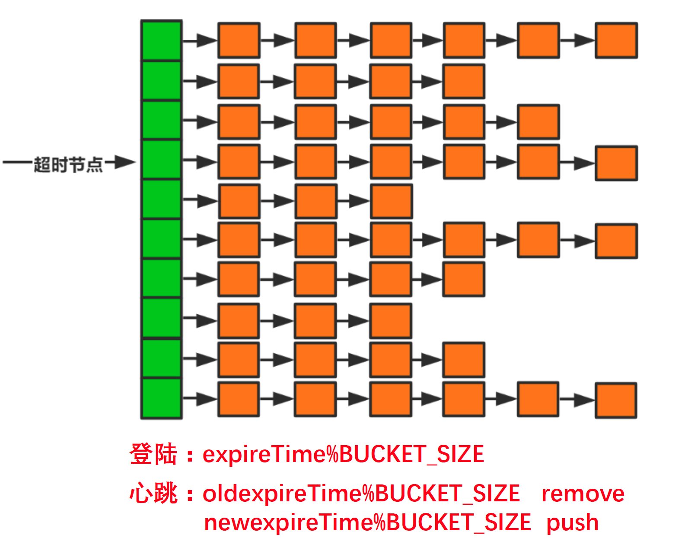
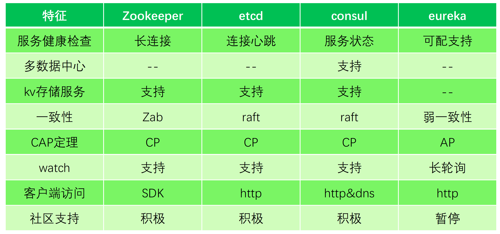
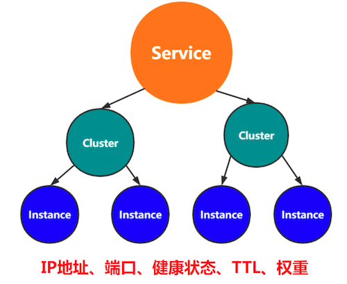
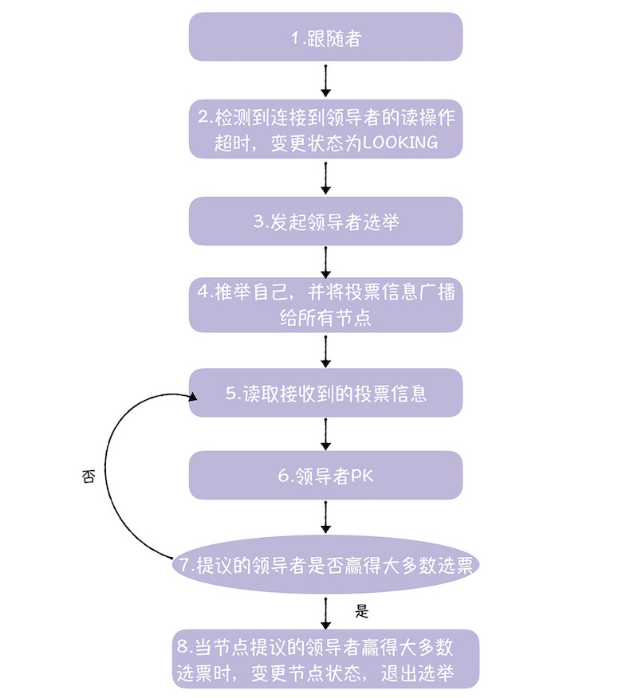

## 注册中心作用及设计分析

### 什么是注册中心？

用来实现微服务实例的自动注册与发现，是分布式系统中的核心基础服务

### 主要功能

- 服务注册

  服务提供方将自身路由信息，服务信息发布到注册中心，供消费方获取用于与提供方建立连接并发起调用。

  （路由信息： 节点IP，端口，服务信息：序列化协议，路由规则，节点权重）

- 服务发现

  服务消费方通过访问注册中心获取服务提供方节点路由信息。

  - 服务消费方启动后，从注册中心拉取服务提供方节点列表，建立连接，进行RPC调用。

  - 接受注册中心变更通知，重新获取数据，更新节点列表。
  - 服务消费方运行过程中定时拉取服务提供节点列表，更新本地数据。

- 健康检查

  确保已注册节点健康度，能够及时准确剔除失效节点，保证服务发现正确性

- 变更通知

  当服务提供方节点发生变更时，注册中心应该能够第一时间把变更事件或变更后的数据推送到服务订阅方。

- 服务治理相关

  服务扩/缩容，机器迁移，权重，灰度流量

### 设计实现

- 数据存储，需要存储的数据有

  - 每个服务节点的信息
  - 每种服务的集群信息
  - 每个节点订阅者的信息

- 超时处理

  当注册中心在超时时长内未收到服务节点的心跳，需要移除该节点信息。以下提供一种超时扫描方法

  

  1. 服务节点向注册中心发起首次心跳时，带上参数expireTime(当前时间加上超时时长)，注册中心收到后，利用expireTime%BUCKET_SIZE算出，应该将这个节点放到哪个桶中。
  2. 服务节点在下一次心跳时，带上两个参数， oldexpireTime上一次心跳发送的expireTime，newexpireTime新的过期时间，注册中心根据oldexpireTime%BUCKET_SIZE找到对应的桶，将该节点从中移除（如果该节点不发心跳了，该节点就会一直留在那个桶中）。根据newexpireTime%BUCKET_SIZE找到新的桶，将该节点放到新的桶中。
  3. 注册中心每隔一秒访问一个桶，留在桶中的节点都是心跳超时的节点，不健康的节点，因此会被注册中心移除出节点列表。

  上述算法的优点是，不需要每次都遍历所有节点来判断是否过期。但是节点数少的时候，例如1000以内，每次都遍历所有节点其实也能接受。

- 实现思路

  1. 自带存储，保证数据一致性
  2. 逻辑+配套存储(Redis)

一个注册中心节点发生变更，怎么将变更通知到其他节点？Gossip协议

Gossip 过程是由种子节点发起，当一个种子节点有状态需要更新到网络中的其他节点时，它会随机的选择周围几个节点散播消息，收到消息的节点也会重复该过程，直至最终网络中所有的节点都收到了消息。这个过程可能需要一定的时间，由于不能保证某个时刻所有节点都收到消息，但是理论上最终所有节点都会收到消息，因此它是一个最终一致性协议。

- 六度分离理论
- 周期性散播消息
- 随机选择N个节点散播
- 散播不重复(不是严格不重复)不回传

Gossip缺陷： 1. 消息延迟 2. 消息冗余，可能消息会重复发到同一个节点

### 注册中心选型对比

ZK是顺序一致性。

## Nacos分析

### 健康检查

对于临时节点（随时可能下线节点）采用心跳注册，临时实例使用心跳上报方式维持活性，5秒上报，15秒标记不健康，30秒剔除。对于持久化节点，采用tcp/http探测。

### 数据模型

- 数据存储

  

- 数据隔离

  四层数据隔离 1. 账号 2. 命名空间指定集群 3.分组 4.服务名标识服务   

- 数据一致性

  Raft CP一致性， Distro AP一致性

  Distro协议，每个节点维护注册在自己这里节点的心跳，通过广播的形式同步到其他节点。

## Zookeeper，Zab分析

Zab协议（Zookeeper Atomic Broadcast）

### 实现操作顺序性

如何实现？

- 将每个操作设定为一个提案，并赋予一个自增的ZXID
- Leader节点通过TPC协议保障提案有序地发送到Follwer节点？？？
- 按照ZXID，顺序提交提案，前一个提案未提交之前不能提交下一个

### 选主逻辑

节点角色：

server节点组成的一个集群，在集群中存在一个唯一的leader节点负责响应写入请求，其他节点只负责接收

转发Client请求。

Leader：响应写入请求，发起提案，超过半数Follower同意写入，写入成功；

Follower：响应查询，将写入请求发给Leader，参与选举和写入投票

ObServer：响应查询，将写入请求发给Leader，不参与投票，只接收写入结果

节点状态：

- LOOKING：选举状态，该状态下的节点认为当前集群中没有领导者，会发起领导者选举。
- FOLLOWING ：跟随者状态，意味着当前节点是跟随者。
- LEADING ：领导者状态，意味着当前节点是领导者。
- OBSERVING： 观察者状态，意味着当前节点是观察者。

获得过半投票数为新主，投票数据<proposedLeader, proposedEpoch, ZXID, node>

- proposedLeader，节点提议的，领导者的集群 ID，也就是在集群配置（比如 myid 配置文件）时指定的 ID。
- proposedEpoch，节点提议的，领导者的任期编号。
- proposedLastZxid，事务标识符，越大表示数据越新。
- node，投票的节点，比如节点 B。

比较策略：proposedEpoch大的胜出，proposedEpoch相同比较proposedLastZxid大的胜出，proposedLastZxid相同比较proposedLeader大的胜出。

选主流程：

- 领导者选举的目标，是选举出大多数节点中数据最完整的节点，也就是大多数节点中事务标识符值最大的节点。
- 逻辑时钟（logicclock）（也就是选举的轮次），会影响选票的有效性，具体来说，逻辑时钟大的节点不会接收来自值小的节点的投票信息。
- 在领导者选举的实现中，事务标识符采用的是 dataTree.lastProcessedZxid 的值。需要你特别注意的是，在跟随者节点正常运行时，dataTree.lastProcessedZxid 表示的是已提交提案的事务标识符最大值，但当跟随者检测到异常，退出跟随者状态时（在 follower.shutdown() 函数中），跟随者会将所有未提交提案提交，并使用 lastProcessedZxid 表示节点上提案（包括刚提交的提案）的事务标识符的最大值，在接下来的领导者选举中，使用的也是该值，也就是说，ZAB 的领导者选举，选举出的是大多数节点中数据最完整的节点。

### 故障恢复

### 数据一致性保障

Leader负责处理写入请求，两阶段提交。