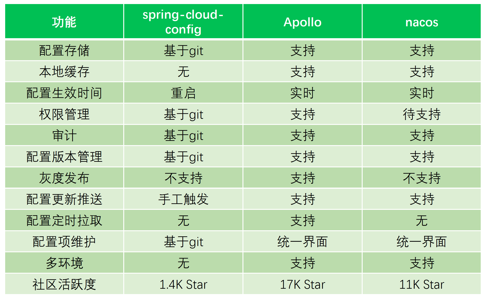
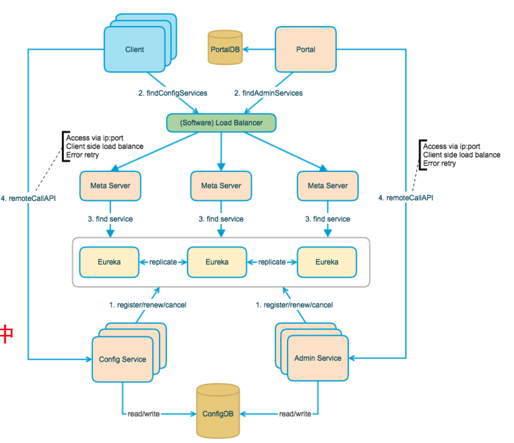
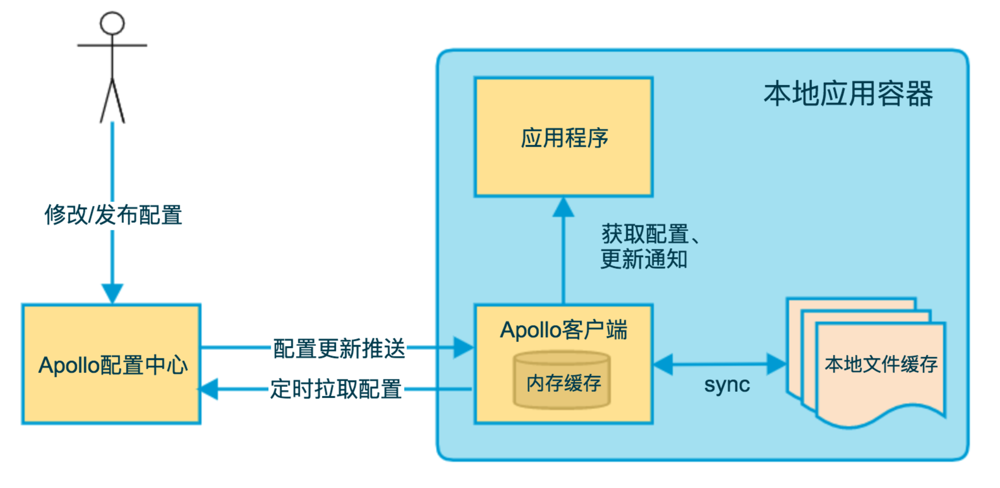

## 配置中心在分布式架构中的作用

模块配置：可以在不重新编译代码的情况下，改变程序运行逻辑、调整边界值、被调用模块路由信息等等，

用来方便维护，提高工作效率一种手段。常见配置文件种类有：xml, properties, YAML

不使用配置中心之前，每个服务实例使用自己的本地配置文件，本地配置的方式有如下缺点：

- 重启生效
- 不易维护
- 生效慢

### 什么是配置中心

配置中心：分布式系统中集中化管理线上应用程序配置项的管理中心

引入配置中心带来的好处

- 效率提升

- 维护成本降低

- 安全性提升

### 功能分析

- 配置项管理
  - 配置项编辑
  - 版本管理
  - 热发布
  - 灰度发布
  - 环境隔离
  - 提供API接口

- 权限控制
  - 读权限
  - 写权限

- 操作审计
  - 记录用户操作行为

## 开源配置中心选型

- spring-cloud/spring-cloud-config

  spring出品，可以和spring cloud无缝配合

- nacos

  阿里中间件团队开源配置中心

- ctrip apollo

  Apollo（阿波罗）是携程框架部门研发的开源配置管理中心，具备规范的权限、流程治理等特性。

### 选择Apollo

- 统一管理不同环境、不同集群的配置

- 配置修改实时生效（热发布）

- 版本发布管理

- 权限管理、发布审核、操作审计

- 提供Java和.Net原生客户端

- 部署简单

### Apollp整体架构

Config Service:

- 提供配置的读取、推送等功能

Admin Service：

- 提供配置的修改、发布等功能

Portal：管理界面

Eureka：注册中心

MetaServer：Eurka代理

Eurka、MetaServer集成在Config Service中

### Apollo重要特性

- 多环境支持
  - 开发环境
  - 测试环境
  - 沙箱环境
  - 生产环境

- Namespace管理
  - 私有类型
  - 共有类型
  - 关联类型

- 配置实时发布

  - ConfigService定时扫描

  - 客户端长轮询

### 客户端工作原理

实时获取配置

- 实时性：长轮训+定时拉取

- 可用性：本地文件缓存

配置变更推送

客户端与服务端使用长轮询方式保持一条连接，服务端以此连接实现向客户端的通知推送

长轮询

- 服务端挂起请求的方式达到长连接的效果

- 实现消息实时推送

- 弥补Pull/Push方式的不足

Apollo长轮询逻辑

- 客户端会发起一个Http请求到Config Service。

- Config Service 不会立即返回结果，而是把请求挂起。

- 如果在60秒内没有该客户端关心的配置发布，向客户端返回304。

- 如果有该客户端关心的配置发布，组装变更通知放入http返回数据中。

配置项热生效：通过注册监听器，应用程序获取配置的更新通知，做出相应变更。

Apollo客户端数据源顺序：

1. System中获取
2. 本地仓库获取（本地缓存）
3. env获取
4. 配置文件获取