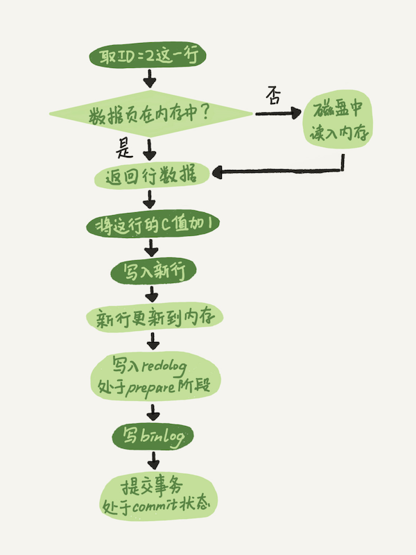

# 2. 日志系统

##一条SQL更新语句是如何执行的？

```sql
mysql> create table T(ID int primary key, c int);
mysql> update T set c=c+1 where ID=2;
```



## 两阶段提交

更新完内存中的数据之后，写入redo log，并处于prepare阶段，但并事务没有提交，即使此时

刷盘，之后被读出来依然是未提交数据。等到binlog写入完成，将事务正式提交，处于commit状态。

两阶段提交的目的是为了保证数据库的状态和用它的日志恢复出来的库的状态一致，如果没有两阶段提交，无论先写binlog还是先写redo log，在系统崩溃的情况下，都会出错。

# 3. 事务隔离

## 视图

读已提交和可重复读的实现方式是创建视图，然后通过MVCC控制事务能够访问的数据。在“可重复读”的隔离模式下，视图是在事务启动的时候创建的，整个事务存在期间都用这个视图。

在“读已提交”的隔离模式下，视图是在每个SQL语句开始执行的时候创建的。


# 6. 全局锁和表锁

## 全局锁

对整个数据库加锁，使用`flush tables with read lock`命令。

使用场景：做全库逻辑备份

对于支持事务的表，使用mysqldump -single-transaction 来做备份会更好，因为不会导致数据库在备份期间不可写。

## 表级锁

表级锁分两种，一种是表锁，一种是元数据锁(mete data lock, MDL)

- 表锁的语法是`lock table .. read/write`
- MDL不需要显示使用，在对表增删改查时，加MDL读锁，对表做结构变更操作时，加MDL写锁。

# 7.行锁

## 两阶段锁

行锁是在写SQL语句真正被执行的时候加的，在事务结束后才释放，因此尽量把加锁语句放到事务的后面。

## 死锁

对于死锁，有两种解决办法，一是超时回滚，二是主动死锁检测。死锁检测的计算量很大，而超时回滚不好控制超时时间的设置。

# 8. 事务

可重复读实现—视图。在事务启动时，创建一个视图，实际上就是一个事务数组，这个数组里面记录了此时活跃的所有事务id。

事务数组里面事务ID最小值记为低水位，当前系统里已经创建过的事务ID最大值称为高水位。

这个视图数组把所有的row trx_id分为了一下情况。


对于当前事务来说，一个数据版本的row trx_id，有以下几种情况

- 落在绿色区域，表示这个版本是已提交或者当前事务自己生成的，可见。
- 落在红色部分，表示这个版本是由将来启动的事务生成的，肯定是不可见的。
- 落在黄色区域
  - 如果row trx_id在事务数组中，表示是未提交事务生成的，不可见。
  - 如果row trx_id不在事务数组中，表示是已经提交的事务生成的，可见。

对于读已提交，视图是在每条SQL执行的时候生成。

# 9. 普通索引和唯一索引，怎么选择？

无论是普通索引还是唯一索引，读的性能都差不多，无非是普通索引可能会多读至多一个数据页。有区别的地方就在于写，因为对普通索引上的写不用判断唯一性，因此无论是更新还是插入，都不需要立即去读盘，就可以使用change buffer这个机制来提高性能。而对于唯一索引，在写的时候，必须去读盘判断其唯一性是否满足，因此无法使用change buffer来提高性能。

## Change Buffer

当对数据进行修改的时候，如果数据页刚好在内存中，则直接修改。如果不在内存中，将修改操作（对数据的修改，对索引的修改）写到Change Buffer里面，当该数据页下次被读出来的时候，进行Merge操作，将新数据正式写到数据页中。当从磁盘读出一个页到内存中时，怎么知道它是不是最新数据，需不需要和change buffer进行merge呢？检测Insert Buffer Bitmap页，里面记录了哪些页有更新操作保存在了change buffer里面。

merge操作会在后台线程中定期执行，也会在数据库关闭时，执行merge操作。

什么情况下能使用change buffer？只能是普通索引，不能是唯一索引。如果写操作之后需要马上读，则change buffer完全没有作用，甚至拖累性能。最佳使用场景是账单类，日志类的系统这种写多读少的系统。

比较change buffer和redo log在对更新操作性能方面的收益，change buffer主要减少随机读的IO消耗，redo log减少随机写的IO消耗（将随机写变为顺序写）。

