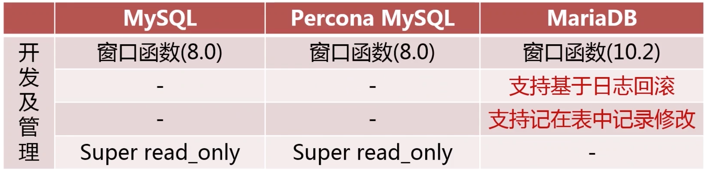
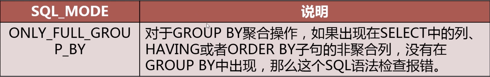

# 1. MySQL版本类问题

## 1.1 如何选择使用何种版本的MySQL

问题：为什么选择某一版本MySQL版本？

知识点：

### 1.1.1 MySQL常见发行版

- MySQL官方版本，Oracle所属,innodb也属于Oracle，不开源。又分为企业版，社区版。企业版性能更好，功能更多提供监控工具。
- Percona MySQL，兼容官方版，提供了官方企业版才有的功能。Percona社区版对官方社区版进行了优化。Percona是在官方版本基础上开发，落后于官方版。
- MariaDB，不能保证完全兼容，大多数功能兼容。MySQL数据可以很容易迁移到MariaDB上。

### 1.1.2 各个发行版之间的区别和优缺点




## 1.2 如何对MySQL进行升级

### 1.2.1 在升级前考虑什么

1. 升级给业务带来的益处
   - 是否解决业务上的痛点
   - 是否解决运维上的痛点
2. 升级带来的影响
   - 对原业务程序的支持是否有影响
   - 对原业务程序的性能是否有影响
3. 数据库升级方案的制定
   - 评估受影响的业务系统
   - 升级的详细步骤
   - 升级后的数据库环境检查
   - 升级后的业务检查
4. 升级失败的回滚方案
   - 升级失败回滚步骤
   - 回滚后的数据库环境检查
   - 回滚后的业务检查

### 1.2.2 数据库升级步骤

1. 对待升级数据库进行备份
2. 升级Slave服务器版本
3. 手动进行主从切换
4. 升级Master服务器版本
5. 升级完成后进行业务检查

## 1.3 最新的MySQL版本及新特性

MySQL8.0版本主要的新特性


# 2. MySQL用户管理常见问题

## 2.1 如何在给定场景下为某用户授权

### 2.1.1 定义MySQL数据库账号

- 用户名@可访问控制列表(允许访问的IP)

### 2.1.2 MySQL常用的用户权限


### 2.1.3 如何为用户授权

- 遵循最小权限原则
- 使用Grant命令对用户授权

```mysql
grant select, insert, update on db.tb to user@ip;
```

- 收回用户命令

```mysql
revoke delete on db.tb from user@ip;
```


## 2.2 如何保证数据库账号的安全

### 2.2.1 数据库用户管理流程规范

- 最小权限原则
- 密码强度策略
- 密码过期原则
- 限制历史密码重用

## 2.3 如何从一个实例迁移数据库账号到另一个实例


- 导出用户建立及授权语句

  ```mysql
  pt-show-grants u=root,p=123456,h=localhost
  ```


# 3. 服务器配置类问题

## 3.1使用SQLMode改变SQL处理行为

SQL_MODE：配置MySQL处理SQL的方式

```mysql
set [session/global/persist] sql_mode = 'xxxx'
// persist 表示会在本地生成一个配置记录文件，下次启动会读取这个配置，设置为这个mode
```

常用的SQL Mode:



### 3.1.1 分析一个Group By语句的异常原因

