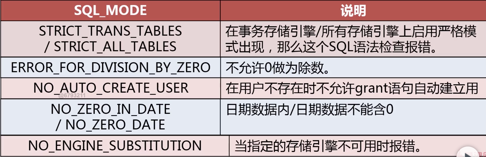
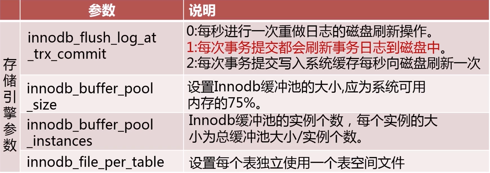
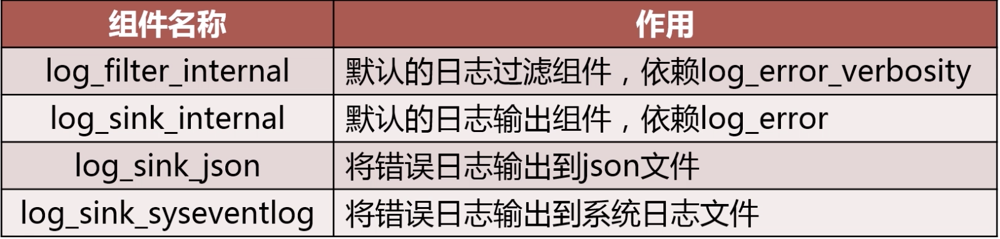

# 1. MySQL版本类问题

## 1.1 如何选择使用何种版本的MySQL

问题：为什么选择某一版本MySQL版本？

知识点：

### 1.1.1 MySQL常见发行版

- MySQL官方版本，Oracle所属,innodb也属于Oracle，不开源。又分为企业版，社区版。企业版性能更好，功能更多提供监控工具。
- Percona MySQL，兼容官方版，提供了官方企业版才有的功能。Percona社区版对官方社区版进行了优化。Percona是在官方版本基础上开发，落后于官方版。
- MariaDB，不能保证完全兼容，大多数功能兼容。MySQL数据可以很容易迁移到MariaDB上。

### 1.1.2 各个发行版之间的区别和优缺点


## 1.2 如何对MySQL进行升级

### 1.2.1 在升级前考虑什么

1. 升级给业务带来的益处
   - 是否解决业务上的痛点
   - 是否解决运维上的痛点
2. 升级带来的影响
   - 对原业务程序的支持是否有影响
   - 对原业务程序的性能是否有影响
3. 数据库升级方案的制定
   - 评估受影响的业务系统
   - 升级的详细步骤
   - 升级后的数据库环境检查
   - 升级后的业务检查
4. 升级失败的回滚方案
   - 升级失败回滚步骤
   - 回滚后的数据库环境检查
   - 回滚后的业务检查

### 1.2.2 数据库升级步骤

1. 对待升级数据库进行备份
2. 升级Slave服务器版本
3. 手动进行主从切换
4. 升级Master服务器版本
5. 升级完成后进行业务检查

## 1.3 最新的MySQL版本及新特性

MySQL8.0版本主要的新特性


# 2. MySQL用户管理常见问题

## 2.1 如何在给定场景下为某用户授权

### 2.1.1 定义MySQL数据库账号

- 用户名@可访问控制列表(允许访问的IP)

### 2.1.2 MySQL常用的用户权限


### 2.1.3 如何为用户授权

- 遵循最小权限原则
- 使用Grant命令对用户授权

```mysql
grant select, insert, update on db.tb to user@ip;
```

- 收回用户命令

```mysql
revoke delete on db.tb from user@ip;
```


## 2.2 如何保证数据库账号的安全

### 2.2.1 数据库用户管理流程规范

- 最小权限原则
- 密码强度策略
- 密码过期原则
- 限制历史密码重用

## 2.3 如何从一个实例迁移数据库账号到另一个实例


- 导出用户建立及授权语句

  ```mysql
  pt-show-grants u=root,p=123456,h=localhost
  ```


# 3. 服务器配置类问题

## 3.1使用SQLMode改变SQL处理行为

SQL_MODE：配置MySQL处理SQL的方式

```mysql
set [session/global/persist] sql_mode = 'xxxx'
// persist 表示会在本地生成一个配置记录文件，下次启动会读取这个配置，设置为这个mode
```

常用的SQL Mode:




## 3.2 对比配置文件同MySQL运行配置参数

 产生差异的原因是使用了set命令动态地调整了参数。

```mysql
set [session | @@session.] system_var_name = expr
set [global | @@global.] system_var_name = expr
set [persist | @@persist.] system_var_name = expr
```

使用pt-config-diff工具比较配置文件

```mysql
pt-config-diff u=root,p=,h=localhost /etc/my.cnf
```

## 3.3 MySQL中的关键性能参数

  





# 4. 日志类问题

## 4.1 常见日志类型


## 4.2 错误日志(error_log)

作用：

- 分析排查MySQL运行错误
- 记录未经授权的访问

参数：

- `log_error` = $mysql/sql_log/mysql-error.log ，设置错误日志保存地址。

- `log_error_verbosity` = [1,2,3]，设置记录错误日志级别

  

- 8.0新增的配置参数：`log_error_services` = [日志服务组件；日志服务组件]

  

## 4.3 常规日志(general_log)

作用：

- 记录所有发向MySQL的请求

参数：

- `general_log` = [ON | $\color{red}{OFF}$]，开启关闭功能。
- `general_log_file`，设置log输出目录。
- `log_output` = [$\color{red}{FILE}$ | TABLE |NONE]，设置log存储方式。

## 4.4 慢查询日志(slow_query_log)

作用：

- 将执行成功并符合条件的查询记录到日志中。
- 找到需要优化的SQL。

参数：

- `slow_query_log` = [ON | $\color{red}{OFF}$]，开启关闭功能。
- `slow_query_log_file`，设置log输出目录。
- `long_query_time` = xx秒，查询执行时间大于这个值才被记录。
- `log_queries_not_using_indexes` = [ON | $\color{red}{OFF}$]，没使用index的query。
- `log_slow_admin_statements` = [ON | $\color{red}{OFF}$]，记录管理命令。
- `log_slow_slave_statements` = [ON | $\color{red}{OFF}$]

## 4.5 二进制日志(binary_log)

作用：

- 记录所有对数据库中数据的**修改**。
- 基于时间点的备份和恢复。
- 主从复制。

参数：

- `log_bin`=[=basename]，必须在配置文件里面修改。
- `binlog_format `= [$\color{red}{ROW}$ | STATEMENTS |MIXED]，以块为单位还是以行为单位记录日志，以块为单位就记录sql语句，以行为单位就记录被影响的每一行。
- `binlog_row_image` = [$\color{red}{FULL}$ | MINIMAL | NOBLOB]，定义row模式记录的方式，默认记录修改前和后**整行**的记录。MINIMAL模式下只记录被修改的列。NOBLOB，记录除了BLOB类的列之外修改前后的值。
- `binlog_rows_query_log_events` = [ON | $\color{red}{OFF}$]，记录被修改的行的同时，记录下修改该行的SQL。
- `log_slave_updates` =  [ON | $\color{red}{OFF}$]，是否记录从master机器上备份过来的bin_log。
- `sync_binlog` = [0 | $\color{red}{1}$]，默认每写一次binlog就往磁盘上写一次。设置为0，表示由操作系统自己决定什么时候刷新。
- `expire_logs_days` = days，bin_log过期时间，以天为单位，到期自动清理。
- `PURGE BINARY LOGS TO 'mysql-bin.010'`，将mysql-bin.010之前的bin_log删除。
- `PURGE BINARY LOGS BEFORE '2018-04-22 22:46:26'`，将2018-04-22 22:46:26之前的bin_log删除。

## 4.6 中继日志(relay_log)

只存在于主从架构中，slave上。

作用：

- 临时记录从主服务器同步的二进制日志。

参数：

- `relay_log` = filename，log存放位置。
- `relay_log_purge` =  [ $\color{red}{ON}$ | OFF]，记录被使用之后，是否自动清理。

# 5. 存储引擎类问题

MySQL常用的存储引擎


## 5.1 MyISAM引擎

特点：

- 非事务型存储引擎
- 以堆表方式存储
- 使用表级锁
- 支持Btree索引，空间索引，全文索引
- 表，数据，索引分开存储
- 可以压缩
- 表可以没有主键

堆表：

- 堆就是无序数据的集合,索引就是将数据变得有序,在索引中键值有序,数据还是无序的
- 数据存放在数据里面,索引存放在索引里
- 堆表中,主键索引和普通索引一样的,叶子节点存放的是指向堆表中数据的指针（可以是一个页编号加偏移量）,指向物理地址,没有回表的说法
- 堆表中,主键索引和普通索引基本上没区别,和非空的唯一索引没区别
- mysql 的 myisam 引擎，oracle pg 都支持的是堆表

读性能优于Innodb，因为：

1. MyISAM不用回表，索引都直接指向数据物理地址。

2. INNODB需要维护MVCC一致；

3. MyISAM 表锁.牺牲了写性能,提高了读性能。

使用场景：

- 读操作远远大于写操作的场景
- 不需要事务的场景

## 5.2 CSV存储引擎

特点：

- 不支持事务
- 数据以CSV格式存储，以逗号隔开
- 所有的列多不为NULL
- 不支持索引

使用场景：

- 作为数据交换的中间表使用

## 5.3 Archive引擎

特点：

- 非事务型存储引擎
- 表数据使用zlib压缩(比MyISAM小75%，比Innodb小23%)
- 只支持Insert和Select，不支持更改，删除
- 只允许在自增ID上建索引

使用场景：

- 日志和数据采集类应用
- 数据归档存储

## 5.4 Memory存储引擎

特点：

- 不支持事务
- 数据保存在内存中，读取快，易丢失
- 所有字段长度固定
- 支持Btree和Hash索引

使用场景：

- 用于缓存字典映射表
- 缓存周期性分析数据

## 5.5 Innodb存储引擎

特点：

- 事务型存储引擎，支持ACID
- 数据按主键聚集存储
- 支持行级锁及MVCC
- 支持Btree和自适应Hash索引
- 支持全文和空间索引

使用场景：

- 大多数OLTP场景

### 5.5.1 Innodb不支持在线修改表结构的场景：


在线DDL存在的问题：

- 有部分语句不支持在线DDL
- 长时间DDL操作会引起严重的主从延迟
- 无法对DDL操作进行资源限制

如何更安全的执行DDL：

- `pt-online-schema-change [OPTIONS] DSN`

### 5.5.2 Innodb如何实现事务：


### 5.5.3 InnoDB MVCC实现方式


## 5.6 NDB引擎

特点：

- 事务型存储引擎，只支持读已提交事务隔离级别
- 要求数据在使用前，加载到内存中
- 支持行级锁
- 支持高可用集群
- 支持Ttree索引

使用场景：

- 需要数据完全同步的高可用场景