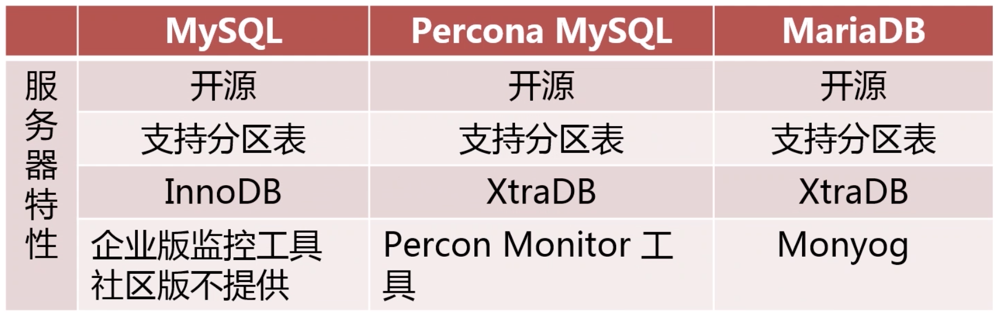
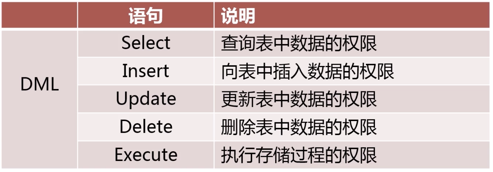
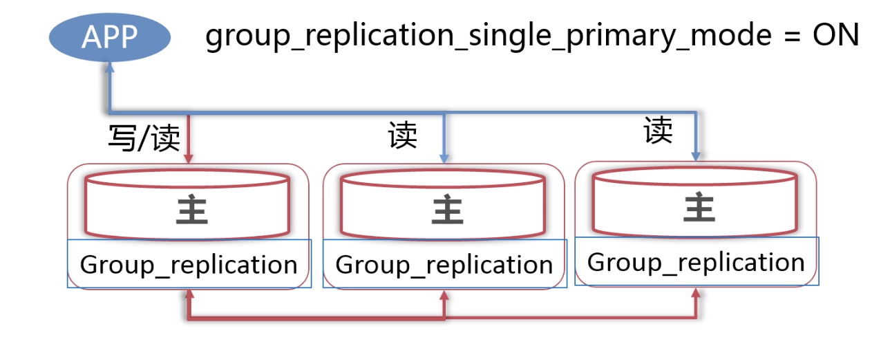
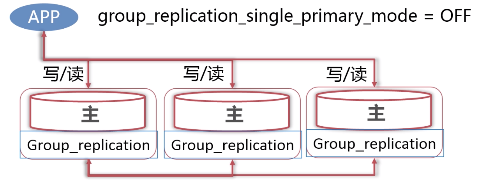

# 1. MySQL版本类问题

## 1.1 如何选择使用何种版本的MySQL

问题：为什么选择某一版本MySQL版本？

知识点：

### 1.1.1 MySQL常见发行版

- MySQL官方版本，Oracle所属,innodb也属于Oracle，不开源。又分为企业版，社区版。企业版性能更好，功能更多提供监控工具。
- Percona MySQL，兼容官方版，提供了官方企业版才有的功能。Percona社区版对官方社区版进行了优化。Percona是在官方版本基础上开发，落后于官方版。
- MariaDB，不能保证完全兼容，大多数功能兼容。MySQL数据可以很容易迁移到MariaDB上。

### 1.1.2 各个发行版之间的区别和优缺点




## 1.2 如何对MySQL进行升级

### 1.2.1 在升级前考虑什么

1. 升级给业务带来的益处
   - 是否解决业务上的痛点
   - 是否解决运维上的痛点
2. 升级带来的影响
   - 对原业务程序的支持是否有影响
   - 对原业务程序的性能是否有影响
3. 数据库升级方案的制定
   - 评估受影响的业务系统
   - 升级的详细步骤
   - 升级后的数据库环境检查
   - 升级后的业务检查
4. 升级失败的回滚方案
   - 升级失败回滚步骤
   - 回滚后的数据库环境检查
   - 回滚后的业务检查

### 1.2.2 数据库升级步骤

1. 对待升级数据库进行备份
2. 升级Slave服务器版本
3. 手动进行主从切换
4. 升级Master服务器版本
5. 升级完成后进行业务检查

## 1.3 最新的MySQL版本及新特性

MySQL8.0版本主要的新特性


# 2. MySQL用户管理常见问题

## 2.1 如何在给定场景下为某用户授权

### 2.1.1 定义MySQL数据库账号

- 用户名@可访问控制列表(允许访问的IP)

### 2.1.2 MySQL常用的用户权限




### 2.1.3 如何为用户授权

- 遵循最小权限原则
- 使用Grant命令对用户授权

```mysql
grant select, insert, update on db.tb to user@ip;
```

- 收回用户命令

```mysql
revoke delete on db.tb from user@ip;
```


## 2.2 如何保证数据库账号的安全

### 2.2.1 数据库用户管理流程规范

- 最小权限原则
- 密码强度策略
- 密码过期原则
- 限制历史密码重用

## 2.3 如何从一个实例迁移数据库账号到另一个实例


- 导出用户建立及授权语句

  ```mysql
  pt-show-grants u=root,p=123456,h=localhost
  ```


# 3. 服务器配置类问题

## 3.1使用SQLMode改变SQL处理行为

SQL_MODE：配置MySQL处理SQL的方式

```mysql
set [session/global/persist] sql_mode = 'xxxx'
// persist 表示会在本地生成一个配置记录文件，下次启动会读取这个配置，设置为这个mode
```

常用的SQL Mode:


## 3.2 对比配置文件同MySQL运行配置参数

 产生差异的原因是使用了set命令动态地调整了参数。

```mysql
set [session | @@session.] system_var_name = expr
set [global | @@global.] system_var_name = expr
set [persist | @@persist.] system_var_name = expr
```

使用pt-config-diff工具比较配置文件

```mysql
pt-config-diff u=root,p=,h=localhost /etc/my.cnf
```

## 3.3 MySQL中的关键性能参数

  


# 4. 日志类问题

## 4.1 常见日志类型


## 4.2 错误日志(error_log)

作用：

- 分析排查MySQL运行错误
- 记录未经授权的访问

参数：

- `log_error` = $mysql/sql_log/mysql-error.log ，设置错误日志保存地址。

- `log_error_verbosity` = [1,2,3]，设置记录错误日志级别

  

- 8.0新增的配置参数：`log_error_services` = [日志服务组件；日志服务组件]

  

## 4.3 常规日志(general_log)

作用：

- 记录所有发向MySQL的请求

参数：

- `general_log` = [ON | $\color{red}{OFF}$]，开启关闭功能。
- `general_log_file`，设置log输出目录。
- `log_output` = [$\color{red}{FILE}$ | TABLE |NONE]，设置log存储方式。

## 4.4 慢查询日志(slow_query_log)

作用：

- 将执行成功并符合条件的查询记录到日志中。
- 找到需要优化的SQL。

参数：

- `slow_query_log` = [ON | $\color{red}{OFF}$]，开启关闭功能。
- `slow_query_log_file`，设置log输出目录。
- `long_query_time` = xx秒，查询执行时间大于这个值才被记录。
- `log_queries_not_using_indexes` = [ON | $\color{red}{OFF}$]，没使用index的query。
- `log_slow_admin_statements` = [ON | $\color{red}{OFF}$]，记录管理命令。
- `log_slow_slave_statements` = [ON | $\color{red}{OFF}$]

## 4.5 二进制日志(binary_log)

作用：

- 记录所有对数据库中数据的**修改**。
- 基于时间点的备份和恢复。
- 主从复制。

参数：

- `log_bin`=[=basename]，必须在配置文件里面修改。
- `binlog_format `= [$\color{red}{ROW}$ | STATEMENTS |MIXED]，以块为单位还是以行为单位记录日志，以块为单位就记录sql语句，以行为单位就记录被影响的每一行。
- `binlog_row_image` = [$\color{red}{FULL}$ | MINIMAL | NOBLOB]，定义row模式记录的方式，默认记录修改前和后**整行**的记录。MINIMAL模式下只记录被修改的列。NOBLOB，记录除了BLOB类的列之外修改前后的值。
- `binlog_rows_query_log_events` = [ON | $\color{red}{OFF}$]，记录被修改的行的同时，记录下修改该行的SQL。
- `log_slave_updates` =  [ON | $\color{red}{OFF}$]，是否记录从master机器上备份过来的bin_log。
- `sync_binlog` = [0 | $\color{red}{1}$]，默认每写一次binlog就往磁盘上写一次。设置为0，表示由操作系统自己决定什么时候刷新。
- `expire_logs_days` = days，bin_log过期时间，以天为单位，到期自动清理。
- `PURGE BINARY LOGS TO 'mysql-bin.010'`，将mysql-bin.010之前的bin_log删除。
- `PURGE BINARY LOGS BEFORE '2018-04-22 22:46:26'`，将2018-04-22 22:46:26之前的bin_log删除。

## 4.6 中继日志(relay_log)

只存在于主从架构中，slave上。

作用：

- 临时记录从主服务器同步的二进制日志。

参数：

- `relay_log` = filename，log存放位置。
- `relay_log_purge` =  [ $\color{red}{ON}$ | OFF]，记录被使用之后，是否自动清理。

# 5. 存储引擎类问题

MySQL常用的存储引擎


## 5.1 MyISAM引擎

特点：

- 非事务型存储引擎
- 以堆表方式存储
- 使用表级锁，不支持行锁。
- 支持Btree索引，空间索引，全文索引
- 表(.frm)，数据(.MYD)，索引(.MYI)分开存储
- MySQL只缓存MyISAM索引，数据的缓存由操作系统本身来完成。
- 针对只读表，支持压缩
- 表可以没有主键
- 不支持外键

堆表：

- 堆就是无序数据的集合,索引就是将数据变得有序,在索引中键值有序,数据还是无序的。 
- 数据存放在数据文件里面,索引存放在索引文件里。
- 堆表中,主键索引和普通索引一样的,叶子节点存放的是指向堆表中数据的指针（可以是一个页编号加偏移量）,指向物理地址,没有回表的说法
- mysql 的 myisam 引擎，oracle pg 都支持的是堆表

使用场景：

- 读操作远远大于写操作的场景，OLAP应用
- 只读类应用
- 空间类应用
- 不需要事务的场景

## 5.2 CSV存储引擎

特点：

- 不支持事务
- 数据以CSV格式存储，以逗号隔开
- 所有的列都不为NULL
- 不支持索引

使用场景：

- 作为数据交换的中间表使用

## 5.3 Archive引擎

特点：

- 非事务型存储引擎
- 表数据使用zlib压缩(比MyISAM小75%，比Innodb小23%)
- 只支持Insert和Select，不支持更改，删除
- 只允许在自增ID上建索引

使用场景：

- 日志和数据采集类应用
- 数据归档存储

## 5.4 Memory存储引擎

特点：

- 不支持事务
- 数据保存在内存中，读取快，易丢失
- 所有字段长度固定
- 支持Btree和Hash索引

使用场景：

- 用于缓存字典映射表
- 缓存周期性分析数据

## 5.5 Innodb存储引擎

特点：

- 事务型存储引擎，支持ACID
- 数据按主键聚集存储
- 支持外键
- 支持行级锁及MVCC
- 支持Btree和自适应Hash索引，全文索引和空间索引

使用场景：

- 大多数OLTP场景

### 5.5.1 Innodb不支持在线修改表结构的场景：


在线DDL存在的问题：

- 有部分语句不支持在线DDL
- 长时间DDL操作会引起严重的主从延迟
- 无法对DDL操作进行资源限制

如何更安全的执行DDL：

- `pt-online-schema-change [OPTIONS] DSN`

### 5.5.2 Innodb如何实现事务：


### 5.5.3 InnoDB MVCC实现方式

### 5.5.4 表空间

- 表数据可以选择存储在独立表空间（每个表的数据单独存放为一个文件），和系统表空间（所有的表数据存放在同一个文件中）。
- 系统表空间无法简单的收缩文件大小。
- 独立表空间可以通过optimize table命令收缩系统文件。
- 独立表空间拥有比系统表空间更好的IO性能。
- 系统表空间存储着Innodb数据字典信息，Undo回滚段。

## 5.6 NDB引擎

特点：

- 事务型存储引擎，只支持读已提交事务隔离级别
- 要求数据在使用前，加载到内存中
- 支持行级锁
- 支持高可用集群
- 支持Ttree索引

使用场景：

- 需要数据完全同步的高可用场景

# 6. MySQL高可用架构部署类问题

## 6.1 MySQL主从复制

- 异步复制：事务提交后，主库将更新binlog文件，此时主库只会通知一下Dump线程发送这些新的binlog，然后主库就会返回事务提交成功，而此时不会保证这些binlog传到任何一个从库节点上。

  配置步骤：

在Master上的操作：

1. 开启binlog，（可选）开启gtid。

2. 建立同步所用的数据库账号，`create user repl@'172.21.0.%' identified by '123456';`并授权`GRANT REPLICATION SLAVE ON *.* to repl@'172.21.0.%';`，查看用户权限`show grants for repl@'172.21.0.%';`

3. 使用mysqldump + master_data参数来备份数据库`mysqldump --single-transaction -uroot -p --routines --triggers --events --master-data=2 --all-databases > master.sql` 。--master_data参数会生成类似`CHANGE MASTER TO MASTER_LOG_FILE='mysql-bin.000090', MASTER_LOG_POS=107;`，用来描述最新数据的binlog文件以及偏移量，mysqldump会将生成sql格式的备份文件 。
4. 把备份文件传输到slave服务器。

在Slave上的操作：

1. 开启binlog(可选，如果该slave可能被提升为master)，开启gtid(可选)。

2. slave服务器将备份数据保存到自己库中之后，从最新数据点开始请求binlog。如果版本不一致，使用mysql_upgrade命令来检查和修复不兼容的表。（MySQL主从架构只支持slave版本高于或等于master版本的情况）
  3. 使用Change master配置链路，`change master to master_host='172.21.0.2', master_log_file='binlog.000002', MASTER_LOG_POS=1761;`。
  4. 使用start slave启动复制，`start slave user='repl' password='123456';`。
  
- 半同步复制：半同步复制，是介于全同步复制和异步复制之间的一种，主库只需要等待至少一个slave节点收到并且flush binlog到relay log文件即可，主库不需要等待所有从库给主库反馈。这里不需要slave节点apply并提交新的事务，这样就节省了很多时间。

  配置步骤：
  
  （先配置异步复制，再进行以下步骤）
  
  1. Master节点安装半同步复制插件`install plugin rpl_semi_sync_master soname 'semisync_master.so';`并开启插件`set persist rpl_semi_sync_master_enabled=on;`
  2. Slave节点同样安装插件，注意这里安装的是slave版插件，`install plugin rpl_semi_sync_slave soname 'semisync_slave.so';`，启动插件`set persist rpl_semi_sync_slave_enabled=on;`
  3. 如果之前slave线程已经在运行，要先停止slave线程，`stop slave;`，再`start slave user='xx' password='xxx';`
  4. 查看配置是否成功，在master上运行`show global status like 'rpl%';`查看`Rpl_semi_sync_master_clients`的值是否等于slave的数量。在slave上运行`show global status like 'rpl%';`，查看`Rpl_semi_sync_slave_status`是否是ON。
  
- 全同步复制：当主库提交事务之后，所有的从库节点必须收到，APPLY并且提交这些事务，然后主库线程才能继续做后续操作。这里面有一个很明显的缺点就是，主库完成一个事务的时间被拉长，性能降低

## 6.2 比较gtid复制和日志点复制

什么是基于日志点的复制:

- 传统的主从复制方式，各个发行版都通用。可用于主从数据库使用不同发行版的场景。
- Slave请求Master的增量日志依赖于日志偏移量。
- 配置链路时需指定master_log_file和master_log_pos参数。
- 在各个slave中，binlog文件和偏移量是不相同的，因此在master宕机时，需要做主从迁移的时候，很难在新的master中找到正确的二进制文件和偏移量的值。这就是要引入基于gtid复制的原因。

什么事基于gtid的复制： 

- GTID = source_id（服务的UUID）:transaction_id（事务ID）
- Slave增量同步Master的数据依赖于其未同步的事务ID。

两种复制方式的特点：


两种复制方式如何选择：

- 需要兼容老版本MySQL及MariaDB
- 需要使用MMM架构
- 其他情况优先选择基于GTID的复制

## 6.3 MMM和MHA两种高可用复制架构

 MMM和MHA架构的作用：

- 对主从复制集群中的MASTER的健康进行监控。
- 当MASTER宕机后把写虚IP迁移到新的MASTER。
- 重新配置集群中的其他Slave对新的MASTER同步。

### 6.3.1 MMM架构

> MMM（Multi-Master Replication Manager for MySQL）是一套支持双主故障切换和双主日常管理的脚本程序。MMM使用Perl语言开发，主要用来监控和管理MySQL Master-Master（双主）复制，虽然叫做双主复制，但是业务上同一时刻只允许对一个主进行写入，另一台备选主上提供部分读服务，以加速在主主切换时刻备选主的预热，可以说MMM这套脚本程序一方面实现了故障切换的功能，另一方面其内部附加的工具脚本也可以实现多个slave的read负载均衡。

架构图如下：


优点：

1. 自动的主主Failover切换，提供读写虚IP的配置，使读写请求都可以做到高可用。

2. 多个Slave读的负载均衡。
3. 完成故障转移后，可以持续对MySQL集群进行高可用监控。

缺点：

1. 无法完全保证数据的一致性。有可能Slave上的数据比主备服务器上的数据新，当主备服务器转换为主服务器，并进行同步的时候，就会主从导致数据不一致。（解决方法：主备服务器使用5.7以后的半同步复制）
2. 不支持GTID的复制方式，主备切换后，难以找到新的同步点。（解决方式：自行修改perl脚本实现）
3. 社区不活跃，很久未更新版本。

MMM架构的适用场景：

- 适用基于日志点的主从复制方式
- 使用主主复制的架构
- 需要考虑读高可用的场景

### 6.3.2 MHA架构


MHA（Master High Availability）架构的故障转移步骤：

1. 尝试从宕机的master保存二进制日志
2. 选举具有最新数据的Slave
3. 应用差异的中继日志到其他Slave
4. 应用从Master保存的二进制日志
5. 提升选举的Slave为新的Master
6. 配置其他Slave向新的Master同步

优点：

- 支持GTID和基于日志点的复制
- 可以从多个Slave中选举最合适的新Master，尽可能保证数据不丢失，和数据一致性。
- 会尝试从旧Master中尽可能多的保存未同步日志

缺点：

- 未必能获取到旧主未同步的日志（可用半同步方式解决）
- 需要自行开发VIP转移脚本
- 只对Master进行监控，而没有实现Slave的高可用，也没有实现从服务器的负载均衡。

适用场景：

- 使用GTID的复制方式
- 使用一主多从的复制架构
- 希望更少的数据丢失的场景

## 6.4 减少主从复制延迟

延迟产生原因：

- 大事务执行时间太长
- 网络延迟
- Master节点上是并发写入，而salve节点从relay log中恢复数据是单线程的。

解决方法：

- 将大事务分解为小事务，使用pt-online-schema-change工具进行ddl操作。
- 减少单次事务处理的数据量，采用最小row格式（只存储被修改的列）存储二进制日志。
- 减少主上所同步的slave数量
- 5.7后，slave节点采用多线程复制来恢复数据。
- 采用MGR复制架构

## 6.5 MGR复制集群

MGR（MySQL Group Replication）是MySQL官方推出的一种基于Paxos协议的复制。在MGR出现之前，用户常见的MySQL高可用方式，无论怎么变化架构，本质就是Master-Slave架构。MySQL 5.7版本开始支持无损半同步复制（lossless semi-sync replication），从而进一步提示数据复制的强一致性。


MGR单主模式（默认模式）：



MGR多主模式：



- 集群大小最大支持9台服务器
- 集群大小 >= 允许宕机数量 * 2 + 1


MGR优点：

- Group Replication组内成员间基本无延迟。
- 可以支持多写模式，读写高可用。
- 数据强一致性，可以保证不丢失事务。

MGR缺点：

- 只支持innodb存储引擎的表，并且每个表上必须有一个主键。
- 单主模式下很难确认下一个Primary。
- 只能用在gtid模式的复制形式下，且日志格式必须为row。

适用场景：

- 对主从延迟十分敏感的应用场景。
- 希望对读写提供高可用的场景。
- 希望可以保证数据强一致的场景。

## 6.6 解决读写负载大的问题

读负载大问题：

- 增加Slave服务器
- 进行读写分离，把读分担到Slave。
- 增加数据库中间层，进行负载均衡。

写负载大问题：

- 分库分表

# 7. MySQL备份恢复类问题

## 7.1 备份方式

- 逻辑备份和物理备份：

  

  逻辑备份可读性和可移植行好，但是慢。物理备份要求目标环境和备份前环境完全一样，优点是速度快。

- 全量备份和增量备份以及差异备份：

  

## 7.2 常用备份工具


 mysqldump优点：

- 备份结果为可读的sql文件，可用于跨版本跨平台恢复数据。
- 备份结果的尺寸小于物理备份，便于长时间存储。
- MySQL发行版自带工具，无需安装第三方软件。

mysqldump缺点：

- 只能单线程执行备份恢复任务，备份恢复速度较慢。
- 为完成一致性备份需要对备份表加锁，容易造成阻塞。
- 备份时候，先把表中数据读出来再写入备份文件中，会把有用数据挤出缓冲池，因此对Innodb Buffer Pool造成污染。

mysqlpump优点：

- 语法和mysqldump高度兼容，学习成本低。
- 支持基于库和表的并行备份，可以提高逻辑备份的性能。
- 支持使用ZLIB和Lz4算法对备份进行压缩。

mysqlpump缺点：

- 基于表进行备份，也就是一个表只有一个线程进行备份，对于大表来说性能较差。
- 5.7.11之前版本不支持一致性并行备份。
- 也会对Innodb Buffer Pool造成污染。

xtrabackup的优点：

- 支持Innodb存储引擎的在线热备份，对Innodb缓存没有影响。
- 支持并行对数据库的全备和增量备份。
- 备份和恢复效率比逻辑备份高。

xtrabackup的缺点：

- 对单表恢复时比较复杂。
- 完整的数据文件拷贝，因此备份文件比逻辑备份大。
- 对跨平台和数据库版本的备份恢复支持度不如逻辑备份。
- 不支持mysql 8.0

## 7.3 增量备份和恢复

使用mysqldump：先全量备份导出backup0.sql，再使用`mysqlbinlog`命令，指定偏移量和binlog文件，将binlog转换为backup1.sql，最后将backup0.sql，backup1.sql全部导入数据库。

## 7.4 备份二进制文件

- 使用cp命令将binlog复制到备份节点
- 使用`mysqlbinlog`命令，能够持续不断地从目标服务器上备份binlog。

# 8. MySQL管理及监控类问题

## 8.1 常见监控指标

- 性能类指标

  

- 功能类指标

  

## 8.2 QPS和TPS

- 使用命令`show global status where variable_name in ('Queries', 'uptime');`来获取当前的请求量和时间。在两个时间点记录各自的数据，就可以计算出这段时间的QPS。
- `show global status where variable_name in ('com_insert', 'com_delete', 'com_update');`
- Tc约等于com_insert + com_delete + com_update

## 8.3 数据库并发数和数据库连接数

- `show global status like 'Threads_running'`，查询数据库并发数。
- `show global status like 'Threads_connected'`，查询当前连接数。
- Threads_connected / max_connections > 0.8，为报警阈值。

## 8.4 Innodb缓存命中率

- `innodb_buffer_pool_read_requests`：从缓存池中读取的次数，也是全部读取请求的数量。
- `innodb_buffer_pool_reads `：从物理磁盘读取的次数。
- 命中率等于(innodb_buffer_pool_read_requests - innodb_buffer_pool_reads) / innodb_buffer_pool_read_requests

## 8.5 数据库可用性

- 周期性连接数据库服务器并执行select @@version;
- `mysqladmin -uxxx -pxxxx -hxxxx ping`

## 8.6 阻塞


## 8.9 死锁 

- `show engine innodb status`查看最近一次发生的死锁
- pt-deadlock-logger命令，可以将死锁信息存储到表中。
- set global innodb_print_all_deadlocks=on;将死锁记录到错误日志中。

## 8.8 慢查询

- 通过慢查询日志
- 通过information_schama.processlist表实时监控

## 8.9 主从延迟

- 通过`show slave status`，并查看`Seconds_Behind_master`的值，来查看延迟。
- 通过pt-heartbeat命令，在主库新建一张表，插入当前时间信息，开另外一个线程读取新的数据，比较延迟。

## 8.10 主从状态

- 通过`show slave status`，并查看`Slave_IO_Running`和`Slave_SQL_Running`的值，来查看主从状态。

# 9. MySQL优化及异常处理

 ## 9.1 服务器负载过大


## 9.2 服务器IO负载过大

使用`iostat -dmx 1`查看IO情况


可能原因：

- 输出大量日志
- MySQL正在进行大批量写
- 慢查询产生了大量的磁盘临时表

解决方法：

- 优化慢查询，减少使用磁盘临时表。
- 增加tmp_table_size和max_heap_table_size参数的大小，将临时日志尽可能多地放到内存中，而不用写到磁盘上。

## 9.3 主从不一致故障

原因：

- 在从服务器上进行了写操作
- 注入空事务进行错误修复
- 使用了statement格式的复制，导致一些取UUID，当前系统时间的值不一样。

办法：

- 在从数据库上设置`read_only = ON`，`super_read_only = ON`
- 使用row格式的复制

## 9.4 主从复制时主键冲突

原因：

- 从库被执行了写操作，在恢复主库数据时，发生了冲突。

- 从服务器在恢复数据时重启，导致重复执行relay log中的事务。

解决方式：

- 跳过故障数据
- 使用pt工具检查数据一致性
- 直接删除从库中主键冲突数据（建议）

## 9.5 relay_log损坏

办法：

- 找到已经正确同步的日志点
- 使用reset slave删除relay_log
- 在正确同步日志点后重新同步日志

# 10. MySQL基准测试

基准测试是针对系统来设置的一种简化的压力测试，基准测试不关心业务逻辑，测试所使用的查询可以和业务环境无关。

## 10.1 目的

- 建立MySQL服务器的性能基准线。
- 模拟比当前系统更高的负载，以找出系统的拓展瓶颈。

- 测试不同的硬件、软件和操作系统配置。
- 证明新的硬件设备是否配置正确。

## 10.2 基准测试常见指标

- TPS
- QPS
- 响应时间
- 并发量：同时处理的查询请求的数量

## 10.3 基准测试工具介绍

mysqlslap：MySQL服务器自带的基准测试工具。

常用参数：


sysbench

常用参数：


# 11. MySQL数据库结构优化

目的：

- 减少数据冗余
- 尽量避免数据维护中出现更新，插入和删除异常。
  - 插入异常：表中的某个实体随着另外一个实体而存在
  - 更新异常：更改表中某个实体的单独属性时，需要对多行进行更新。
  - 删除异常：删除表中的某一实体，则会导致其他实体的消失。
- 节约数据存储空间
- 提高查询效率

## 11.1 数据库范式

1. 第一范式：
   - 数据库表中的所有字段都只具有单一属性
   - 单一属性的列都是由基本的数据类型所构成的
   - 设计出来的表都是简单的二维表
2. 第二范式：
   - 表中不能存在非主键列对部分主键的依赖关系。
   - 只有一个业务主键时，一定符合第二范式。
3. 第三范式：
   - 在第二范式的基础上，消除了非主属性对主键的传递依赖。

范式化优点：

- 可以尽量减少数据冗余
- 范式化的更新操作比反范式化更快
- 范式化的表通常比反范式化更小

范式化缺点：

- 对于查询需要对多个表进行关联
- 更难进行索引优化

反范式化优点：

- 可以减少表的关联
- 可以更好的进行索引优化

反范式化缺点：

- 存在数据冗余及数据维护异常
- 对数据修改需要更多成本

## 11.2 物理设计

选择正确的数据类型


选择正确的实数类型


选择VARCHAR和CHAR类型

varchar类型的存储特点：

- varchar用于存储变长字符串，只占用必要的存储空间。
- varchar的长度指的是字符长度，不是多少字节。
- 列的最大长度小于255则只占用一个额外字节用于记录字符串长度
- 列的最大长度大于255则要占用两个额外字节用于记录字符串长度
- varchar(5)和varchar(200)存储'MySQL'字符串占的空间一样，但是在计算时varchar(5)的性能更好，因为在计算时mysql会使用相同空间来存储字符串，也就是说varchar(200)会占用更多内存。

varchar适用场景：

- 字符串的最大长度比平均长度大很多
- 字符串列很少被更新，更新容易导致页分裂。
- 使用了类似于utf-8的多字节字符集来存储字符串

char类型存储特点：

- 定长
- 存储为char类型的列会删除末尾的空格
- 最大长度为255

char适用场景：

- 存储长度近似的值
- 短字符串，例如性别
- 经常更新的字符串列

datetime与timestamp的区别

- datetime与时区无关，存进去什么样，读出来就是什么样，无论当前时区怎么变化。
- timestamp存储时是UTC格式，读出来会转化为当前时区。

