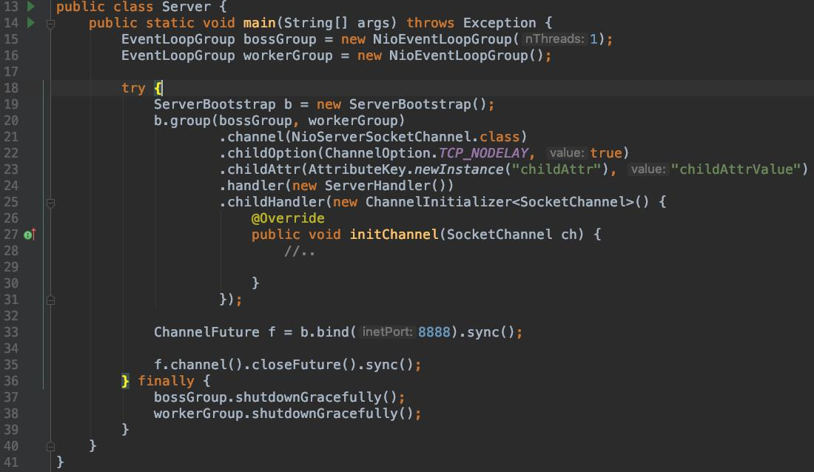
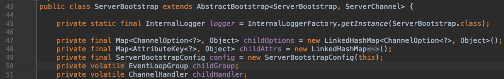
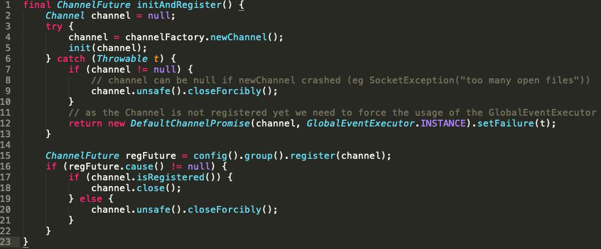
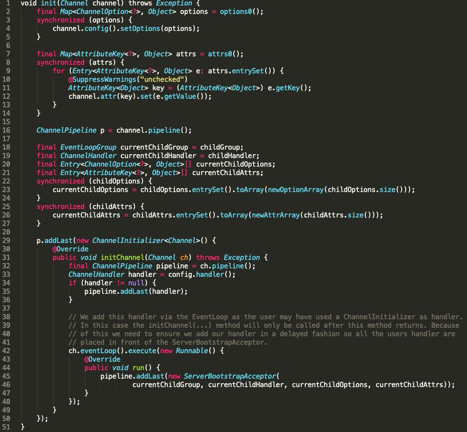
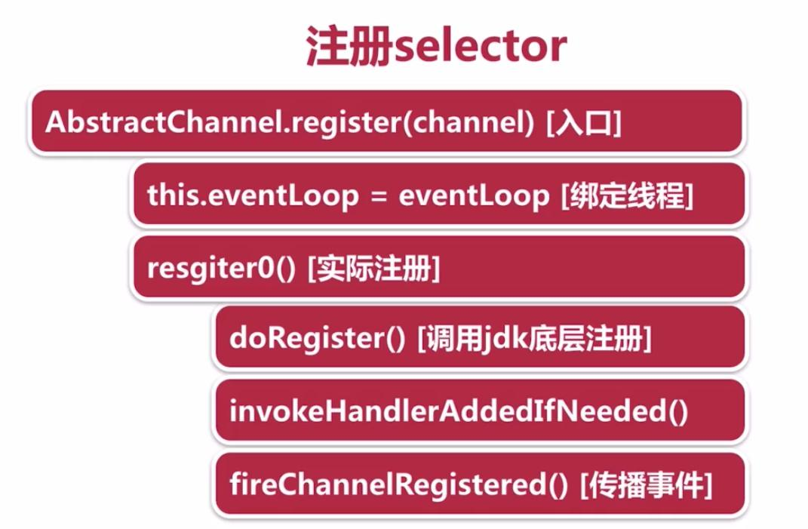
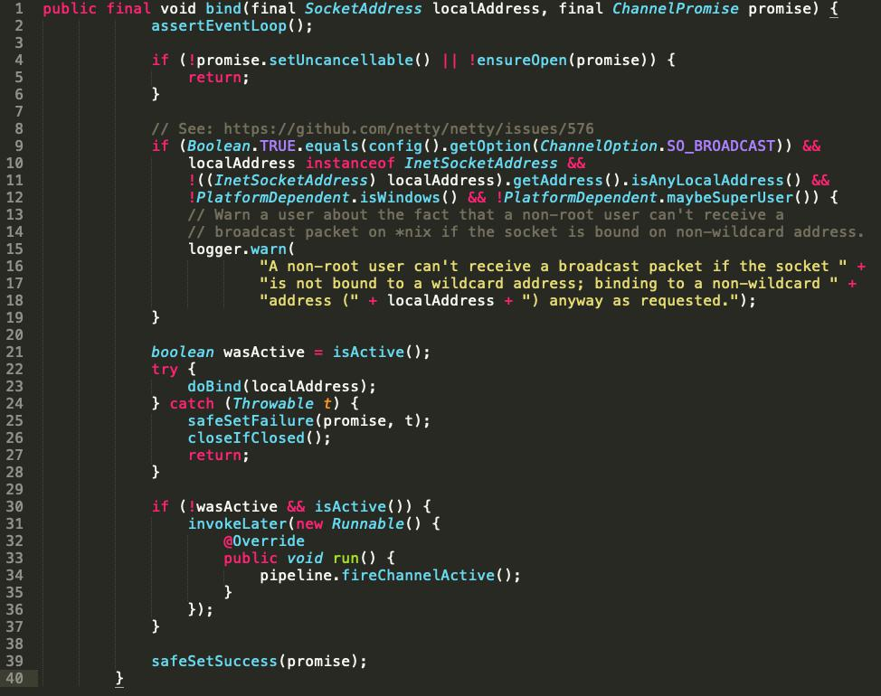
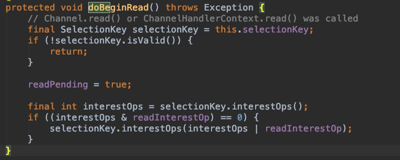

# Netty ServerBootstrap 启动过程

### 1. main函数代码示例

这段代码写的是服务端的启动过程，我把它分为4个过程
1. (15~16) 创建`boosGroup`和`workerGroup`,为什么创建这两个线程组？因为在Nio里面，boosGroup负责接收用户请求，workerGroup负责处理用户请求

2. (19~31) 新建一个`ServerBootStrap`对象，然后调用`.group().channel()....`这个链式方法，把一堆属性配置给它,这些需要配置的属性有的继承自它的父类`AbstractBootstrap`，有的属性是它自己的,如下图所示，在一个`ServerBootStrap`的内部有很多属性，以及在它的父类`AbstractBootstrap`里面还有一些属性。上图中的链式方法调用中（`.group().channel()....`），除了`.channel()`之外都是简单的赋值，channel的配置用到了channelFactory(工厂模式)，利用反射去生成新的channel实例，所以上图21行只是传入了一个`NioServerSocketChannel.class`，而不是一个对象实例，在后面的channel初始化过程中，才会去利用反射生成这么一个实例。



3. (33行) 调用.bind()正式启动服务，启动过程中绝大部分操作都在这里面。下面这张UML图展示了.bind()之后的整体流程，图来自(@芋道源码)


### 2. 重要步骤解析
参考上图，这里有个重要概念，Netty里面的`Channel`对应着Java原生的`Socket`

#### 2.1 doBind()
对应UML图中的步骤3，这里面做了两件事，1）channel的创建和初始化然后注册到`EventLoopGroup`, 2）绑定channel的端口，注册channel到SelectionKey. 对应的两个函数为第2行的`initAndRegister()`,以及第11行，或者第29行的`doBind0()`


#### 2.2 initAndRegister()

这个函数里，有3个重要步骤。

1）(第4行)调用`channelFactory.newChannel()`新建一个Channel

在工厂实现类`ReflectiveChannelFactory`中实现了`newChannel()`这个接口，我们之前在main函数中有一段代码`b.channel(NioServerSocketChannel.class)`，就是将下面这个`Class clazz`设置为`NioServerSocketChannel.class`，然后调用`.newInstance()`利用反射生成一个对象实例
``` java
public T newChannel() {
	try {
		return clazz.newInstance();
	} catch (Throwable t) {
		throw new ChannelException("Unable to create Channel from class " + clazz, t);
	}
}
```

---
执行`NioServerSocketChannel.class`的构造函数在初始化的过程被执行，步骤如下，图来自(@芋道源码)

这里有4个最重要的操作，为这个channel新建`id`,`unsafe`,`pipeline`。然后调用configureBlocking(false),设置该channel为non-blocking，也就是非阻塞。在初始化的时候还会传入一个感兴趣的事件为`SelectionKey.OP_ACCEPT`，意思就是对accept事件感兴趣


2) (第5行)调用`init(channel)`对这个新建的channel进行初始化配置


之前我们在main函数中调用`.group().channel()....`这个链式方法传入了很多配置对吧，当时只是保存在对象的属性中，现在才是把这些配置实实在在给配置到channel上，上面代码里面的synchronized代码是为了控制并发，以防该属性在操作过程中被修改。在哪儿可能会被修改呢？例如在`ServerBootstrap$childOption`中，我们可以看到它也是先锁住这个变量再进行修改的。
```java
public <T> ServerBootstrap childOption(ChannelOption<T> childOption, T value) {
	if (childOption == null) {
		throw new NullPointerException("childOption");
	}
	if (value == null) {
		synchronized (childOptions) {
			childOptions.remove(childOption);
		}
	} else {
		synchronized (childOptions) {
			childOptions.put(childOption, value);
		}
	}
	return this;
}
```

在42行使用了eventLoop这样一个异步方式去将`ServerBootstrapAcceptor`对象加入到pipeline中，这里使用异步方式的原因是，用户可能设置ChannelInitializer作为一个handler，这就导致了如果不用异步的方式，`ServerBootstrapAcceptor`一定会添加在某个handler之前，因为添加handler的操作一定是在这个函数执行完成之后执行，为了确保`ServerBootstrapAcceptor`在所有的handler之后被添加，所以要使用异步的方式。为什么异步就能达到这个效果呢？我估计是跟js一样吧，异步的方法调用会在所有的同步方法被执行之后才执行。(我自己想的，没证实过)

3）将这个新建的channel注册到EventLoopGroup中

在initAndRegister()方法的第15行，调用了`config().group().register(channel)`，这个链比较长，自己查看源码进不到对的路径，只有用了打断点单步调试才进到了正确的地方(体会到了java的抽象能力，跳了无数个文件才找到最终做事情的文件，心累)。我们直接从`AbstractChannel$register`开始看。下图是注册channel到EventLoopGroup的步骤，图来自慕课@闪电侠_



首先将该channel绑定到eventLoop对象中，也就是`this.eventLoop = eventLoop`.

然后，调用`register0()`这个私有方法去执行注册。

再调用`doRegister()`去调用jdk底层去真正注册。

触发`invokeHandlerAddedIfNeeded()`，这个时候，如果你传入的handler是一个`ChannelInitializer`对象，那么它的`.initChannel()`初始化方法将在这里执行。例如:


还有，在handler里面定义的一些事件回调函数也会在这个时候触发，例如：


最后调用，`fireChannelRegistered()`去触发channel已注册的事件

### 2.3 doBind0
这一步是将channel与端口号进行绑定。图来自慕课@闪电侠_


入口是`AbstractChannel`的一个内部类`AbstractUnsafe.bind()`

先在第23行调用`doBind()`去调用jdk底层方法，将channel和端口绑定

绑定完成，触发channlActive这么一个事件

接着触发一个read事件，会调用`doBeginRead()`


由于之前设置的感兴趣事件是一个accept事件，于是selector就开始监听在该channel上的accept事件，也就是新的连接。
至此，服务端程序启动完成。
