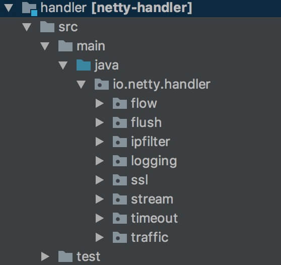
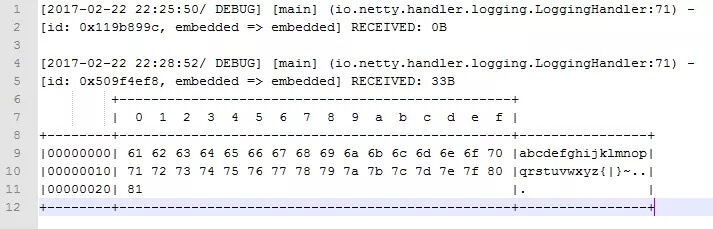

# ChannelHandler（四）之 LoggingHandler

## 1. 概述

在 `netty-handler` 模块中，提供了多种 ChannelHandler 的实现类。如下图所示：



- 每个 `package` 包，对应一个**功能特性**的 ChannelHandler 实现。

本文，我们来分享 `logger` 包下 `logging` 包的 LoggerHandler 。

## 2. LogLevel

`io.netty.handler.logging.LogLevel` ，日志级别枚举类。代码如下：

```java
/**
 * Maps the regular {@link LogLevel}s with the {@link InternalLogLevel} ones.
 */
public enum LogLevel {

    TRACE(InternalLogLevel.TRACE),
    DEBUG(InternalLogLevel.DEBUG),
    INFO(InternalLogLevel.INFO),
    WARN(InternalLogLevel.WARN),
    ERROR(InternalLogLevel.ERROR);

    /**
     * Netty 内部日志级别
     */
    private final InternalLogLevel internalLevel;

    LogLevel(InternalLogLevel internalLevel) {
        this.internalLevel = internalLevel;
    }

    /**
     * For internal use only.
     *
     * <p/>Converts the specified {@link LogLevel} to its {@link InternalLogLevel} variant.
     *
     * @return the converted level.
     */
    public InternalLogLevel toInternalLevel() {
        return internalLevel;
    }

}
```

- Netty 提供了一套日志框架，方便接入 slf4j、log4j、jdk logger 等等日志框架。
- LogLevel 实现对 `io.netty.util.internal.logging.InternalLogLevel` 的**一一**映射。

## 3. LoggingHandler

`io.netty.handler.logging.LoggingHandler` ，继承 ChannelDuplexHandler 类，日志处理器，对 Inbound/Outbound 事件进行日志的记录。一般情况下，用于开发测试时的调试之用。

### 3.1 构造方法

```java
@Sharable
public class LoggingHandler extends ChannelDuplexHandler {

    /**
     * 默认 {@link #level} 日志级别
     */
    private static final LogLevel DEFAULT_LEVEL = LogLevel.DEBUG;

    /**
     * Netty 内部 Logger 对象
     */
    protected final InternalLogger logger;
    /**
     * Netty 内部 LogLevel 级别
     */
    protected final InternalLogLevel internalLevel;

    /**
     * 配置的 LogLevel 级别
     */
    private final LogLevel level;

    /**
     * Creates a new instance whose logger name is the fully qualified class
     * name of the instance with hex dump enabled.
     */
    public LoggingHandler() {
        this(DEFAULT_LEVEL);
    }

    /**
     * Creates a new instance whose logger name is the fully qualified class
     * name of the instance.
     *
     * @param level the log level
     */
    public LoggingHandler(LogLevel level) {
        if (level == null) {
            throw new NullPointerException("level");
        }

        // 获得 logger
        logger = InternalLoggerFactory.getInstance(getClass());
        this.level = level;
        internalLevel = level.toInternalLevel();
    }

    /**
     * Creates a new instance with the specified logger name and with hex dump
     * enabled.
     *
     * @param clazz the class type to generate the logger for
     */
    public LoggingHandler(Class<?> clazz) {
        this(clazz, DEFAULT_LEVEL);
    }

    /**
     * Creates a new instance with the specified logger name.
     *
     * @param clazz the class type to generate the logger for
     * @param level the log level
     */
    public LoggingHandler(Class<?> clazz, LogLevel level) {
        if (clazz == null) {
            throw new NullPointerException("clazz");
        }
        if (level == null) {
            throw new NullPointerException("level");
        }

        // 获得 logger
        logger = InternalLoggerFactory.getInstance(clazz);
        this.level = level;
        internalLevel = level.toInternalLevel();
    }

    /**
     * Creates a new instance with the specified logger name using the default log level.
     *
     * @param name the name of the class to use for the logger
     */
    public LoggingHandler(String name) {
        this(name, DEFAULT_LEVEL);
    }

    /**
     * Creates a new instance with the specified logger name.
     *
     * @param name the name of the class to use for the logger
     * @param level the log level
     */
    public LoggingHandler(String name, LogLevel level) {
        if (name == null) {
            throw new NullPointerException("name");
        }
        if (level == null) {
            throw new NullPointerException("level");
        }

        // 获得 logger
        logger = InternalLoggerFactory.getInstance(name);
        this.level = level;
        internalLevel = level.toInternalLevel();
    }
    
    // ... 省略其他方法
}
```

- 通过 `@Sharable` 注解，支持共享。
- `level` 属性，配置的 LogLevel 级别。
  - `DEFAULT_LEVEL` **静态**属性，默认的 `level` 级别。构造方法如果未传递 `LogLevel level` 方法参数，则使用默认值。
  - `internalLevel` 属性，Netty 内部 LogLevel 级别。通过 `LogLevel#toInternalLevel()` 方法，将 `level` 转化成 `internalLevel` 。
  - `logger` 属性，Netty 内部 Logger 对象。通过 `Class<?> clazz` 或 `String name` 方法参数，进行获得。

### 3.2 具体实现

```java
@Override
public void channelRegistered(ChannelHandlerContext ctx) throws Exception {
    if (logger.isEnabled(internalLevel)) {
        logger.log(internalLevel, format(ctx, "REGISTERED"));
    }
    //
    ctx.fireChannelRegistered();
}

@Override
public void channelUnregistered(ChannelHandlerContext ctx) throws Exception {
    if (logger.isEnabled(internalLevel)) {
        logger.log(internalLevel, format(ctx, "UNREGISTERED"));
    }
    ctx.fireChannelUnregistered();
}

@Override
public void channelActive(ChannelHandlerContext ctx) throws Exception {
    // 打印日志
    if (logger.isEnabled(internalLevel)) {
        logger.log(internalLevel, format(ctx, "ACTIVE"));
    }
    // 传递 Channel active 事件，给下一个节点
    ctx.fireChannelActive();
}

@Override
public void channelInactive(ChannelHandlerContext ctx) throws Exception {
    if (logger.isEnabled(internalLevel)) {
        logger.log(internalLevel, format(ctx, "INACTIVE"));
    }
    ctx.fireChannelInactive();
}

@Override
public void exceptionCaught(ChannelHandlerContext ctx, Throwable cause) throws Exception {
    if (logger.isEnabled(internalLevel)) {
        logger.log(internalLevel, format(ctx, "EXCEPTION", cause), cause);
    }
    ctx.fireExceptionCaught(cause);
}

@Override
public void userEventTriggered(ChannelHandlerContext ctx, Object evt) throws Exception {
    if (logger.isEnabled(internalLevel)) {
        logger.log(internalLevel, format(ctx, "USER_EVENT", evt));
    }
    ctx.fireUserEventTriggered(evt);
}

@Override
public void bind(ChannelHandlerContext ctx, SocketAddress localAddress, ChannelPromise promise) throws Exception {
    if (logger.isEnabled(internalLevel)) {
        logger.log(internalLevel, format(ctx, "BIND", localAddress));
    }
    ctx.bind(localAddress, promise);
}

@Override
public void connect(
        ChannelHandlerContext ctx,
        SocketAddress remoteAddress, SocketAddress localAddress, ChannelPromise promise) throws Exception {
    if (logger.isEnabled(internalLevel)) {
        logger.log(internalLevel, format(ctx, "CONNECT", remoteAddress, localAddress));
    }
    ctx.connect(remoteAddress, localAddress, promise);
}

@Override
public void disconnect(ChannelHandlerContext ctx, ChannelPromise promise) throws Exception {
    if (logger.isEnabled(internalLevel)) {
        logger.log(internalLevel, format(ctx, "DISCONNECT"));
    }
    ctx.disconnect(promise);
}

@Override
public void close(ChannelHandlerContext ctx, ChannelPromise promise) throws Exception {
    if (logger.isEnabled(internalLevel)) {
        logger.log(internalLevel, format(ctx, "CLOSE"));
    }
    ctx.close(promise);
}

@Override
public void deregister(ChannelHandlerContext ctx, ChannelPromise promise) throws Exception {
    if (logger.isEnabled(internalLevel)) {
        logger.log(internalLevel, format(ctx, "DEREGISTER"));
    }
    ctx.deregister(promise);
}

@Override
public void channelReadComplete(ChannelHandlerContext ctx) throws Exception {
    if (logger.isEnabled(internalLevel)) {
        logger.log(internalLevel, format(ctx, "READ COMPLETE"));
    }
    ctx.fireChannelReadComplete();
}

@Override
public void channelRead(ChannelHandlerContext ctx, Object msg) throws Exception {
    if (logger.isEnabled(internalLevel)) {
        logger.log(internalLevel, format(ctx, "READ", msg));
    }
    ctx.fireChannelRead(msg);
}

@Override
public void write(ChannelHandlerContext ctx, Object msg, ChannelPromise promise) throws Exception {
    if (logger.isEnabled(internalLevel)) {
        logger.log(internalLevel, format(ctx, "WRITE", msg));
    }
    ctx.write(msg, promise);
}

@Override
public void channelWritabilityChanged(ChannelHandlerContext ctx) throws Exception {
    if (logger.isEnabled(internalLevel)) {
        logger.log(internalLevel, format(ctx, "WRITABILITY CHANGED"));
    }
    ctx.fireChannelWritabilityChanged();
}

@Override
public void flush(ChannelHandlerContext ctx) throws Exception {
    if (logger.isEnabled(internalLevel)) {
        logger.log(internalLevel, format(ctx, "FLUSH"));
    }
    ctx.flush();
}
```

里面的每个方法，都是使用 `logger` 打印日志，并继续传播事件到下一个节点。

而打印的日志的格式，通过 `#format(...)` 方法，进行拼接。

### 3.3 format

`#format(...)` 方法，根据参数的不同，分成三种。

① `#format(ChannelHandlerContext ctx, String eventName)` 方法，代码如下：

```java
/**
 * Formats an event and returns the formatted message.
 *
 * @param eventName the name of the event
 */
protected String format(ChannelHandlerContext ctx, String eventName) {
    String chStr = ctx.channel().toString();
    return new StringBuilder(chStr.length() + 1 + eventName.length())
        .append(chStr)
        .append(' ')
        .append(eventName)
        .toString();
}
```

② `#format(ChannelHandlerContext ctx, String eventName, Object arg)` 方法，代码如下：

```java
/**
 * Formats an event and returns the formatted message.
 *
 * @param eventName the name of the event
 * @param arg       the argument of the event
 */
protected String format(ChannelHandlerContext ctx, String eventName, Object arg) {
    if (arg instanceof ByteBuf) {
        return formatByteBuf(ctx, eventName, (ByteBuf) arg);
    } else if (arg instanceof ByteBufHolder) {
        return formatByteBufHolder(ctx, eventName, (ByteBufHolder) arg);
    } else {
        return formatSimple(ctx, eventName, arg);
    }
}
```

- 根据参数不同，会调用不同的 format 方法。

③ `#format(ChannelHandlerContext ctx, String eventName, Object firstArg, Object secondArg)` 方法，代码如下：

```java
/**
 * Formats an event and returns the formatted message.  This method is currently only used for formatting
 * {@link ChannelOutboundHandler#connect(ChannelHandlerContext, SocketAddress, SocketAddress, ChannelPromise)}.
 *
 * @param eventName the name of the event
 * @param firstArg  the first argument of the event
 * @param secondArg the second argument of the event
 */
protected String format(ChannelHandlerContext ctx, String eventName, Object firstArg, Object secondArg) {
    if (secondArg == null) {
        return formatSimple(ctx, eventName, firstArg);
    }

    String chStr = ctx.channel().toString();
    String arg1Str = String.valueOf(firstArg);
    String arg2Str = secondArg.toString();
    StringBuilder buf = new StringBuilder(
            chStr.length() + 1 + eventName.length() + 2 + arg1Str.length() + 2 + arg2Str.length());
    buf.append(chStr).append(' ').append(eventName).append(": ").append(arg1Str).append(", ").append(arg2Str);
    return buf.toString();
}
```

#### 3.3.1 formatByteBuf

`#formatByteBuf(ChannelHandlerContext ctx, String eventName, ByteBuf msg)` 方法，代码如下：

```java
/**
 * Generates the default log message of the specified event whose argument is a {@link ByteBuf}.
 */
private static String formatByteBuf(ChannelHandlerContext ctx, String eventName, ByteBuf msg) {
    String chStr = ctx.channel().toString();
    int length = msg.readableBytes();
    if (length == 0) {
        StringBuilder buf = new StringBuilder(chStr.length() + 1 + eventName.length() + 4);
        buf.append(chStr).append(' ').append(eventName).append(": 0B");
        return buf.toString();
    } else {
        int rows = length / 16 + (length % 15 == 0? 0 : 1) + 4;
        StringBuilder buf = new StringBuilder(chStr.length() + 1 + eventName.length() + 2 + 10 + 1 + 2 + rows * 80);

        buf.append(chStr).append(' ').append(eventName).append(": ").append(length).append('B').append(NEWLINE);
        appendPrettyHexDump(buf, msg); // <1>

        return buf.toString();
    }
}
```

- `<1>` 处的 `appendPrettyHexDump(buf, msg)` ，实际调用的是 `ByteBufUtil#appendPrettyHexDump(StringBuilder dump, ByteBuf buf)` 方法。

如下是一个打印的示例：

>  FROM [《自顶向下深入分析Netty（八）–ChannelHandler》](https://www.jianshu.com/p/a9bcd89553f5)
>
> 

#### 3.3.2 formatByteBufHolder

`#formatByteBufHolder(ChannelHandlerContext ctx, String eventName, ByteBufHolder msg)` 方法，代码如下：

```java
/**
 * Generates the default log message of the specified event whose argument is a {@link ByteBufHolder}.
 */
private static String formatByteBufHolder(ChannelHandlerContext ctx, String eventName, ByteBufHolder msg) {
    String chStr = ctx.channel().toString();
    String msgStr = msg.toString();
    ByteBuf content = msg.content();
    int length = content.readableBytes();
    if (length == 0) {
        StringBuilder buf = new StringBuilder(chStr.length() + 1 + eventName.length() + 2 + msgStr.length() + 4);
        buf.append(chStr).append(' ').append(eventName).append(", ").append(msgStr).append(", 0B");
        return buf.toString();
    } else {
        int rows = length / 16 + (length % 15 == 0? 0 : 1) + 4;
        StringBuilder buf = new StringBuilder(chStr.length() + 1 + eventName.length() + 2 + msgStr.length() + 2 + 10 + 1 + 2 + rows * 80);

        buf.append(chStr).append(' ').append(eventName).append(": ").append(msgStr).append(", ").append(length).append('B').append(NEWLINE);
        appendPrettyHexDump(buf, content);

        return buf.toString();
    }
}
```

- 和 `#formatByteBuf(ChannelHandlerContext ctx, String eventName, ByteBuf msg)` 方法，实际打印的效果，非常相似。

#### 3.3.3 formatSimple

`#formatSimple(ChannelHandlerContext ctx, String eventName, Object msg)` 方法，代码如下：

```java
/**
 * Generates the default log message of the specified event whose argument is an arbitrary object.
 */
private static String formatSimple(ChannelHandlerContext ctx, String eventName, Object msg) {
    String chStr = ctx.channel().toString();
    String msgStr = String.valueOf(msg);
    StringBuilder buf = new StringBuilder(chStr.length() + 1 + eventName.length() + 2 + msgStr.length());
    return buf.append(chStr).append(' ').append(eventName).append(": ").append(msgStr).toString();
}
```

