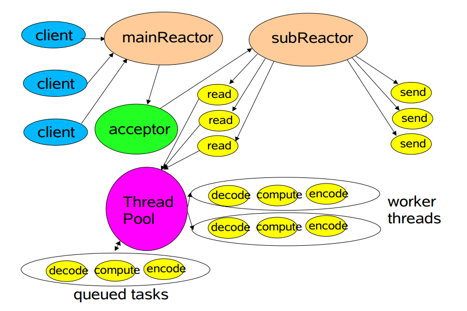
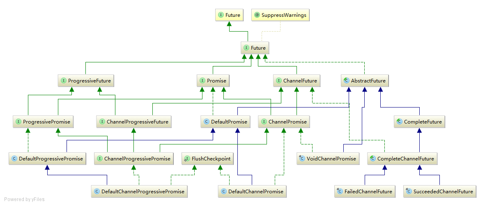

# Util 之 Future



再次回顾这幅图，在上一章中，我们分析了Reactor的完整实现。由于Java NIO事件驱动的模型，要求Netty的事件处理采用异步的方式，异步处理则需要表示异步操作的结果。Future正是用来表示异步操作结果的对象，Future的类签名为：

```java
public interface Future<V>;
```

其中的泛型参数V即表示异步结果的类型。

### 1.1 总述

也许你已经使用过JDK的Future对象，该接口的方法如下：

```java
// 取消异步操作
boolean cancel(boolean mayInterruptIfRunning);
// 异步操作是否取消
boolean isCancelled();
// 异步操作是否完成，正常终止、异常、取消都是完成
boolean isDone();
// 阻塞直到取得异步操作结果
V get() throws InterruptedException, ExecutionException;
// 同上，但最长阻塞时间为timeout
V get(long timeout, TimeUnit unit)
    throws InterruptedException, ExecutionException, TimeoutException;
```

我们的第一印象会觉得这样的设计并不坏，但仔细思考，便会发现问题：
(1).接口中只有isDone()方法判断一个异步操作是否完成，但是对于完成的定义过于模糊，JDK文档指出正常终止、抛出异常、用户取消都会使isDone()方法返回真。在我们的使用中，我们极有可能是对这三种情况分别处理，而JDK这样的设计不能满足我们的需求。

(2).对于一个异步操作，我们更关心的是这个异步操作触发或者结束后能否再执行一系列动作。比如说，我们浏览网页时点击一个按钮后实现用户登录。在javascript中，处理代码如下：

```java
$("#login").click(function(){
    login();
});
```

可见在这样的情况下，JDK中的Future便不能处理，所以，Netty扩展了JDK的Future接口，使其能解决上面的两个问题。扩展的方法如下（类似方法只列出一个）：

```java
// 异步操作完成且正常终止
boolean isSuccess();
// 异步操作是否可以取消
boolean isCancellable();
// 异步操作失败的原因
Throwable cause();
// 添加一个监听者，异步操作完成时回调，类比javascript的回调函数
Future<V> addListener(GenericFutureListener<? extends Future<? super V>> listener);
Future<V> removeListener(GenericFutureListener<? extends Future<? super V>> listener);
// 阻塞直到异步操作完成
Future<V> await() throws InterruptedException;
// 同上，但异步操作失败时抛出异常
Future<V> sync() throws InterruptedException;
// 非阻塞地返回异步结果，如果尚未完成返回null
V getNow();
```

如果你对Future的状态还有疑问，放上代码注释中的ascii图打消你的疑虑：

```java
*                                      +---------------------------+
*                                      | Completed successfully    |
*                                      +---------------------------+
*                                 +---->      isDone() = true      |
* +--------------------------+    |    |   isSuccess() = true      |
* |        Uncompleted       |    |    +===========================+
* +--------------------------+    |    | Completed with failure    |
* |      isDone() = false    |    |    +---------------------------+
* |   isSuccess() = false    |----+---->      isDone() = true      |
* | isCancelled() = false    |    |    |       cause() = non-null  |
* |       cause() = null     |    |    +===========================+
* +--------------------------+    |    | Completed by cancellation |
*                                 |    +---------------------------+
*                                 +---->      isDone() = true      |
*                                      | isCancelled() = true      |
*                                      +---------------------------+
```

可知，Future对象有两种状态尚未完成和已完成，其中已完成又有三种状态：成功、失败、用户取消。各状态的状态断言请在此图中查找。
仔细看完上面的图并联系Future接口中的方法，你是不是也会和我有相同的疑问：Future接口中的方法都是getter方法而没有setter方法，也就是说这样实现的Future子类的状态是不可变的，如果我们想要变化，那该怎么办呢？Netty提供的解决方法是：使用可写的Future即Promise。Promise接口扩展的方法如下：

```java
 // 标记异步操作结果为成功，如果已被设置（不管成功还是失败）则抛出异常IllegalStateException
 Promise<V> setSuccess(V result);
 // 同上，只是结果已被设置时返回False
 boolean trySuccess(V result);

 Promise<V> setFailure(Throwable cause);
 boolean tryFailure(Throwable cause);

// 设置结果为不可取消，结果已被取消返回False
 boolean setUncancellable();
```

需要注意的是：Promise接口继承自Future接口，它提供的setter方法与常见的setter方法大为不同。Promise从Uncompleted–>Completed的状态转变**有且只能有一次**，也就是说setSuccess和setFailure方法最多只会成功一个，此外，在setSuccess和setFailure方法中会通知注册到其上的监听者。为了加深对Future和Promise的理解，我们可以将Future类比于定额发票，Promise类比于机打发票。当商户拿到税务局的发票时，如果是定额发票，则已经确定好金额是100还是50或其他，商户再也不能更改；如果是机打发票，商户相当于拿到了一个发票模板，需要多少金额按实际情况填到模板指定处。显然，不能两次使用同一张机打发票打印，这会使发票失效，而Promise做的更好，它使第二次调用setter方法失败。
至此，我们从总体上了解了Future和Promise的原理。我们再看一下类图：



类图给我们的第一印象是：繁杂。我们抓住关键点：Future和Promise两条分支，分而治之。我们使用自顶向下的方法分析其实现细节，使用两条线索：

```java
AbstractFuture<--CompleteFuture<--CompleteChannelFuture<--Succeeded/FailedChannelFuture

DefaultPromise<--DefaultChannelPromise
```

### 1.2 Future

#### 1.2.1 AbstractFuture

AbstractFuture主要实现Future的get()方法，取得Future关联的异步操作结果：

```java
@Override
public V get() throws InterruptedException, ExecutionException {
    await();    // 阻塞直到异步操作完成

    Throwable cause = cause();
    if (cause == null) {
        return getNow();    // 成功则返回关联结果
    }
    if (cause instanceof CancellationException) {
        throw (CancellationException) cause;    // 由用户取消
    }
    throw new ExecutionException(cause);    // 失败抛出异常
}
```

其中的实现简单明了，但关键调用方法的具体实现并没有，我们将在子类实现中分析。对应的加入超时时间的get(long timeout, TimeUnit unit)实现也类似，不再列出。

#### 1.2.2 CompleteFuture

Complete表示操作已完成，所以CompleteFuture表示一个异步操作已完成的结果，由此可推知：该类的实例在异步操作完成时创建，返回给用户，用户则使用addListener()方法定义一个异步操作。如果你熟悉javascript，将Listener类比于回调函数callback()可方便理解。
我们首先看其中的字段和构造方法：

```java
// 执行器，执行Listener中定义的操作
private final EventExecutor executor;

// 这有一个构造方法，可知executor是必须的
protected CompleteFuture(EventExecutor executor) {
    this.executor = executor;
}
```

CompleteFuture类定义了一个EventExecutor，可视为一个线程，用于执行Listener中的操作。我们再看addListener()和removeListener()方法：

```java
public Future<V> addListener(GenericFutureListener<? extends Future<? super V>> listener) {
    // 由于这是一个已完成的Future，所以立即通知Listener执行
    DefaultPromise.notifyListener(executor(), this, listener);
    return this;
}

public Future<V> removeListener(GenericFutureListener<? extends Future<? super V>> listener) {
    // 由于已完成，Listener中的操作已完成，没有需要删除的Listener
    return this;
}
```

其中的实现也很简单，我们看一下GenericFutureListener接口，其中只定义了一个方法：

```java
// 异步操作完成是调用
void operationComplete(F future) throws Exception;
```

关于Listener我们再关注一下ChannelFutureListener，它并没有扩展GenericFutureListener接口，所以类似于一个标记接口。我们看其中实现的三个通用ChannelFutureListener：

```java
ChannelFutureListener CLOSE = (future) --> {
    future.channel().close();   //操作完成时关闭Channel
};

ChannelFutureListener CLOSE_ON_FAILURE = (future) --> {
    if (!future.isSuccess()) {
        future.channel().close();   // 操作失败时关闭Channel
    }
};

ChannelFutureListener FIRE_EXCEPTION_ON_FAILURE = (future) --> {
    if (!future.isSuccess()) {
        // 操作失败时触发一个ExceptionCaught事件
        future.channel().pipeline().fireExceptionCaught(future.cause());
    }
};
```

这三个Listener对象定义了对Channel处理时常用的操作，如果符合需求，可以直接使用。
由于CompleteFuture表示一个已完成的异步操作，所以可推知sync()和await()方法都将立即返回。此外，可推知线程的状态如下，不再列出代码：

```java
isDone() = true; isCancelled() = false;
```

#### 1.2.3 CompleteChannelFuture

CompleteChannelFuture的类签名如下：

```java
abstract class CompleteChannelFuture extends CompleteFuture<Void> implements ChannelFuture
```

ChannelFuture是不是觉得很亲切？你肯定已经使用过ChannelFuture。ChannelFuture接口相比于Future只扩展了一个方法channel()用于取得关联的Channel对象。CompleteChannelFuture还继承了CompleteFuture，尖括号中的泛型表示Future关联的结果，此结果为Void，意味着CompleteChannelFuture不关心这个特定结果即get()相关方法返回null。也就是说，我们可以将CompleteChannelFuture纯粹的视为一种回调函数机制。
CompleteChannelFuture的字段只有一个：

```java
private final Channel channel; // 关联的Channel对象
```

CompleteChannelFuture的大部分方法实现中，只是将方法返回的Future覆盖为ChannelFuture对象（ChannelFuture接口的要求），代码不在列出。我们看一下executor()方法：

```java
@Override
protected EventExecutor executor() {
    EventExecutor e = super.executor(); // 构造方法指定
    if (e == null) {
        return channel().eventLoop();   // 构造方法未指定使用channel注册到的eventLoop
    } else {
        return e;
    }
}
```

#### 1.2.4 Succeeded/FailedChannelFuture

Succeeded/FailedChannelFuture为特定的两个异步操作结果，回忆总述中关于Future状态的讲解，成功意味着

```java
Succeeded: isSuccess() == true, cause() == null;
Failed:    isSuccess() == false, cause() == non-null
```

代码中的实现也很简单，不再列出。需要注意的是，其中的构造方法不建议用户调用，一般使用Channel对象的方法newSucceededFuture()和newFailedFuture(Throwable)代替。

### 1.3 Promise

#### 1.3.1 DefaultPromise

我们首先看其中的static字段：

```java
// 可以嵌套的Listener的最大层数，可见最大值为8
private static final int MAX_LISTENER_STACK_DEPTH = Math.min(8,
        SystemPropertyUtil.getInt("io.netty.defaultPromise.maxListenerStackDepth", 8));
// result字段由使用RESULT_UPDATER更新
private static final AtomicReferenceFieldUpdater<DefaultPromise, Object> RESULT_UPDATER;
// 此处的Signal是Netty定义的类，继承自Error，异步操作成功且结果为null时设置为改值
private static final Signal SUCCESS = Signal.valueOf(DefaultPromise.class.getName() + ".SUCCESS");
// 异步操作不可取消
private static final Signal UNCANCELLABLE = Signal.valueOf(...);
// 异步操作失败时保存异常原因
private static final CauseHolder CANCELLATION_CAUSE_HOLDER = new CauseHolder(...);
```

嵌套的Listener，是指在listener的operationComplete方法中，可以再次使用future.addListener()继续添加listener，Netty限制的最大层数是8，用户可使用系统变量io.netty.defaultPromise.maxListenerStackDepth设置。
再看其中的私有字段：

```java
// 异步操作结果
private volatile Object result;
// 执行listener操作的执行器
private final EventExecutor executor;
// 监听者
private Object listeners;
// 阻塞等待该结果的线程数
private short waiters;
// 通知正在进行标识
private boolean notifyingListeners;
```

也许你已经注意到，listeners是一个Object类型。这似乎不合常理，一般情况下我们会使用一个集合或者一个数组。Netty之所以这样设计，是因为大多数情况下listener只有一个，用集合和数组都会造成浪费。当只有一个listener时，该字段为一个GenericFutureListener对象；当多余一个listener时，该字段为DefaultFutureListeners，可以储存多个listener。明白了这些，我们分析关键方法addListener()：

```java
@Override
public Promise<V> addListener(GenericFutureListener<? extends Future<? super V>> listener) {
    synchronized (this) {
        addListener0(listener); // 保证多线程情况下只有一个线程执行添加操作
    }

    if (isDone()) {
        notifyListeners();  // 异步操作已经完成通知监听者
    }
    return this;
}

private void addListener0(GenericFutureListener<? extends Future<? super V>> listener) {
    if (listeners == null) {
        listeners = listener;   // 只有一个
    } else if (listeners instanceof DefaultFutureListeners) {
        ((DefaultFutureListeners) listeners).add(listener); // 大于两个
    } else {
        // 从一个扩展为两个
        listeners = new DefaultFutureListeners((GenericFutureListener<? extends Future<V>>) listeners, listener);   
    }
}
```

从代码中可以看出，在添加Listener时，如果异步操作已经完成，则会notifyListeners()：

```java
private void notifyListeners() {
    EventExecutor executor = executor();
    if (executor.inEventLoop()) {   //执行线程为指定线程
        final InternalThreadLocalMap threadLocals = InternalThreadLocalMap.get();
        final int stackDepth = threadLocals.futureListenerStackDepth(); // 嵌套层数
        if (stackDepth < MAX_LISTENER_STACK_DEPTH) {
            // 执行前增加嵌套层数
            threadLocals.setFutureListenerStackDepth(stackDepth + 1);   
            try {
                notifyListenersNow();
            } finally {
                // 执行完毕，无论如何都要回滚嵌套层数
                threadLocals.setFutureListenerStackDepth(stackDepth);
            }
            return;
        }
    }
    // 外部线程则提交任务给执行线程
    safeExecute(executor, () -> { notifyListenersNow(); });
}

private static void safeExecute(EventExecutor executor, Runnable task) {
    try {
        executor.execute(task);
    } catch (Throwable t) {
        rejectedExecutionLogger.error("Failed to submit a listener notification task. Event loop shut down?", t);
    }
}
```

所以，外部线程不能执行监听者Listener中定义的操作，只能提交任务到指定Executor，其中的操作最终由指定Executor执行。我们再看notifyListenersNow()方法：

```java
private void notifyListenersNow() {
    Object listeners;
    // 此时外部线程可能会执行添加Listener操作，所以需要同步
    synchronized (this) { 
        if (notifyingListeners || this.listeners == null) {
            // 正在通知或已没有监听者（外部线程删除）直接返回
            return; 
        }
        notifyingListeners = true;  
        listeners = this.listeners;
        this.listeners = null;
    }
    for (;;) {
        if (listeners instanceof DefaultFutureListeners) { // 通知单个
            notifyListeners0((DefaultFutureListeners) listeners);
        } else { // 通知多个（遍历集合调用单个）
            notifyListener0(this, (GenericFutureListener<? extends Future<V>>) listeners);
        }
        synchronized (this) {
            // 执行完毕且外部线程没有再添加监听者
            if (this.listeners == null) {
                notifyingListeners = false; 
                return; 
            }
            // 外部线程添加了监听者继续执行
            listeners = this.listeners; 
            this.listeners = null;
        }
    }
}

private static void notifyListener0(Future future, GenericFutureListener l) {
    try {
        l.operationComplete(future);
    } catch (Throwable t) {
        logger.warn("An exception was thrown by " + l.getClass().getName() + ".operationComplete()", t);
    }
}
```

到此为止，我们分析完了Promise最重要的addListener()和notifyListener()方法。在源码中还有static的notifyListener()方法，这些方法是CompleteFuture使用的，对于CompleteFuture，添加监听者的操作不需要缓存，直接执行Listener中的方法即可，执行线程为调用线程，相关代码可回顾CompleteFuture。addListener()相对的removeListener()方法实现简单，我们不再分析。
回忆result字段，修饰符有volatile，所以使用RESULT_UPDATER更新，保证更新操作为原子操作。Promise不携带特定的结果（即携带Void）时，成功时设置为静态字段的Signal对象SUCCESS；如果携带泛型参数结果，则设置为泛型一致的结果。对于Promise，设置成功、设置失败、取消操作，**三个操作至多只能调用一个且同一个方法至多生效一次**，再次调用会抛出异常（set）或返回失败（try）。这些设置方法原理相同，我们以setSuccess()为例分析:

```java
public Promise<V> setSuccess(V result) {
    if (setSuccess0(result)) {
        notifyListeners();  // 可以设置结果说明异步操作已完成，故通知监听者
        return this;
    }
    throw new IllegalStateException("complete already: " + this);
}

private boolean setSuccess0(V result) {
    // 为空设置为Signal对象Success
    return setValue0(result == null ? SUCCESS : result);
}

private boolean setValue0(Object objResult) {
    // 只有结果为null或者UNCANCELLABLE时才可设置且只可以设置一次
    if (RESULT_UPDATER.compareAndSet(this, null, objResult) ||
        RESULT_UPDATER.compareAndSet(this, UNCANCELLABLE, objResult)) {
        checkNotifyWaiters();   // 通知等待的线程
        return true;
    }
    return false;
}
```

checkNotifyWaiters()方法唤醒调用await()和sync()方法等待该异步操作结果的线程，代码如下：

```java
private synchronized void checkNotifyWaiters() {
    // 确实有等待的线程才notifyAll
    if (waiters > 0) {  
        notifyAll();    // JDK方法
    }
}
```

有了唤醒操作，那么sync()和await()的实现是怎么样的呢？我们首先看sync()的代码：

```java
public Promise<V> sync() throws InterruptedException {
    await();
    rethrowIfFailed();  // 异步操作失败抛出异常
    return this;
}
```

可见，sync()和await()很类似，区别只是sync()调用，如果异步操作失败，则会抛出异常。我们接着看await()的实现：

```java
public Promise<V> await() throws InterruptedException {
    // 异步操作已经完成，直接返回
    if (isDone()) {
        return this;    
    }
    if (Thread.interrupted()) {
        throw new InterruptedException(toString());
    }
    // 死锁检测
    checkDeadLock();
    // 同步使修改waiters的线程只有一个
    synchronized (this) {
        while (!isDone()) { // 等待直到异步操作完成
            incWaiters();   // ++waiters;
            try {
                wait(); // JDK方法
            } finally {
                decWaiters(); // --waiters
            }
        }
    }
    return this;
}
```

其中的实现简单明了，其他await()方法也类似，不再分析。我们注意其中的checkDeadLock()方法用来进行死锁检测：

```java
protected void checkDeadLock() {
    EventExecutor e = executor();
    if (e != null && e.inEventLoop()) {
        throw new BlockingOperationException(toString());
    }
}
```

也就是说，**不能在同一个线程中调用await()相关的方法**。为了更好的理解这句话，我们使用代码注释中的例子来解释。Handler中的channelRead()方法是由Channel注册到的eventLoop执行的，其中的Future的Executor也是这个eventLoop，所以不能在channelRead()方法中调用await这一类（包括sync）方法。

```java
// 错误的例子
public void channelRead(ChannelHandlerContext ctx, Object msg) {
    ChannelFuture future = ctx.channel().close();
    future.awaitUninterruptibly();
    // ...
}

// 正确的做法
public void channelRead(ChannelHandlerContext ctx, Object msg) {
    ChannelFuture future = ctx.channel().close();
    future.addListener(new ChannelFutureListener() {
        public void operationComplete(ChannelFuture future) {
            // ... 使用异步操作
        }
    });
}
```

到了这里，我们已经分析完Future和Promise的主要实现。剩下的DefaultChannelPromise、VoidChannelPromise实现都很简单，我们不再分析。ProgressivePromise表示异步的进度结果，也不再进行分析。

