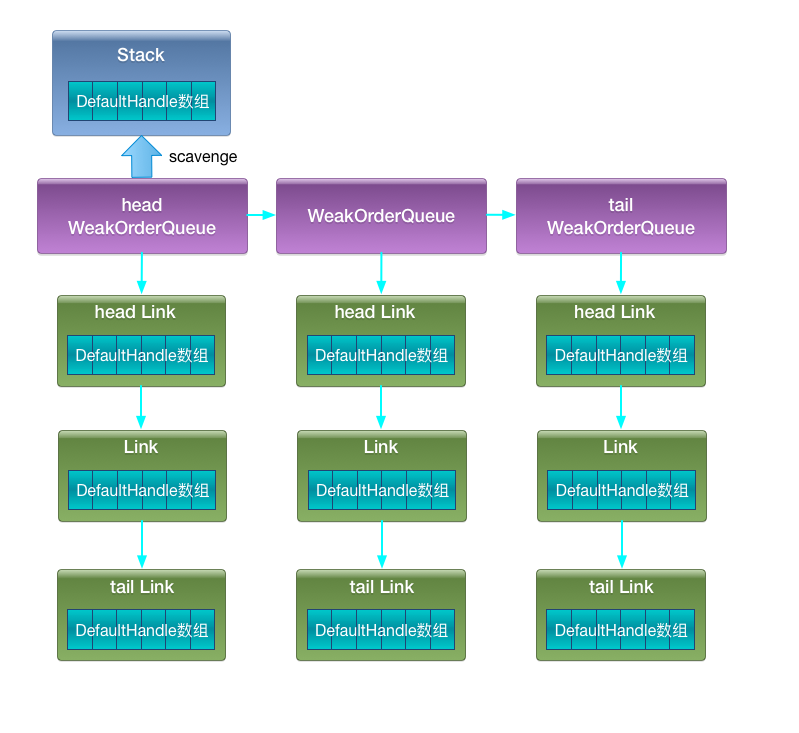

# Util 之 Recycler

- 沧行 [《Netty之Recycler》](https://www.jianshu.com/p/4eab8450560c)

Recycler用来实现对象池，其中对应堆内存和直接内存的池化实现分别是PooledHeapByteBuf和PooledDirectByteBuf。Recycler主要提供了3个方法：

- get():获取一个对象。
- recycle(T, Handle):回收一个对象，T为对象泛型。
- newObject(Handle):当没有可用对象时创建对象的实现方法。

Recycler关联了4个核心类：

- DefaultHandle:对象的包装类，在Recycler中缓存的对象都会包装成DefaultHandle类。
- Stack:存储本线程回收的对象。对象的获取和回收对应Stack的pop和push，即获取对象时从Stack中pop出1个DefaultHandle，回收对象时将对象包装成DefaultHandle push到Stack中。Stack会与线程绑定，即每个用到Recycler的线程都会拥有1个Stack，在该线程中获取对象都是在该线程的Stack中pop出一个可用对象。
- WeakOrderQueue:存储其它线程回收到本线程stack的对象，当某个线程从Stack中获取不到对象时会从WeakOrderQueue中获取对象。每个线程的Stack拥有1个WeakOrderQueue链表，链表每个节点对应1个其它线程的WeakOrderQueue，其它线程回收到该Stack的对象就存储在这个WeakOrderQueue里。
- Link: WeakOrderQueue中包含1个Link链表，回收对象存储在链表某个Link节点里，当Link节点存储的回收对象满了时会新建1个Link放在Link链表尾。

get 过程：

- 先从stack里面拿
- 如果没有，就去weakOrderQueue里面回收对象到stack里，并返回对象
- 前一步没能获取对象，就新建对象

