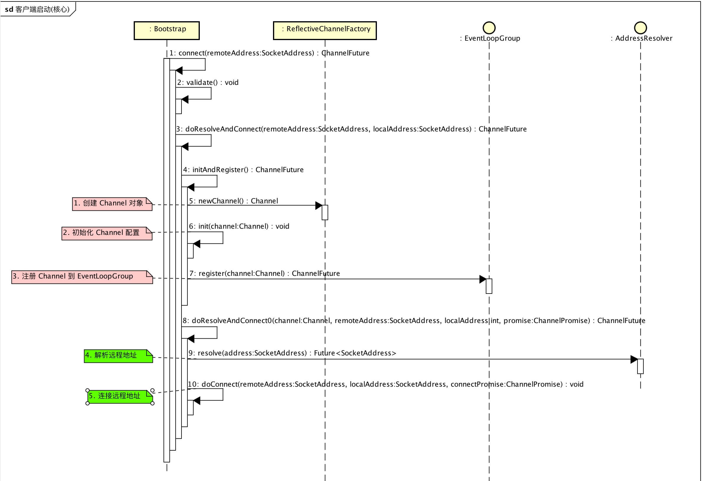

### 客户端启动程序 Bootstrap

#### 1.Bootstrap程序示例

```java
 1    public static void main(String[] args) throws Exception {
 2        // Configure SSL.git
 3        final SslContext sslCtx;
 4        if (SSL) {
 5            sslCtx = SslContextBuilder.forClient()
 6                .trustManager(InsecureTrustManagerFactory.INSTANCE).build();
 7        } else {
 8            sslCtx = null;
 9        }
10
11        // Configure the client.
12        EventLoopGroup group = new NioEventLoopGroup();
13        try {
14            Bootstrap b = new Bootstrap();
15            b.group(group)
16             .channel(NioSocketChannel.class)
17             .option(ChannelOption.TCP_NODELAY, true)
18             .handler(new ChannelInitializer<SocketChannel>() {
19                 @Override
20                 public void initChannel(SocketChannel ch) throws Exception {
21                     ChannelPipeline p = ch.pipeline();
22                     if (sslCtx != null) {
23                         p.addLast(sslCtx.newHandler(ch.alloc(), HOST, PORT));
24                     }
25                     //p.addLast(new LoggingHandler(LogLevel.INFO));
26                     p.addLast(new EchoClientHandler());
27                 }
28             });
29
30            // Start the client.
31            ChannelFuture f = b.connect(HOST, PORT).sync();
32
33            // Wait until the connection is closed.
34            f.channel().closeFuture().sync();
35        } finally {
36            // Shut down the event loop to terminate all threads.
37            group.shutdownGracefully();
38        }
39    }
```

这段代码来自netty官方示例，echoClient。

+ 12行 新建了一个NioEventLoopGroup, 因为是客户端，所以只有一个，而在服务端，也就是ServerBootstarp，需要有一主一从两个EventLoopGroup
+ 14-28行，和服务端类似，先新建一个Bootstrap对象，再配置一些属性到该对象上。
+ 31行，配置完属性之后，就调用connect方法去正式启动这个Bootstrap，sync是同步等待启动成功
+ 34行，阻塞等待connection关闭

#### 2.Bootstrap类解析
Bootstrap 继承自 AbstractBootstrap，同样的ServerBootstrap也继承自AbstractBootstrap
+ 构造函数
```java
    public Bootstrap() { }

    private Bootstrap(Bootstrap bootstrap) {
        super(bootstrap);
        resolver = bootstrap.resolver;
        remoteAddress = bootstrap.remoteAddress;
    }
```
一个无参构造方法，什么也不做。另一个是传递一个Bootstrap对象作为模板，复制该模板的属性到新的对象上

+ `#resolver()`设置解析器，解析器用来解析地址(例如baidu.com -> IP 地址)
```java
    public Bootstrap resolver(AddressResolverGroup<?> resolver) {
        this.resolver = (AddressResolverGroup<SocketAddress>) (resolver == null ? DEFAULT_RESOLVER : resolver);
        return this;
    }
```

+ `#remoteAddress()`设置远程地址,有三种不同的参数组合，如下
```java
    public Bootstrap remoteAddress(SocketAddress remoteAddress) {
        this.remoteAddress = remoteAddress;
        return this;
    }

    public Bootstrap remoteAddress(String inetHost, int inetPort) {
        remoteAddress = InetSocketAddress.createUnresolved(inetHost, inetPort);
        return this;
    }

    public Bootstrap remoteAddress(InetAddress inetHost, int inetPort) {
        remoteAddress = new InetSocketAddress(inetHost, inetPort);
        return this;
    }
```

+ `#connect()`创建一个Channel去连接相应的remoteAddress，有如下几种参数组合
```java
    public ChannelFuture connect() {
        validate();
        SocketAddress remoteAddress = this.remoteAddress;
        if (remoteAddress == null) {
            throw new IllegalStateException("remoteAddress not set");
        }

        return doResolveAndConnect(remoteAddress, config.localAddress());
    }

    public ChannelFuture connect(String inetHost, int inetPort) {
        return connect(InetSocketAddress.createUnresolved(inetHost, inetPort));
    }

    public ChannelFuture connect(InetAddress inetHost, int inetPort) {
        return connect(new InetSocketAddress(inetHost, inetPort));
    }

    public ChannelFuture connect(SocketAddress remoteAddress) {
        if (remoteAddress == null) {
            throw new NullPointerException("remoteAddress");
        }

        validate();
        return doResolveAndConnect(remoteAddress, config.localAddress());
    }

    public ChannelFuture connect(SocketAddress remoteAddress, SocketAddress localAddress) {
        if (remoteAddress == null) {
            throw new NullPointerException("remoteAddress");
        }
        validate();
        return doResolveAndConnect(remoteAddress, localAddress);
    }
```
调用connect()的核心流程如下，图来自@芋道源码

前面的步骤和ServerBootstrap类似，先validate()，再创建，初始化，注册Channel。与#bind()方法不同的是，在4，5步，先解析远程地址，再连接远程地址。而在#bind()中，是先绑定channel的端口，再注册channel到selectionKey

+ `#doResolveAndConnect()`
```java
    private ChannelFuture doResolveAndConnect(final SocketAddress remoteAddress, final SocketAddress localAddress) {
        final ChannelFuture regFuture = initAndRegister();
        final Channel channel = regFuture.channel();

        if (regFuture.isDone()) {
            if (!regFuture.isSuccess()) {
                return regFuture;
            }
            return doResolveAndConnect0(channel, remoteAddress, localAddress, channel.newPromise());
        } else {
            // Registration future is almost always fulfilled already, but just in case it's not.
            final PendingRegistrationPromise promise = new PendingRegistrationPromise(channel);
            regFuture.addListener(new ChannelFutureListener() {
                @Override
                public void operationComplete(ChannelFuture future) throws Exception {
                    // Directly obtain the cause and do a null check so we only need one volatile read in case of a
                    // failure.
                    Throwable cause = future.cause();
                    if (cause != null) {
                        // Registration on the EventLoop failed so fail the ChannelPromise directly to not cause an
                        // IllegalStateException once we try to access the EventLoop of the Channel.
                        promise.setFailure(cause);
                    } else {
                        // Registration was successful, so set the correct executor to use.
                        // See https://github.com/netty/netty/issues/2586
                        promise.registered();
                        doResolveAndConnect0(channel, remoteAddress, localAddress, promise);
                    }
                }
            });
            return promise;
        }
    }
```
先创建，初始化，注册channel，具体过程在服务端启动中有分析，然后再以监听事件的方式去调用`doResolveAndConnect0()`做进一步的解析与连接工作

+ `#doResolveAndConnect0()` 

```java
private ChannelFuture doResolveAndConnect0(final Channel channel, SocketAddress remoteAddress,
										   final SocketAddress localAddress, final ChannelPromise promise) {
	try {
		final EventLoop eventLoop = channel.eventLoop();
		final AddressResolver<SocketAddress> resolver = this.resolver.getResolver(eventLoop);

		if (!resolver.isSupported(remoteAddress) || resolver.isResolved(remoteAddress)) { // 1
			// Resolver has no idea about what to do with the specified remote address or it's resolved already.
			doConnect(remoteAddress, localAddress, promise);
			return promise;
		}

		final Future<SocketAddress> resolveFuture = resolver.resolve(remoteAddress); // 2

		if (resolveFuture.isDone()) {
			final Throwable resolveFailureCause = resolveFuture.cause();

			if (resolveFailureCause != null) {
				// Failed to resolve immediately
				channel.close();
				promise.setFailure(resolveFailureCause);
			} else {
				// Succeeded to resolve immediately; cached? (or did a blocking lookup)
				doConnect(resolveFuture.getNow(), localAddress, promise);// 3
			}
			return promise;
		}

		// Wait until the name resolution is finished.
		resolveFuture.addListener(new FutureListener<SocketAddress>() {
			@Override
			public void operationComplete(Future<SocketAddress> future) throws Exception {
				if (future.cause() != null) {
					channel.close();
					promise.setFailure(future.cause());
				} else {
					doConnect(future.getNow(), localAddress, promise); // 3
				}
			}
		});
	} catch (Throwable cause) {
		promise.tryFailure(cause);
	}
	return promise;
}
```
1. 如果当前解析器不支持，或者该地址已经解析过了,就直接doConnect()
2. 调用解析器去解析remoteAddress
3. 解析完成，调用doConnect()方法，如果解析失败就关闭channel,设置状态为失败


+ `#doConnect()`使用异步调用的方式去调用这种可能会阻塞线程的方法,这里的调用栈最终会调用`AbstractNioUnsafe#connect`

```java
    private static void doConnect(
            final SocketAddress remoteAddress, final SocketAddress localAddress, final ChannelPromise connectPromise) {

        // This method is invoked before channelRegistered() is triggered.  Give user handlers a chance to set up
        // the pipeline in its channelRegistered() implementation.
        final Channel channel = connectPromise.channel();
        channel.eventLoop().execute(new Runnable() {
            @Override
            public void run() {
                if (localAddress == null) {
                    channel.connect(remoteAddress, connectPromise);
                } else {
                    channel.connect(remoteAddress, localAddress, connectPromise);
                }
                connectPromise.addListener(ChannelFutureListener.CLOSE_ON_FAILURE);
            }
        });
    }
```

+ `AbstractNioUnsafe#connect()`

```java
1    @Override
2    public final void connect(
3            final SocketAddress remoteAddress, final SocketAddress localAddress, final ChannelPromise promise) {
4        if (!promise.setUncancellable() || !ensureOpen(promise)) {
5            return;
6        }
7    
8        try {
9            if (connectPromise != null) {
10                // Already a connect in process.
11                throw new ConnectionPendingException();
12            }
13    
14            boolean wasActive = isActive();
15            if (doConnect(remoteAddress, localAddress)) {
16                fulfillConnectPromise(promise, wasActive);
17            } else {
18                connectPromise = promise;
19                requestedRemoteAddress = remoteAddress;
20    
21                // Schedule connect timeout.
22                int connectTimeoutMillis = config().getConnectTimeoutMillis();
23                if (connectTimeoutMillis > 0) {
24                    connectTimeoutFuture = eventLoop().schedule(new Runnable() {
25                        @Override
26                        public void run() {
27                            ChannelPromise connectPromise = AbstractNioChannel.this.connectPromise;
28                            ConnectTimeoutException cause =
29                                    new ConnectTimeoutException("connection timed out: " + remoteAddress);
30                            if (connectPromise != null && connectPromise.tryFailure(cause)) {
31                                close(voidPromise());
32                            }
33                        }
34                    }, connectTimeoutMillis, TimeUnit.MILLISECONDS);
35                }
36    
37                promise.addListener(new ChannelFutureListener() {
38                    @Override
39                    public void operationComplete(ChannelFuture future) throws Exception {
40                        if (future.isCancelled()) {
41                            if (connectTimeoutFuture != null) {
42                                connectTimeoutFuture.cancel(false);
43                            }
44                            connectPromise = null;
45                            close(voidPromise());
46                        }
47                    }
48                });
49            }
50        } catch (Throwable t) {
51            promise.tryFailure(annotateConnectException(t, remoteAddress));
52            closeIfClosed();
53        }
54    }
```
第9-12行: 如果connectPromise不为空，说明已经发起过连接，应该禁止多次发起连接，此时抛出异常。

第15行: 先调用`NioSocketChannel#doConnect()`,如果返回值为true,说明连接成功，执行`AbstractNioChannel#fulfillConnectPromise()`,去触发相应的回调函数，如`fireChannelActive()`,如果用户取消了这次连接尝试，则关闭该channel

第18-53行: 如果连接失败则执行这一段操作，先设定一个定时任务，超过这个时间，就会抛出连接超时异常，如果在这期间，ChannelFuture对象被取消了，也就是在该任务被完成之前被取消了，则取消该定时任务，也就不抛出连接超时了

+ `NioSocketChannel#doConnect()`

```java
 1    protected boolean doConnect(SocketAddress remoteAddress, SocketAddress localAddress) throws Exception {
 2        if (localAddress != null) {
 3            doBind0(localAddress);
 4        }
 5
 6        boolean success = false;
 7        try {
 8            boolean connected = SocketUtils.connect(javaChannel(), remoteAddress);
 9            if (!connected) {
10                selectionKey().interestOps(SelectionKey.OP_CONNECT);
11            }
12            success = true;
13            return connected;
14        } finally {
15            if (!success) {
16                doClose();
17            }
18        }
19    }
```

第2-4行：如果localAddress不为空，则调用doBind0去绑定本地地址，一般情况，Nio Client是不需要绑定本地地址。默认情况下，系统会随机分配一个可用的本地地址，进行绑定

第8行：调用`SocketUtils#connect(SocketChannel socketChannel, SocketAddress remoteAddress)`，连接远程地址，代码如下，使用了java原生的NIO SocketChannel连接远程地址。
```java
public static boolean connect(final SocketChannel socketChannel, final SocketAddress remoteAddress) throws IOException {
    try {
        return AccessController.doPrivileged(new PrivilegedExceptionAction<Boolean>() {
            @Override
            public Boolean run() throws IOException {
                return socketChannel.connect(remoteAddress);
            }
        });
    } catch (PrivilegedActionException e) {
        throw (IOException) e.getCause();
    }
}
```

第9-11行：如果连接没成功，调用`selectionKey().interestOps()`方法，将SelectionKey.OP_CONNECT添加为感兴趣事件。这个事件如果被selector轮询到，就会触发`AbstractNioUnsafe#finishConnect()`，这里面会将之前设置的连接超时future任务给取消掉，因为这时候连接成功了，就不会抛连接超时异常了。

第12-13行，如果在try模块中发生了异常，则finally里面的条件满足，关闭该channel。如果正常，会返回connect的执行结果，就算此时没有连接成功，返回false也没关系，因为设置了感兴趣事件，之后要是成功了，会正确触发后续的程序。

+ `AbstractNioUnsafe#finishConnect()`该方法会在感兴趣的事件被触发的时候调用

```java
 1    public final void finishConnect() {
 2        // Note this method is invoked by the event loop only if the connection attempt was
 3        // neither cancelled nor timed out.
 4
 5        assert eventLoop().inEventLoop();
 6
 7        try {
 8            boolean wasActive = isActive();
 9            doFinishConnect();
10            fulfillConnectPromise(connectPromise, wasActive);
11        } catch (Throwable t) {
12            fulfillConnectPromise(connectPromise, annotateConnectException(t, requestedRemoteAddress));
13        } finally {
14            // Check for null as the connectTimeoutFuture is only created if a connectTimeoutMillis > 0 is used
15            // See https://github.com/netty/netty/issues/1770
16            if (connectTimeoutFuture != null) {
17                connectTimeoutFuture.cancel(false);
18            }
19            connectPromise = null;
20        }
21    }
```

第9行：执行`doFinishConnect()`，实际上会调用java原生的finishConnect方法

```java
protected void doFinishConnect() throws Exception {
    if (!javaChannel().finishConnect()) {
        throw new Error();
    }
}
```

第10行：执行fulfillConnectPromise()方法，该方法之前分析过，如果最初的连接就成功的话，就会在前面就被执行

第13-20：在finally块里面，我们把connectTimeoutFuture这个定时抛出连接超时异常的任务给取消掉，因为已经连接成功了

至此，客户端启动完成。