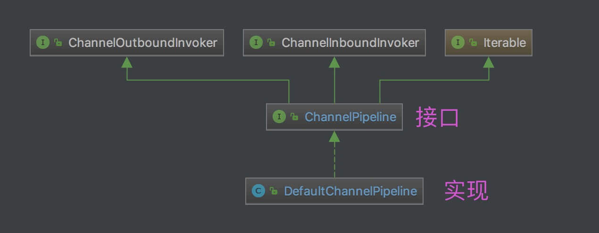
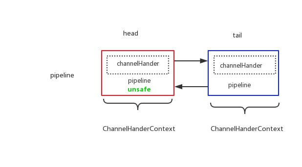
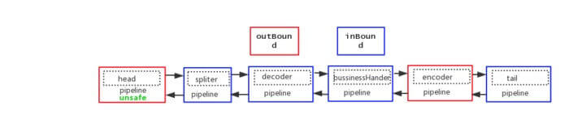
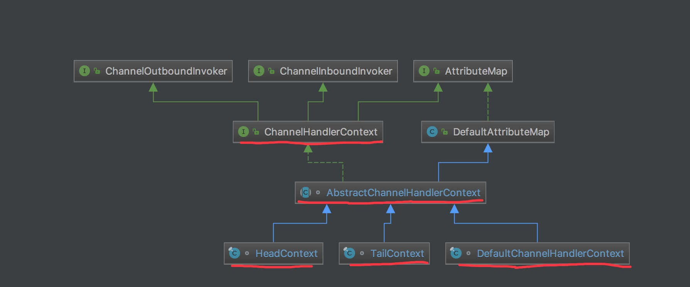
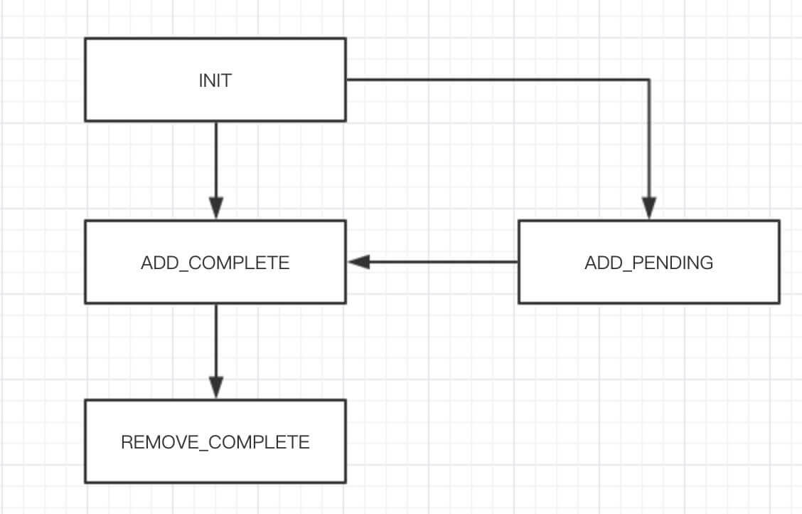

### **1. 概述**

之前对 EventLoopGroup 和 EventLoop 做了定义，我们再来回顾下：

> ChannelPipeline 为 ChannelHandler 组成的**链**，提供了一个容器并定义了用于沿着链传播入站和出站事件流的 API 。一个数据或者事件可能会被多个 Handler 处理，在这个过程中，数据或者事件经流 ChannelPipeline ，由 ChannelHandler 处理。在这个处理过程中，一个 ChannelHandler 接收数据后处理完成后交给下一个 ChannelHandler，或者什么都不做直接交给下一个 ChannelHandler。

因为 ChannelPipeline 涉及的代码量较大，所以笔者会分成好几篇文章分别分享。而本文，我们来分享 ChannelPipeline 的**初始化**。也因此，本文更多是体现 ChannelPipeline 的**整体性**，所以不会过多介绍每个类的具体的**每个方法**的实现。

### 2. ChannelPipeline

`io.netty.channel.ChannelPipeline` ，继承 ChannelInboundInvoker、ChannelOutboundInvoker、Iterable 接口，Channel Pipeline 接口。代码如下：

```java
public interface ChannelPipeline
        extends ChannelInboundInvoker, ChannelOutboundInvoker, Iterable<Entry<String, ChannelHandler>> {

    // ========== 添加 ChannelHandler 相关 ==========
    ChannelPipeline addFirst(String name, ChannelHandler handler);
    ChannelPipeline addFirst(EventExecutorGroup group, String name, ChannelHandler handler);
    ChannelPipeline addLast(String name, ChannelHandler handler);
    ChannelPipeline addLast(EventExecutorGroup group, String name, ChannelHandler handler);
    ChannelPipeline addBefore(String baseName, String name, ChannelHandler handler);
    ChannelPipeline addBefore(EventExecutorGroup group, String baseName, String name, ChannelHandler handler);
    ChannelPipeline addAfter(String baseName, String name, ChannelHandler handler);
    ChannelPipeline addAfter(EventExecutorGroup group, String baseName, String name, ChannelHandler handler);
    ChannelPipeline addFirst(ChannelHandler... handlers);
    ChannelPipeline addFirst(EventExecutorGroup group, ChannelHandler... handlers);
    ChannelPipeline addLast(ChannelHandler... handlers);
    ChannelPipeline addLast(EventExecutorGroup group, ChannelHandler... handlers);

    // ========== 移除 ChannelHandler 相关 ==========
    ChannelPipeline remove(ChannelHandler handler);
    ChannelHandler remove(String name);
    <T extends ChannelHandler> T remove(Class<T> handlerType);
    ChannelHandler removeFirst();
    ChannelHandler removeLast();
    
    // ========== 替换 ChannelHandler 相关 ==========
    ChannelPipeline replace(ChannelHandler oldHandler, String newName, ChannelHandler newHandler);
    ChannelHandler replace(String oldName, String newName, ChannelHandler newHandler);
    <T extends ChannelHandler> T replace(Class<T> oldHandlerType, String newName, ChannelHandler newHandler);

    // ========== 查询 ChannelHandler 相关 ==========
    ChannelHandler first();
    ChannelHandlerContext firstContext();
    ChannelHandler last();
    ChannelHandlerContext lastContext();
    ChannelHandler get(String name);
    <T extends ChannelHandler> T get(Class<T> handlerType);
    ChannelHandlerContext context(ChannelHandler handler);
    ChannelHandlerContext context(String name);
    ChannelHandlerContext context(Class<? extends ChannelHandler> handlerType);
    List<String> names();

    // ========== Channel 相关 ==========
    Channel channel();

    // ========== ChannelInboundInvoker 相关 ==========    
    @Override
    ChannelPipeline fireChannelRegistered();
    @Override
    ChannelPipeline fireChannelUnregistered();
    @Override
    ChannelPipeline fireChannelActive();
    @Override
    ChannelPipeline fireChannelInactive();
    @Override
    ChannelPipeline fireExceptionCaught(Throwable cause);
    @Override
    ChannelPipeline fireUserEventTriggered(Object event);
    @Override
    ChannelPipeline fireChannelRead(Object msg);
    @Override
    ChannelPipeline fireChannelReadComplete();
    @Override
    ChannelPipeline fireChannelWritabilityChanged();

    // ========== ChannelOutboundInvoker 相关 ==========    
    @Override
    ChannelPipeline flush();
    
}
```

虽然接口的方法比较多，笔者做了归类如下：

- ChannelHandler 的增删改查的相关方法。
- Channel 的相关方法，目前只有一个。
- 继承自 ChannelInboundInvoker 的相关方法。
- 继承自 ChannelOutboundInvoker 的相关方法。

为什么继承 Iterable 接口？因为 ChannelPipeline 是 ChannelHandler 组成的**链**。允许外部遍历整个链上的ChannelHandler，ChannelPipeline 的类图如下：



### 2.1 ChannelInboundInvoker

`io.netty.channel.ChannelInboundInvoker` ，Channel Inbound Invoker( 调用者 ) 接口。代码如下：

```java
ChannelPipeline fireChannelRegistered();
ChannelPipeline fireChannelUnregistered();
ChannelPipeline fireChannelActive();
ChannelPipeline fireChannelInactive();
ChannelPipeline fireExceptionCaught(Throwable cause);
ChannelPipeline fireUserEventTriggered(Object event);
ChannelPipeline fireChannelRead(Object msg);
ChannelPipeline fireChannelReadComplete();
ChannelPipeline fireChannelWritabilityChanged();
```

- 通知 Channel 事件的接口方法。

### 2.2 ChannelOutboundInvoker

`io.netty.channel.ChannelOutboundInvoker` ，Channel Outbound Invoker( 调用者 ) 接口。代码如下：

```java
// ========== Channel 操作相关 ==========    
ChannelFuture bind(SocketAddress localAddress);
ChannelFuture connect(SocketAddress remoteAddress);
ChannelFuture connect(SocketAddress remoteAddress, SocketAddress localAddress);
ChannelFuture disconnect();
ChannelFuture close();
ChannelFuture deregister();
ChannelFuture bind(SocketAddress localAddress, ChannelPromise promise);
ChannelFuture connect(SocketAddress remoteAddress, ChannelPromise promise);
ChannelFuture connect(SocketAddress remoteAddress, SocketAddress localAddress, ChannelPromise promise);
ChannelFuture disconnect(ChannelPromise promise);
ChannelFuture close(ChannelPromise promise);
ChannelFuture deregister(ChannelPromise promise);
ChannelOutboundInvoker read();
ChannelFuture write(Object msg);
ChannelFuture write(Object msg, ChannelPromise promise);
ChannelOutboundInvoker flush();
ChannelFuture writeAndFlush(Object msg, ChannelPromise promise);
ChannelFuture writeAndFlush(Object msg);

// ========== Promise 相关 ==========    
ChannelPromise newPromise();
ChannelProgressivePromise newProgressivePromise();
ChannelFuture newSucceededFuture();
ChannelFuture newFailedFuture(Throwable cause);
ChannelPromise voidPromise();
```

- 发起 Channel 操作的接口方法。
- 创建 Promise 对象的接口方法。

### **2.3 Outbound v.s Inbound 事件**

**对于 Outbound 事件**：

- Outbound 事件是【请求】事件(由 Connect 发起一个请求, 并最终由 Unsafe 处理这个请求)

- Outbound 事件的发起者是 Channel

- Outbound 事件的处理者是 Unsafe

- Outbound 事件在 Pipeline 中的传输方向是 `tail` -> `head`

  > 旁白：Outbound 翻译为“出站”，所以从 `tail`( 尾 )到 `head`( 头 )也合理。
  >
  > 至于什么是 `head` 和 `tail` ，等看了具体的 ChannelPipeline 实现类 DefaultChannelPipeline 再说。

- 在 ChannelHandler 中处理事件时, 如果这个 Handler 不是最后一个 Handler, 则需要调用 `ctx.xxx` (例如 `ctx.connect` ) 将此事件继续传播下去. 如果不这样做, 那么此事件的传播会提前终止.

- Outbound 事件流: `Context.OUT_EVT` -> `Connect.findContextOutbound` -> `nextContext.invokeOUT_EVT` -> `nextHandler.OUT_EVT` -> `nextContext.OUT_EVT`

**对于 Inbound 事件**：

- Inbound 事件是【通知】事件, 当某件事情已经就绪后, 通知上层.

- Inbound 事件发起者是 Unsafe

- Inbound 事件的处理者是 TailContext, 如果用户没有实现自定义的处理方法, 那么Inbound 事件默认的处理者是 TailContext, 并且其处理方法是空实现.

- Inbound 事件在 Pipeline 中传输方向是 `head`( 头 ) -> `tail`( 尾 )

  > 旁白：Inbound 翻译为“入站”，所以从 `head`( 头 )到 `tail`( 尾 )也合理。

- 在 ChannelHandler 中处理事件时, 如果这个 Handler 不是最后一个 Handler, 则需要调用 `ctx.fireIN_EVT` (例如 `ctx.fireChannelActive` ) 将此事件继续传播下去. 如果不这样做, 那么此事件的传播会提前终止.

- Inbound 事件流: `Context.fireIN_EVT` -> `Connect.findContextInbound` -> `nextContext.invokeIN_EVT` -> `nextHandler.IN_EVT` -> `nextContext.fireIN_EVT`

Outbound 和 Inbound 事件十分的相像, 并且 Context 与 Handler 直接的调用关系容易混淆, 因此读者在阅读这里的源码时, 需要特别的注意。

### 3. DefaultChannelPipeline

`io.netty.channel.DefaultChannelPipeline` ，实现 ChannelPipeline 接口，默认 ChannelPipeline 实现类。实际上，也只有这个实现类。

### 3.1 静态属性

```java
/**
 * {@link #head} 的名字
 */
private static final String HEAD_NAME = generateName0(HeadContext.class);
/**
 * {@link #tail} 的名字
 */
private static final String TAIL_NAME = generateName0(TailContext.class);

/**
 * 名字({@link AbstractChannelHandlerContext#name})缓存 ，基于 ThreadLocal ，用于生成在线程中唯一的名字。
 */
private static final FastThreadLocal<Map<Class<?>, String>> nameCaches = new FastThreadLocal<Map<Class<?>, String>>() {

    @Override
    protected Map<Class<?>, String> initialValue() throws Exception {
        return new WeakHashMap<Class<?>, String>();
    }

};

/**
 * {@link #estimatorHandle} 的原子更新器
 */
private static final AtomicReferenceFieldUpdater<DefaultChannelPipeline, MessageSizeEstimator.Handle> ESTIMATOR =
        AtomicReferenceFieldUpdater.newUpdater(
                DefaultChannelPipeline.class, MessageSizeEstimator.Handle.class, "estimatorHandle");
```

+ `HEAD_NAME` 和 `TAIL_NAME` 静态属性，通过调用 `#generateName0(Class<?> handlerType)` 方法，生成对应的名字。代码如下：

```java
private static String generateName0(Class<?> handlerType) {
    return StringUtil.simpleClassName(handlerType) + "#0";
}
```

 + 即 `HEAD_NAME = "HeadContext#0"`，`TAIL_NAME= "TailContext#0"` 
 + `nameCaches` 静态属性，名字( `AbstractChannelHandlerContext.name` )缓存 ，基于 ThreadLocal ，用于生成**在线程中唯一的名字**。

### 3.2 构造方法

```java
/**
 * Head 节点
 */
final AbstractChannelHandlerContext head;
/**
 * Tail 节点
 */
final AbstractChannelHandlerContext tail;

/**
 * 所属 Channel 对象
 */
private final Channel channel;
/**
 * 成功的 Promise 对象
 */
private final ChannelFuture succeededFuture;
/**
 * 不进行通知的 Promise 对象
 *
 * 用于一些方法执行，需要传入 Promise 类型的方法参数，但是不需要进行通知，就传入该值
 *
 * @see io.netty.channel.AbstractChannel.AbstractUnsafe#safeSetSuccess(ChannelPromise) 
 */
private final VoidChannelPromise voidPromise;
/**
 * TODO 1008 DefaultChannelPipeline 字段用途
 */
private final boolean touch = ResourceLeakDetector.isEnabled();

/**
 * 子执行器集合。
 *
 * 默认情况下，ChannelHandler 使用 Channel 所在的 EventLoop 作为执行器。
 * 但是如果有需要，也可以自定义执行器。详细解析，见 {@link #childExecutor(EventExecutorGroup)} 。
 * 实际情况下，基本不会用到。
 */
private Map<EventExecutorGroup, EventExecutor> childExecutors;
/**
 * TODO 1008 DefaultChannelPipeline 字段用途
 */
private volatile MessageSizeEstimator.Handle estimatorHandle;
/**
 * 是否首次注册
 */
private boolean firstRegistration = true;

/**
 * This is the head of a linked list that is processed by {@link #callHandlerAddedForAllHandlers()} and so process
 * all the pending {@link #callHandlerAdded0(AbstractChannelHandlerContext)}.
 *
 * We only keep the head because it is expected that the list is used infrequently and its size is small.
 * Thus full iterations to do insertions is assumed to be a good compromised to saving memory and tail management
 * complexity.
 * 
 * 准备添加 ChannelHandler 的回调
 */
private PendingHandlerCallback pendingHandlerCallbackHead;

/**
 * Set to {@code true} once the {@link AbstractChannel} is registered.Once set to {@code true} the value will never
 * change.
 * Channel 是否已注册
 */
private boolean registered;

protected DefaultChannelPipeline(Channel channel) {
    this.channel = ObjectUtil.checkNotNull(channel, "channel");
    // succeededFuture 的创建
    succeededFuture = new SucceededChannelFuture(channel, null);
    // voidPromise 的创建
    voidPromise =  new VoidChannelPromise(channel, true);

    // 创建 Tail 及诶点
    tail = new TailContext(this); // <1>
    // 创建 Head 节点
    head = new HeadContext(this); // <2>

    // 相互指向 <3>
    head.next = tail;
    tail.prev = head;
}
```

+ `head` 属性，Head 节点，在构造方法的 `<1>` 处初始化。

+ `tail` 节点，Tail 节点，在构造方法的 `<2>` 处初始化。

+ 在构造方法的 `<3>` 处，`head` 节点向**下**指向 `tail` 节点，`tail` 节点向**上**指向 `head` 节点，从而形成**相互**的指向。即如下图所示：

  > 

+ pipeline 中的节点的数据结构是 ChannelHandlerContext 类。每个 ChannelHandlerContext 包含**一个** ChannelHandler、它的**上下**节点( **从而形成 ChannelHandler 链** )、以及其他上下文。

+ 默认情况下，pipeline 有 `head` 和 `tail` 节点，形成默认的 ChannelHandler 链。而我们可以在它们之间，加入自定义的 ChannelHandler 节点。如下图所示：

  > 

+ `childExecutors` 属性，子执行器集合。默认情况下，ChannelHandler 使用 Channel 所在的 EventLoop 作为执行器。但是如果有需要，也可以自定义执行器。
+ `pendingHandlerCallbackHead` 属性，准备添加 ChannelHandler 的回调。
+ `registered` 属性，Channel 是否已注册。
+ `firstRegistration` 属性，是否首次注册。

### **3.3 其他方法**

DefaultChannelPipeline 中的其他方法，详细解析，见后续的文章。

### 4. ChannelHandlerContext

`io.netty.channel.ChannelHandlerContext` ，继承 ChannelInboundInvoker、ChannelOutboundInvoker、AttributeMap 接口，ChannelHandler Context( 上下文 )接口，作为 ChannelPipeline 中的**节点**。代码如下：

```java
// ========== Context 相关 ==========
String name();
Channel channel();
EventExecutor executor();
ChannelHandler handler();
ChannelPipeline pipeline();
boolean isRemoved(); // 是否已经移除

// ========== ByteBuf 相关 ==========    
ByteBufAllocator alloc();

// ========== ChannelInboundInvoker 相关 ==========    
@Override
ChannelHandlerContext fireChannelRegistered();
@Override
ChannelHandlerContext fireChannelUnregistered();
@Override
ChannelHandlerContext fireChannelActive();
@Override
ChannelHandlerContext fireChannelInactive();
@Override
ChannelHandlerContext fireExceptionCaught(Throwable cause);
@Override
ChannelHandlerContext fireUserEventTriggered(Object evt);
@Override
ChannelHandlerContext fireChannelRead(Object msg);
@Override
ChannelHandlerContext fireChannelReadComplete();
@Override
ChannelHandlerContext fireChannelWritabilityChanged();

// ========== ChannelOutboundInvoker 相关 ==========
@Override
ChannelHandlerContext read();
@Override
ChannelHandlerContext flush();

// ========== AttributeMap 相关 ==========
@Deprecated
@Override
<T> Attribute<T> attr(AttributeKey<T> key);
@Deprecated
@Override
<T> boolean hasAttr(AttributeKey<T> key);
```

虽然接口的方法比较多，笔者做了归类如下：

- Context 相关的接口方法。
- 继承自 ChannelInboundInvoker 的相关方法，*和 ChannelPipeline 一样*。
- 继承自 ChannelOutboundInvoker 的相关方法，*和 ChannelPipeline 一样*。
- 继承自 AttributeMap 的相关方法，实际上已经废弃( `@Deprecated` )了，不再从 ChannelHandlerContext 中获取，而是从 Channel 中获取。

ChannelHandlerContext 的类图如下：



### 4.1 AbstractChannelHandlerContext

`io.netty.channel.AbstractChannelHandlerContext` ，实现 ChannelHandlerContext、ResourceLeakHint 接口，继承 DefaultAttributeMap 类，ChannelHandlerContext 抽象基类。

### 4.1.1 静态属性

```java
/**
 * Neither {@link ChannelHandler#handlerAdded(ChannelHandlerContext)}
 * nor {@link ChannelHandler#handlerRemoved(ChannelHandlerContext)} was called.
 */
private static final int INIT = 0; // 初始化
/**
 * {@link ChannelHandler#handlerAdded(ChannelHandlerContext)} is about to be called.
 */
private static final int ADD_PENDING = 1; // 添加准备中
/**
 * {@link ChannelHandler#handlerAdded(ChannelHandlerContext)} was called.
 */
private static final int ADD_COMPLETE = 2; // 已添加
/**
 * {@link ChannelHandler#handlerRemoved(ChannelHandlerContext)} was called.
 */
private static final int REMOVE_COMPLETE = 3; // 已移除

/**
 * {@link #handlerState} 的原子更新器
 */
private static final AtomicIntegerFieldUpdater<AbstractChannelHandlerContext> HANDLER_STATE_UPDATER = AtomicIntegerFieldUpdater.newUpdater(AbstractChannelHandlerContext.class, "handlerState");

// ========== 非静态属性 ==========

/**
 * 处理器状态
 */
private volatile int handlerState = INIT;
```

+ `handlerState` 属性( **非静态**属性，放这里主要是为了统一讲 )，处理器状态。共有 **4** 种状态。



+ `HANDLER_STATE_UPDATER` **静态**属性，`handlerState` 的原子更新器。

### 4.1.2 构造方法

```java
/**
 * 上一个节点
 */
volatile AbstractChannelHandlerContext next;
/**
 * 下一个节点
 */
volatile AbstractChannelHandlerContext prev;
/**
 * 是否为 inbound
 */
private final boolean inbound;
/**
 * 是否为 outbound
 */
private final boolean outbound;
/**
 * 所属 pipeline
 */
private final DefaultChannelPipeline pipeline;
/**
 * 名字
 */
private final String name;
/**
 * 是否使用有序的 EventExecutor ( {@link #executor} )，即 OrderedEventExecutor
 */
private final boolean ordered;

// Will be set to null if no child executor should be used, otherwise it will be set to the
// child executor.
/**
 * EventExecutor 对象
 */
final EventExecutor executor;
/**
 * 成功的 Promise 对象
 */
private ChannelFuture succeededFuture;

// Lazily instantiated tasks used to trigger events to a handler with different executor. 懒加载
// There is no need to make this volatile as at worse it will just create a few more instances then needed.
/**
 * 执行 Channel ReadComplete 事件的任务
 */
private Runnable invokeChannelReadCompleteTask;
/**
 * 执行 Channel Read 事件的任务
 */
private Runnable invokeReadTask;
/**
 * 执行 Channel WritableStateChanged 事件的任务
 */
private Runnable invokeChannelWritableStateChangedTask;
/**
 * 执行 flush 事件的任务
 */
private Runnable invokeFlushTask;
/**
 * 处理器状态
 */
private volatile int handlerState = INIT;

AbstractChannelHandlerContext(DefaultChannelPipeline pipeline, EventExecutor executor, String name,boolean inbound, boolean outbound) {
    this.name = ObjectUtil.checkNotNull(name, "name");
    this.pipeline = pipeline;
    this.executor = executor;
    this.inbound = inbound;
    this.outbound = outbound;
    // Its ordered if its driven by the EventLoop or the given Executor is an instanceof OrderedEventExecutor.
    ordered = executor == null || executor instanceof OrderedEventExecutor; // <1>
}
```

+ `next`、`prev` 属性，分别记录上、下一个节点。
+ Handler 相关属性
  + 在 AbstractChannelHandlerContext 抽象类中，按照我们上文的分享，应该会看到一个类型为 ChannelHandler 的处理器，但是**实际并不是这样**。而是， 我们下文 DefaultChannelHandlerContext、TailContext、HeadContext 见。
  + `inbound`、`outbound` 属性，分别是否为 Inbound、Outbound 处理器。
  + `name` 属性，处理器名字。
  + `handlerState` 属性，处理器状态，初始为 `INIT` 。
+ `executor` 属性，EventExecutor 对象
  + `ordered` 属性，是否使用有序的 `executor`，即 OrderedEventExecutor ，在构造方法的 `<1>` 处理的初始化。
+ `pipeline` 属性，所属 DefaultChannelPipeline 对象。

### **4.1.3 setAddComplete**

`#setAddComplete()` 方法，设置 ChannelHandler 添加完成。完成后，状态有两种结果：

1. `REMOVE_COMPLETE`
2. `ADD_COMPLETE`

代码如下：

```java
final void setAddComplete() {
    for (;;) {
        int oldState = handlerState;
        // Ensure we never update when the handlerState is REMOVE_COMPLETE already.
        // oldState is usually ADD_PENDING but can also be REMOVE_COMPLETE when an EventExecutor is used that is not
        // exposing ordering guarantees.
        if (oldState == REMOVE_COMPLETE || HANDLER_STATE_UPDATER.compareAndSet(this, oldState, ADD_COMPLETE)) {
            return;
        }
    }
}
```

- 循环 + CAS 保证多线程下的安全变更 `handlerState` 属性。

### 4.1.4 setRemoved

`#setRemoved()` 方法，设置 ChannelHandler 已移除。代码如下：

```java
final void setRemoved() {
    handlerState = REMOVE_COMPLETE;
}
```

### 4.1.5 setAddPending

`#setAddPending()` 方法，设置 ChannelHandler 准备添加中。代码如下：

```java
final void setAddPending() {
    boolean updated = HANDLER_STATE_UPDATER.compareAndSet(this, INIT, ADD_PENDING);
    assert updated; // This should always be true as it MUST be called before setAddComplete() or setRemoved().
}
```

- 当且仅当 `INIT` 可修改为 `ADD_PENDING` 。理论来说，这是一个绝对会成功的操作，原因见英文注释。

### 4.2 HeadContext

HeadContext ，实现 ChannelOutboundHandler、ChannelInboundHandler 接口，继承 AbstractChannelHandlerContext 抽象类，**pipe 头节点** Context 实现类。

> HeadContext 是 DefaultChannelPipeline 的内部类。

### 4.2.1 构造方法

```java
private final Unsafe unsafe;

HeadContext(DefaultChannelPipeline pipeline) {
    super(pipeline, null, HEAD_NAME, false, true); // <1>
    unsafe = pipeline.channel().unsafe(); // <2>
    setAddComplete(); // <3>
}
```

- `<1>` 处，调用父 AbstractChannelHandlerContext 的构造方法，设置 `inbound = false`、`outbound = true` 。
- `<2>` 处，使用 Channel 的 Unsafe 作为 `unsafe` 属性。HeadContext 实现 ChannelOutboundHandler 接口的方法，都会调用 Unsafe 对应的方法。代码如下：

```java
@Override
public void bind(ChannelHandlerContext ctx, SocketAddress localAddress, ChannelPromise promise) throws Exception {
    unsafe.bind(localAddress, promise);
}

@Override
public void connect(ChannelHandlerContext ctx, SocketAddress remoteAddress, SocketAddress localAddress, ChannelPromise promise) throws Exception {
    unsafe.connect(remoteAddress, localAddress, promise);
}

@Override
public void disconnect(ChannelHandlerContext ctx, ChannelPromise promise) throws Exception {
    unsafe.disconnect(promise);
}

@Override
public void close(ChannelHandlerContext ctx, ChannelPromise promise) throws Exception {
    unsafe.close(promise);
}

@Override
public void deregister(ChannelHandlerContext ctx, ChannelPromise promise) throws Exception {
    unsafe.deregister(promise);
}

@Override
public void read(ChannelHandlerContext ctx) {
    unsafe.beginRead();
}

@Override
public void write(ChannelHandlerContext ctx, Object msg, ChannelPromise promise) throws Exception {
    unsafe.write(msg, promise);
}

@Override
public void flush(ChannelHandlerContext ctx) throws Exception {
    unsafe.flush();
}
```

+ 这也就是为什么设置 `outbound = true` 的原因。
+ `<3>` 处，调用 `#setAddComplete()` 方法，设置 ChannelHandler 添加完成。此时，`handlerStatus` 会变成 `ADD_COMPLETE` 状态。

### **4.2.2 handler**

`#handler()` 方法，返回自己作为 Context 的 **ChannelHandler** 。代码如下：

```java
@Override
public ChannelHandler handler() {
    return this;
}
```

- 因为 HeadContext ，实现 ChannelOutboundHandler、ChannelInboundHandler 接口，而它们本身就是 ChannelHandler 。

### 4.3 TailContext

TailContext ，实现 ChannelInboundHandler 接口，继承 AbstractChannelHandlerContext 抽象类，**pipe 尾节点** Context 实现类。

> TailContext 是 DefaultChannelPipeline 的内部类。

### 4.3.1 构造方法

```java
TailContext(DefaultChannelPipeline pipeline) {
    super(pipeline, null, TAIL_NAME, true, false); // <1>
    setAddComplete(); // <2>
}	
```

- `<1>` 处，调用父 AbstractChannelHandlerContext 的构造方法，设置 `inbound = true`、`outbound = false` ，和 HeadContext **相反**。
- `<2>` 处，调用 `#setAddComplete()` 方法，设置 ChannelHandler 添加完成。此时，`handlerStatus` 会变成 `ADD_COMPLETE` 状态。

### **4.3.2 handler**

`#handler()` 方法，返回自己作为 Context 的 **ChannelHandler** 。代码如下：

```java
@Override
public ChannelHandler handler() {
    return this;
}
```

- 因为 HeadContext ，实现 ChannelInboundHandler 接口，而它们本身就是 ChannelHandler 。

### 4.4 DefaultChannelHandlerContext

`io.netty.channel.DefaultChannelHandlerContext` ，实现 AbstractChannelHandlerContext 抽象类。代码如下：

```java
final class DefaultChannelHandlerContext extends AbstractChannelHandlerContext {

    private final ChannelHandler handler;

    DefaultChannelHandlerContext(
            DefaultChannelPipeline pipeline, EventExecutor executor, String name, ChannelHandler handler) {
        super(pipeline, executor, name, isInbound(handler), isOutbound(handler)); // <1>
        if (handler == null) {
            throw new NullPointerException("handler");
        }
        this.handler = handler; // <2>
    }

    @Override
    public ChannelHandler handler() {
        return handler;
    }

    private static boolean isInbound(ChannelHandler handler) {
        return handler instanceof ChannelInboundHandler;
    }

    private static boolean isOutbound(ChannelHandler handler) {
        return handler instanceof ChannelOutboundHandler;
    }

}
```

- 不同于 HeadContext、TailContext，它们自身就是一个 Context 的同时，也是一个 ChannelHandler 。而 DefaultChannelHandlerContext 是**内嵌** 一个 ChannelHandler 对象，即 `handler` 。这个属性通过构造方法传入，在 `<2>` 处进行赋值。
- `<1>` 处，调用父 AbstractChannelHandlerContext 的构造方法，通过判断传入的 `handler` 是否为 ChannelInboundHandler 和 ChannelOutboundHandler 来分别判断是否为 `inbound` 和 `outbound` 。

