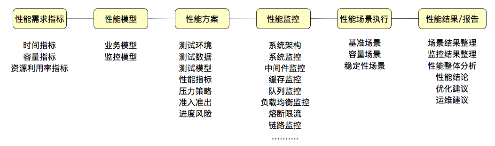
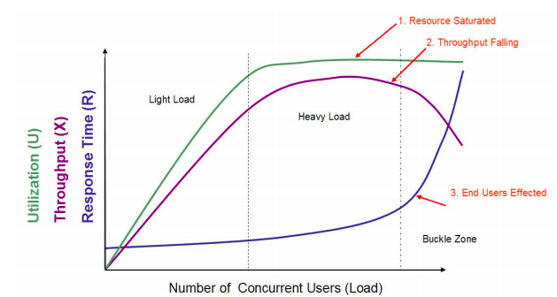
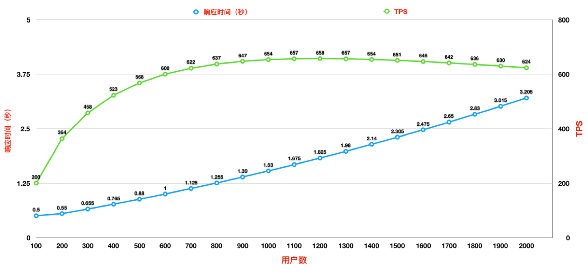
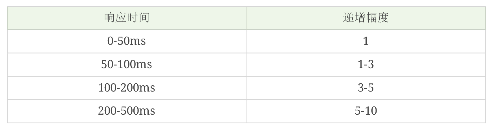

# 性能测试基础

## 性能测试概念

> 性能测试针对系统的性能指标，建立性能测试模型，制定性能测试方案，制定监控策略，在场景条件之下执行性能场景，分析判断性能瓶颈并调优，最终得出性能结果来评估系统的性能指标是否满足既定值。

##性能场景

**经典容量性能场景**

## 性能指标

**指标之间关系**

- TPS=1000ms/响应时间(单位ms)∗压力机线程数
- 使用TPS来衡量服务器处理能力，而不是压力机线程数。
- 通常所说的并发都是指服务端的并发，而不是指压力机上的并发线程数，因为服务端的并发才是服务器的处理能力。性能中常说的并发，是用 TPS 这样的概念来承载具体数值的。压力工具中的线程数、响应时间和 TPS 之间是有对应关系的。

## 性能分析思路

### 瓶颈判断

根据TPS来判断系统的容量瓶颈时，要控制其TPS的增加，使其呈现为一个曲线，再根据曲线的趋势来判断。

###线程递增策略

1. 场景中的线程递增一定是连续的，并且在递增的过程中也是有梯度的。
2. 场景中的线程递增一定要和 TPS 的递增有比例关系，而不是突然达到最上限。
3. 上面两点针对的是常规的性能场景。对于秒杀类的场景，我们前期一定是做好了系统预热的工作的，在预热之后，线程突增产生的压力，也是在可处理范围的。这时，我们可以设计线程突增的场景来看系统瞬间的处理能力。如果不能模拟出秒杀的陡增，就是不合理的场景。

说到秒杀场景，有人觉得用大线程并发是合理的，其实这属于认识上的错误。因为即使线程数增加得再多，对已经达到 TPS 上限的系统来说，除了会增加响应时间之外，并无其他作用。所以我们描述系统的容量是用系统当前能处理的业务量（你用 TPS 也好，RPS 也好，HPS 也好，它们都是用来描述服务端的处理能力的），而不是压力工具中的线程数。

线程数递增经验值：

### 性能衰减

只要每线程每秒的 TPS 开始变少，就意味着性能瓶颈已经出现了。但是瓶颈出现之后，并不是说服务器的处理能力（这里我们用 TPS 来描述）会下降，应该说 TPS 仍然会上升，在性能不断衰减的过程中，TPS 就会达到上限。

